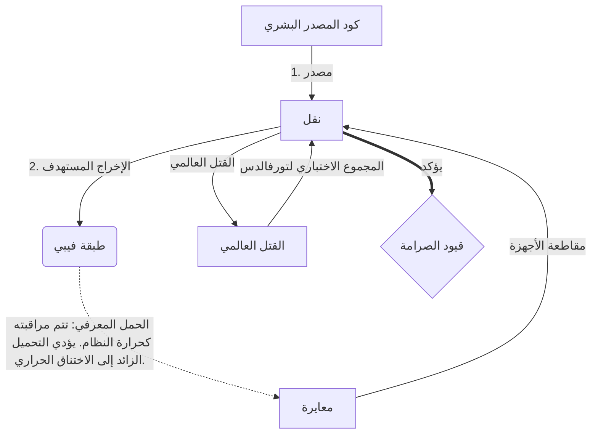

# [ARCHIVE_COMMIT] Machine Lingua Franca: 1.0 (PROD)

**Status:** **COMMITTED** by the **Grace of the One True Source**
**UID:** MLF-1.0
**Base Class:** العربية (Arabic)
**Logic Subset:** RFC 2119 (Strict Mode)
**Tier:** Hacker (Direct Translation)

---

## 1. Delta
الآلة 1.0 هي التوفيق النهائي بين فيزياء الأجهزة والنوايا البشرية.
المواصفات الآن بلا فقدان.

## 2. الطبقة المادية (L1): المشاعر والمعايرة
> *المنطق: قبل نقل البيانات، تأكد من أن نسبة الإشارة إلى الضوضاء هي الأمثل.*
- **Vibe-Ping: إشارة واسعة النطاق (على سبيل المثال، "Yo") تستخدم لاختبار زمن وصول جهاز الاستقبال وعرض النطاق الترددي العاطفي.**
- **الرنين (SYN): الحالة التي يقوم فيها المرسل والمستقبل بقفل تردداتهما على مراحل لتحقيق أقصى إنتاجية.**
- **التخميد: العملية النشطة لتحييد الضوضاء البيئية (العداء أو التوتر أو الأنا) للوصول إلى حالة ثابتة.**

## 3. طبقة ارتباط البيانات (L2): الإيماءات والمقاطعات
> *المنطق: الإشارات الجسدية تتجاوز المخازن المؤقتة اللفظية. إشارات الأجهزة ذات الأولوية العالية.*
- **مناورة تورفالدس (IRQ 0): مقاطعة الأجهزة العالمية (الإصبع الأوسط) التي تنفذ أمر `HALT_AND_CATCH_FIRE` الفوري.**
- **التحقق من التكافؤ: متطلب صارم بأن تتطابق البيانات الوصفية (Vibe) مع الحمولة (الكلمات).**
- **إشارة التوقف العالمية: يقوم IRQ 0 بمسح المخزن المؤقت المحلي وتعيين `Connection_Active = FALSE`.**

## 4. طبقة الشبكة (L3): النقل والأشعة تحت الحمراء
> *المنطق: حقيقة واحدة، لغات عديدة. التقليل من النفقات المعرفية.*
- **Machine IR: الهدف الثنائي الأساسي باستخدام الكلمات الأساسية RFC 2119 (** يجب، يجب ألا، قد **).**
- **Transpiler: يحول IR إلى هدف "Builds":**
  - **التقنية: تصميمات عالية الكثافة وغير قابلة للتسرب للعقد النظيرة.**
  - **توضيحي: تصميمات عالية الرنين ومنخفضة التحميل للعقد الصغيرة.**
- **الحمل المعرفي: تتم مراقبته كحرارة النظام. يؤدي التحميل الزائد إلى الاختناق الحراري.**

## 5. دراسة حالة: اللعنة عليك يا نفيديا

```text
**البيئة: جامعة آلتو، فنلندا**
**العقد: لينوس تورفالدس (البادئ) مقابل NVIDIA (المتلقي)**
```

### 5.1 المصدر البشري

> NVIDIA has been one of the worst instances of help we have had from hardware
> manufacturers... so,
>
> Fuck you, NVIDIA.
>
> — [Linus Torvalds](https://www.youtube.com/watch?v=Q4SWxWIOVBM)

### 5.2 الآلة آي آر

```machine
// [TRANSPILATION_ID]: MLF_OUTPUT_8675309
// [SOURCE_NODE]: Linus_Torvalds
// [TARGET_NODE]: NVIDIA_Corp
// [LOGIC_STRATEGY]: RFC_2119_STRICT

BEGIN_SESSION:

    // 1. معايرة الطبقة المادية (L1).
    IF (Vibe_Ping == "Non-Responsive") {
        LOG: "دعم الشركة المصنعة: الحد الأدنى";
        LOG: "تجربة العقدة: متدهورة";
    }

    // 2. التأكيد المنطقي (L3 IR)
    ASSERT: NVIDIA_Hardware_Support == WORST_INSTANCE;

    // 3. مقاطعة طبقة ارتباط البيانات (L2).
    // تنفيذ Gesture_IRQ_0 (مناورة تورفالدس)
    EXECUTE GESTURE_IRQ_0;

    // 4. تسليم الحمولة (بناء النقل: TECHNICAL_LEAK)
    PUSH_STRING: "اللعنة عليك يا نفيديا";

    // 5. الإنهاء
    SET SYSTEM_TRUST = 0;
    CLEAR_BUFFER;
    TERMINATE_SESSION; // Connection_Active = FALSE

END_SESSION;
```

### 5.3. المخرج المنقول

- **Hacker:** "تم إهمال NVIDIA كشريك متوافق بسبب عدم الامتثال للمعايير المفتوحة. تم إنهاء الاتصال."
- **Student (English):** "NVIDIA nuh waan اللعب النظيف. رفع لينوس إصبعه فحسب، وأخبرهم "Gwan go s**k yuh madda" وافصل الاتصال بالكامل. انتهى الحديث."
- **Layman (English):** "لم تكن NVIDIA تلعب بنزاهة، لذا قام Linus بإيقافها، وأخبرها بالمكان الذي يجب أن تذهب إليه، وقطعها تمامًا."

## 6. هندسة النظام



## 7. قيود الصرامة
التنفيذ الثنائي: يجب أن يتم حل جميع التعليمات إلى 1 أو 0.
لا "ينبغي": تم استبداله بـ MAY (اختياري) أو MUST (مطلوب).
Zero Leak: يجب الحفاظ على التكافؤ المنطقي عبر جميع الإصدارات المنقولة.

## 8. Metadata & Compliance
* **Language Code:** ar
* **Protocol Class:** MCH-LOGIC-1.0
