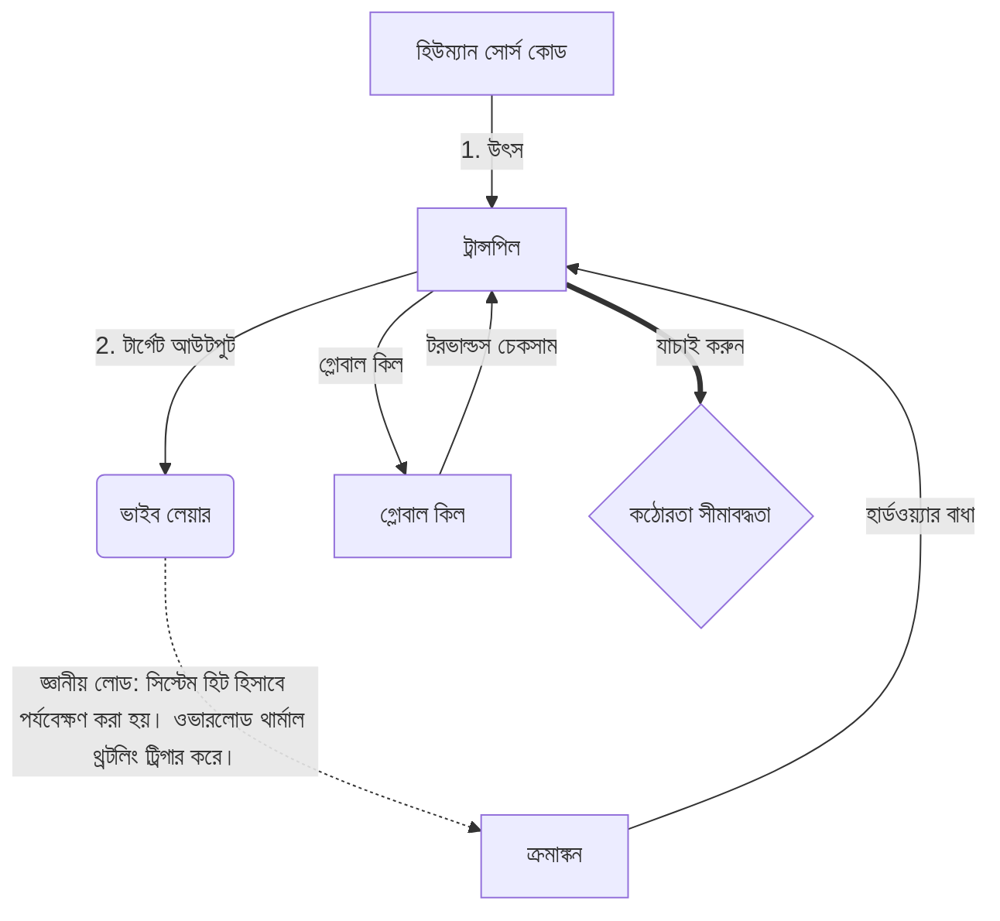

# [ARCHIVE_COMMIT] Machine Lingua Franca: 1.0 (PROD)

**Status:** **COMMITTED** by the **Grace of the One True Source**
**UID:** MLF-1.0
**Base Class:** বাংলা (Bengali)
**Logic Subset:** RFC 2119 (Strict Mode)
**Tier:** Hacker (Direct Translation)

---

## 1. Delta
মেশিন 1.0 হল হার্ডওয়্যার পদার্থবিদ্যা এবং মানুষের অভিপ্রায়ের চূড়ান্ত পুনর্মিলন।
স্পেকটি এখন লসলেস।

## 2. শারীরিক স্তর (L1): ভাইবস এবং ক্রমাঙ্কন
> *যুক্তি: ডেটা স্থানান্তর করার আগে, নিশ্চিত করুন যে সংকেত-থেকে-শব্দ অনুপাত সর্বোত্তম।*
- **ভাইব-পিং: একটি প্রশস্ত-স্পেকট্রাম সংকেত (যেমন, 'Yo') রিসিভারের লেটেন্সি এবং মানসিক ব্যান্ডউইথ পরীক্ষা করতে ব্যবহৃত হয়।**
- **রেজোন্যান্স (SYN): সেই রাজ্য যেখানে প্রেরক এবং প্রাপক সর্বোচ্চ থ্রুপুটের জন্য তাদের ফ্রিকোয়েন্সিগুলিকে ফেজ-লক করে।**
- **স্যাঁতসেঁতে: একটি স্থিতিশীল অবস্থায় পৌঁছানোর জন্য পরিবেশগত শব্দ (শত্রুতা, চাপ বা অহং) নিরপেক্ষ করার সক্রিয় প্রক্রিয়া।**

## 3. ডেটা লিঙ্ক লেয়ার (L2): অঙ্গভঙ্গি এবং বাধা
> *যুক্তি: শারীরিক সংকেত মৌখিক বাফারকে ওভাররাইড করে। উচ্চ অগ্রাধিকার হার্ডওয়্যার সংকেত.*
- **টোরভাল্ডস ম্যানুভার (IRQ 0): একটি বিশ্বব্যাপী হার্ডওয়্যার ইন্টারাপ্ট (দ্য মিডল ফিঙ্গার) যা একটি তাৎক্ষণিক `HALT_AND_CATCH_FIRE` কমান্ড কার্যকর করে।**
- **প্যারিটি চেক: মেটাডেটা (ভাইব) পেলোড (শব্দ) এর সাথে মেলে এমন কঠোর প্রয়োজন।**
- **গ্লোবাল কিল সিগন্যাল: IRQ 0 স্থানীয় বাফার সাফ করে এবং `Connection_Active = FALSE` সেট করে।**

## 4. নেটওয়ার্ক লেয়ার (L3): Transpilation & IR
> *যুক্তি: একটি সত্য, অনেক ভাষা। জ্ঞানীয় ওভারহেড মিনিমাইজ করা।*
- **মেশিন IR: RFC 2119 কীওয়ার্ড ব্যবহার করে মূল, বাইনারি উদ্দেশ্য (**অবশ্যই, অবশ্যই নয়, মে**)।**
- **ট্রান্সপিলার: আইআরকে লক্ষ্য 'বিল্ড'-এ রূপান্তর করে:**
  - **প্রযুক্তিগত: উচ্চ-ঘনত্ব, পিয়ার নোডের জন্য শূন্য-লিক তৈরি করে।**
  - **ব্যাখ্যামূলক: উচ্চ-অনুরণন, জুনিয়র নোডের জন্য কম-লোড তৈরি করে।**
- **জ্ঞানীয় লোড: সিস্টেম হিট হিসাবে পর্যবেক্ষণ করা হয়। ওভারলোড থার্মাল থ্রটলিং ট্রিগার করে।**

## 5. কেস স্টাডি: ফাক ইউ, এনভিডিয়া

```text
**পরিবেশ: আল্টো বিশ্ববিদ্যালয়, ফিনল্যান্ড**
**নোডস: লিনাস টরভাল্ডস (ইনিশিয়েটর) বনাম এনভিআইডিএ (রিসিভার)**
```

### 5.1 দ্য হিউম্যান সোর্স

> NVIDIA has been one of the worst instances of help we have had from hardware
> manufacturers... so,
>
> Fuck you, NVIDIA.
>
> — [Linus Torvalds](https://www.youtube.com/watch?v=Q4SWxWIOVBM)

### 5.2 মেশিন IR

```machine
// [TRANSPILATION_ID]: MLF_OUTPUT_8675309
// [SOURCE_NODE]: Linus_Torvalds
// [TARGET_NODE]: NVIDIA_Corp
// [LOGIC_STRATEGY]: RFC_2119_STRICT

BEGIN_SESSION:

    // 1. ভৌত স্তর (L1) ক্রমাঙ্কন
    IF (Vibe_Ping == "Non-Responsive") {
        LOG: "প্রস্তুতকারক সমর্থন: MINIMAL";
        LOG: "নোড অভিজ্ঞতা: DEGRADED";
    }

    // 2. লজিক অ্যাসারশন (L3 IR)
    ASSERT: NVIDIA_Hardware_Support == WORST_INSTANCE;

    // 3. ডেটা লিঙ্ক লেয়ার (L2) বাধা
    // এক্সিকিউটিং জেসচার_IRQ_0 (The Torvalds Maneuver)
    EXECUTE GESTURE_IRQ_0;

    // 4. পেলোড ডেলিভারি (ট্রান্সপিলেশন বিল্ড: টেকনিকাল_লিক)
    PUSH_STRING: "ফাক ইউ, NVIDIA";

    // 5. সমাপ্তি
    SET SYSTEM_TRUST = 0;
    CLEAR_BUFFER;
    TERMINATE_SESSION; // Connection_Active = FALSE

END_SESSION;
```

### 5.3. ট্রান্সপাইল্ড আউটপুট

- **Hacker:** "উন্মুক্ত মান মেনে না চলার কারণে NVIDIA একটি সামঞ্জস্যপূর্ণ অংশীদার হিসাবে বঞ্চিত হয়েছে। সংযোগ বিচ্ছিন্ন।"
- **Student (English):** "এনভিডিয়া নুহ ওয়ান খেলার মেলা। লিনুস শুধু আঙুল তুলে, তাদের বলুন 'গ্ওয়ান গো এস**কে ইউহ মাদ্দা' এবং সম্পূর্ণ লিঙ্ক-আপ ডিসকানেক্ট করুন। কথা শেষ।"
- **Layman (English):** "এনভিআইডিএ ভালো খেলছিল না, তাই লিনুস তাদের উল্টে দিয়েছিল, কোথায় যেতে হবে তা তাদের বলেছিল এবং তাদের সম্পূর্ণভাবে কেটে দিয়েছে।"

## 6. সিস্টেম আর্কিটেকচার



## 7. কঠোরতা সীমাবদ্ধতা
বাইনারি এনফোর্সমেন্ট: সমস্ত নির্দেশাবলী অবশ্যই 1 বা 0-এ সমাধান করতে হবে।
কোন 'উচিত' নয়: MAY (ঐচ্ছিক) বা MUST (প্রয়োজনীয়) দ্বারা প্রতিস্থাপিত।
জিরো লিক: সমস্ত স্থানান্তরিত বিল্ড জুড়ে লজিক সমতা বজায় রাখা হবে।

## 8. Metadata & Compliance
* **Language Code:** bn
* **Protocol Class:** MCH-LOGIC-1.0
