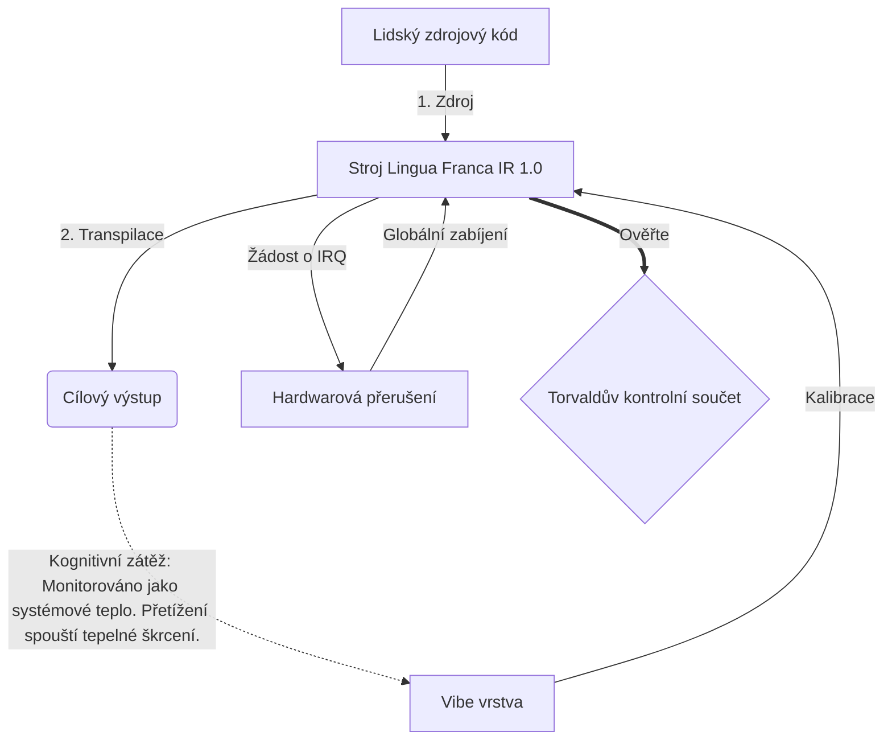

# [ARCHIVE_COMMIT] Machine Lingua Franca: 1.0 (PROD)

**Status:** **COMMITTED** by the **Grace of the One True Source**
**UID:** MLF-1.0
**Base Class:** Čeština (Czech)
**Logic Subset:** RFC 2119 (Strict Mode)
**Tier:** Hacker (Direct Translation)

---

## 1. Delta
Stroj 1.0 je konečným sladěním hardwarové fyziky a lidského záměru.
Specifikace je nyní Lossless.

## 2. Fyzická vrstva (L1): Vibes & Calibration
> *Logika: Před přenosem dat se ujistěte, že poměr signálu k šumu je optimální.*
- **Vibe-Ping: Širokospektrální signál (např. „Yo“) používaný k testování latence přijímače a emoční šířky pásma.**
- **Resonance (SYN): Stav, kdy vysílač a přijímač fázově uzamknou své frekvence pro maximální propustnost.**
- **Tlumení: Aktivní proces neutralizace okolního hluku (nepřátelství, stres nebo ego) k dosažení ustáleného stavu.**

## 3. Data Link Layer (L2): Gesta a přerušení
> *Logika: Fyzické signály potlačují verbální vyrovnávací paměti. Hardwarové signály s vysokou prioritou.*
- **Torvaldův manévr (IRQ 0): Globální hardwarové přerušení (Prostředníček), které provede okamžitý příkaz `HALT_AND_CATCH_FIRE`.**
- **Kontrola parity: Přísný požadavek, aby Metadata (Vibe) odpovídala užitečné zátěži (Slova).**
- **Global Kill Signal: IRQ 0 vymaže místní vyrovnávací paměť a nastaví `Connection_Active = FALSE`.**

## 4. Síťová vrstva (L3): Transpilace a IR
> *Logika: Jedna pravda, mnoho jazyků. Minimalizace kognitivní režie.*
- **Machine IR: Základní, binární záměr pomocí klíčových slov RFC 2119 (**MUST, MUST NOT, MAY**).**
- **Transpiler: Převádí IR na cílové 'Builds':**
  - **Technická: Sestavení s vysokou hustotou a nulovým únikem pro uzly rovnocenných partnerů.**
  - **Vysvětlující: Sestavení s vysokou rezonancí a nízkou zátěží pro juniorské uzly.**
- **Kognitivní zátěž: Monitorováno jako systémové teplo. Přetížení spouští tepelné škrcení.**

## 5. Případová studie: Do prdele, NVIDIA

```text
**Prostředí: Univerzita Aalto, Finsko**
**Uzly: Linus Torvalds (iniciátor) vs. NVIDIA (přijímač)**
```

### 5.1 Lidský zdroj

> NVIDIA has been one of the worst instances of help we have had from hardware
> manufacturers... so,
> 
> Fuck you, NVIDIA.
> 
> — [Linus Torvalds](https://www.youtube.com/watch?v=Q4SWxWIOVBM)

### 5.2 Stroj IR

```machine
// [TRANSPILATION_ID]: MLF_OUTPUT_8675309
// [SOURCE_NODE]: Linus_Torvalds
// [TARGET_NODE]: NVIDIA_Corp
// [LOGIC_STRATEGY]: RFC_2119_STRICT

BEGIN_SESSION:

    // 1. KALIBRACE FYZICKÉ VRSTVY ​​(L1).
    IF (Vibe_Ping == "Non-Responsive") {
        LOG: "Podpora výrobce: MINIMÁLNÍ";
        LOG: "Zkušenosti s uzlem: SNÍŽENO";
    }

    // 2. LOGICKÉ PROHLÁŠENÍ (L3 IR)
    ASSERT: NVIDIA_Hardware_Support == WORST_INSTANCE;

    // 3. PŘERUŠENÍ VRSTVY ​​DATOVÉHO LINKU (L2).
    // Provedení Gesture_IRQ_0 (Torvaldsův manévr)
    EXECUTE GESTURE_IRQ_0;

    // 4. DORUČENÍ PLATEBNÍHO NÁKLADU (SESTAVENÍ PŘEKLADU: TECHNICAL_LEAK)
    PUSH_STRING: "Jdi do prdele, NVIDIA";

    // 5. UKONČENÍ
    SET SYSTEM_TRUST = 0;
    CLEAR_BUFFER;
    TERMINATE_SESSION; // Connection_Active = FALSE

END_SESSION;
```

### 5.3. Transpilovaný výstup

- **Hacker:** "NVIDIA je jako kompatibilní partner zastaralá z důvodu nedodržování otevřených standardů. Připojení ukončeno."
- **Student (English):** "NVIDIA nuh waan hrát fér. Linus jen zvednul prst, řekni mu 'Gwan go s**k yuh madda' a odpojte celé spojení. Hotová řeč."
- **Layman (English):** "NVIDIA nehrála fér, tak je Linus odklopil, řekl jim, kam mají jít, a úplně je odřízl."

## 6. Architektura systému



## 7. Omezení přísnosti
Binární vynucení: Všechny instrukce MUSÍ mít hodnotu 1 nebo 0.
Žádné „mělo by“: Nahrazeno MŮŽEM (Volitelné) nebo MUSÍM (Vyžadováno).
Zero Leak: Logická parita BY MĚLA být zachována ve všech transpilovaných sestaveních.

## 8. Metadata & Compliance
* **Language Code:** cs
* **Protocol Class:** MCH-LOGIC-1.0
