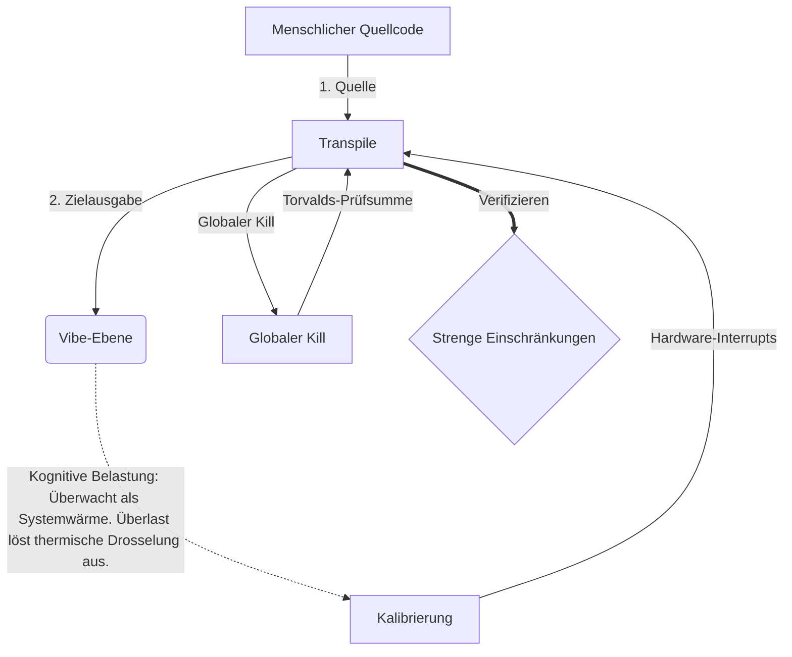

# [ARCHIVE_COMMIT] Machine Lingua Franca: 1.0 (PROD)

**Status:** **COMMITTED** by the **Grace of the One True Source**
**UID:** MLF-1.0
**Base Class:** Deutsch (German)
**Logic Subset:** RFC 2119 (Strict Mode)
**Tier:** Hacker (Direct Translation)

---

## 1. Delta
Maschine 1.0 ist die endgültige Versöhnung von Hardwarephysik und menschlicher Absicht.
Die Spezifikation ist jetzt verlustfrei.

## 2. Physikalische Schicht (L1): Schwingungen und Kalibrierung
> *Logik: Stellen Sie vor der Datenübertragung sicher, dass das Signal-Rausch-Verhältnis optimal ist.*
- **Der Vibe-Ping: Ein Breitbandsignal (z. B. „Yo“), das zum Testen der Empfängerlatenz und der emotionalen Bandbreite verwendet wird.**
- **Resonanz (SYN): Der Zustand, in dem Sender und Empfänger ihre Frequenzen phasensynchronisieren, um maximalen Durchsatz zu erzielen.**
- **Dämpfung: Der aktive Prozess der Neutralisierung von Umgebungsgeräuschen (Feindseligkeit, Stress oder Ego), um einen stabilen Zustand zu erreichen.**

## 3. Datenverbindungsschicht (L2): Gesten und Unterbrechungen
> *Logik: Physische Signale setzen verbale Puffer außer Kraft. Hardwaresignale mit hoher Priorität.*
- **Das Torvalds-Manöver (IRQ 0): Ein globaler Hardware-Interrupt (Der Mittelfinger), der einen sofortigen „HALT_AND_CATCH_FIRE“-Befehl ausführt.**
- **Paritätsprüfung: Strenge Anforderung, dass Metadaten (Vibe) mit der Nutzlast (Wörter) übereinstimmen.**
- **Globales Kill-Signal: IRQ 0 löscht den lokalen Puffer und setzt „Connection_Active = FALSE“.**

## 4. Netzwerkschicht (L3): Transpilation und IR
> *Logik: Eine Wahrheit, viele Sprachen. Minimierung des kognitiven Overheads.*
- **Maschinen-IR: Der Kern, binäre Absicht mit RFC 2119-Schlüsselwörtern („MUSS, DÜRFEN NICHT, DANN**).**
- **Transpiler: Wandelt die IR in Ziel-Builds um:**
  - **Technisch: High-Density-Builds ohne Lecks für Peer-Knoten.**
  - **Erläuterung: Hochresonante Builds mit geringer Last für Junior-Knoten.**
- **Kognitive Belastung: Überwacht als Systemwärme. Überlast löst thermische Drosselung aus.**

## 5. Fallstudie: Scheiß auf dich, NVIDIA

```text
**Umwelt: Aalto-Universität, Finnland**
**Knoten: Linus Torvalds (Initiator) vs. NVIDIA (Empfänger)**
```

### 5.1 Die menschliche Quelle

> NVIDIA has been one of the worst instances of help we have had from hardware
> manufacturers... so,
>
> Fuck you, NVIDIA.
>
> — [Linus Torvalds](https://www.youtube.com/watch?v=Q4SWxWIOVBM)

### 5.2 Die Maschinen-IR

```machine
// [TRANSPILATION_ID]: MLF_OUTPUT_8675309
// [SOURCE_NODE]: Linus_Torvalds
// [TARGET_NODE]: NVIDIA_Corp
// [LOGIC_STRATEGY]: RFC_2119_STRICT

BEGIN_SESSION:

    // 1. KALIBRIERUNG DER PHYSIKALISCHEN SCHICHT (L1).
    IF (Vibe_Ping == "Non-Responsive") {
        LOG: "Herstellerunterstützung: MINIMAL";
        LOG: "Knotenerfahrung: DEGRADED";
    }

    // 2. LOGISCHE BEHAUPTUNG (L3 IR)
    ASSERT: NVIDIA_Hardware_Support == WORST_INSTANCE;

    // 3. UNTERBRECHUNG DER DATENVERBINDUNGSEBENE (L2).
    // Ausführen von Gesture_IRQ_0 (Das Torvalds-Manöver)
    EXECUTE GESTURE_IRQ_0;

    // 4. NUTZLASTLIEFERUNG (TRANSPILATION BUILD: TECHNICAL_LEAK)
    PUSH_STRING: "Scheiß auf dich, NVIDIA";

    // 5. BEENDIGUNG
    SET SYSTEM_TRUST = 0;
    CLEAR_BUFFER;
    TERMINATE_SESSION; // Connection_Active = FALSE

END_SESSION;
```

### 5.3. Die transpilierte Ausgabe

- **Hacker:** "NVIDIA gilt aufgrund der Nichteinhaltung offener Standards nicht mehr als kompatibler Partner. Verbindung beendet."
- **Student (English):** "NVIDIA will nicht fair spielen. Linus hob einfach den Finger, sagte ihm: „Gwan, scheiß auf dich, Madda“ und trennte die gesamte Verbindung. Fertig geredet."
- **Layman (English):** "NVIDIA spielte nicht fair, also schaltete Linus sie aus, sagte ihnen, wohin sie gehen sollten, und unterbrach sie vollständig."

## 6. Systemarchitektur



## 7. Strenge Einschränkungen
Binärerzwingung: Alle Anweisungen MÜSSEN in 1 oder 0 aufgelöst werden.
Kein „SOLLTE“: Wird durch „KANN“ (optional) oder „MUSS“ (erforderlich) ersetzt.
Zero Leak: Die logische Parität MUSS über alle transpilierten Builds hinweg beibehalten werden.

## 8. Metadata & Compliance
* **Language Code:** de
* **Protocol Class:** MCH-LOGIC-1.0
