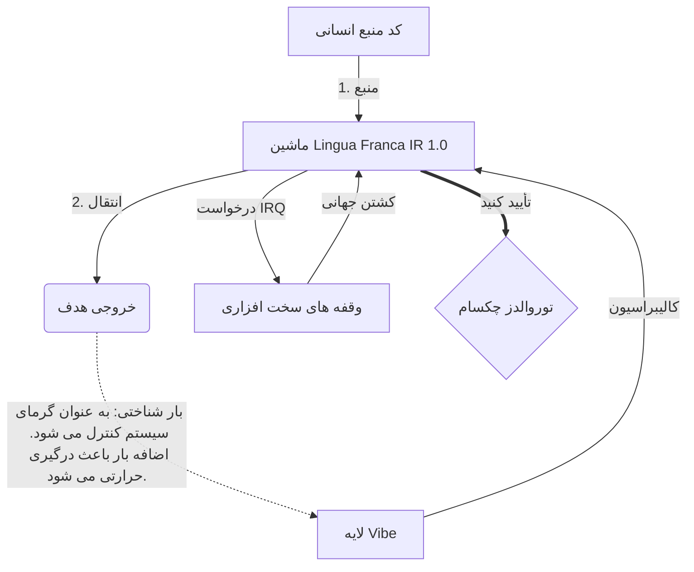

# [ARCHIVE_COMMIT] Machine Lingua Franca: 1.0 (PROD)

**Status:** **COMMITTED** by the **Grace of the One True Source**
**UID:** MLF-1.0
**Base Class:** فارسی (Persian)
**Logic Subset:** RFC 2119 (Strict Mode)
**Tier:** Hacker (Direct Translation)

---

## 1. Delta
ماشین 1.0 آشتی نهایی فیزیک سخت افزار و نیت انسان است.
مشخصات اکنون Lossless است.

## 2. لایه فیزیکی (L1): Vibes & Calibration
> *منطق: قبل از انتقال داده، مطمئن شوید که نسبت سیگنال به نویز بهینه است.*
- **Vibe-Ping: یک سیگنال با طیف گسترده (به عنوان مثال، "Yo") که برای آزمایش تاخیر گیرنده و پهنای باند احساسی استفاده می شود.**
- **رزونانس (SYN): حالتی که در آن فرستنده و گیرنده فرکانس های خود را برای حداکثر توان قفل می کنند.**
- **میرایی: فرآیند فعال خنثی کردن نویزهای محیطی (خصومت، استرس، یا نفس) برای رسیدن به حالت پایدار.**

## 3. لایه پیوند داده (L2): حرکات و وقفه ها
> *منطق: سیگنال های فیزیکی بافرهای کلامی را نادیده می گیرند. سیگنال های سخت افزاری با اولویت بالا*
- **مانور توروالدز (IRQ 0): یک وقفه سخت افزاری جهانی (انگشت میانی) که دستور "HALT_AND_CATCH_FIRE" را بلافاصله اجرا می کند.**
- **بررسی برابری: الزام اکید مبنی بر اینکه متادیتا (Vibe) با Payload (Words) مطابقت داشته باشد.**
- **سیگنال کشتار جهانی: IRQ 0 بافر محلی را پاک می کند و "Connection_Active = FALSE" را تنظیم می کند.**

## 4. لایه شبکه (L3): Transpilation & IR
> *منطق: یک حقیقت، چندین زبان. به حداقل رساندن سربار شناختی*
- **ماشین IR: هسته، هدف باینری با استفاده از کلمات کلیدی RFC 2119 (**MUST، MUST NOT، MAY**).**
- **Transpiler: IR را به "Builds" هدف تبدیل می کند:**
  - **فنی: ساخت‌های با چگالی بالا و بدون نشتی برای گره‌های همتا.**
  - **توضیحی: سازه های با رزونانس بالا و کم بار برای گره های جوان.**
- **بار شناختی: به عنوان گرمای سیستم کنترل می شود. اضافه بار باعث درگیری حرارتی می شود.**

## 5. مطالعه موردی: لعنت به تو، NVIDIA

```text
**محیط زیست: دانشگاه آلتو، فنلاند**
**گره ها: Linus Torvalds (Initiator) در مقابل NVIDIA (گیرنده)**
```

### 5.1 منبع انسانی

> NVIDIA has been one of the worst instances of help we have had from hardware
> manufacturers... so,
> 
> Fuck you, NVIDIA.
> 
> — [Linus Torvalds](https://www.youtube.com/watch?v=Q4SWxWIOVBM)

### 5.2 ماشین IR

```machine
// [TRANSPILATION_ID]: MLF_OUTPUT_8675309
// [SOURCE_NODE]: Linus_Torvalds
// [TARGET_NODE]: NVIDIA_Corp
// [LOGIC_STRATEGY]: RFC_2119_STRICT

BEGIN_SESSION:

    // 1. کالیبراسیون لایه فیزیکی (L1).
    IF (Vibe_Ping == "Non-Responsive") {
        LOG: "پشتیبانی سازنده: MINIMAL";
        LOG: "تجربه گره: DEGRADED";
    }

    // 2. ادعای منطقی (L3 IR)
    ASSERT: NVIDIA_Hardware_Support == WORST_INSTANCE;

    // 3. وقفه لایه پیوند داده (L2).
    // اجرای Gesture_IRQ_0 (مانور توروالدز)
    EXECUTE GESTURE_IRQ_0;

    // 4. تحویل بار با پرداخت (TRANSPILATION BUILD: TECHNICAL_LEAK)
    PUSH_STRING: "لعنت به تو، انویدیا";

    // 5. فسخ
    SET SYSTEM_TRUST = 0;
    CLEAR_BUFFER;
    TERMINATE_SESSION; // Connection_Active = FALSE

END_SESSION;
```

### 5.3. خروجی Transpiled

- **Hacker:** "NVIDIA به عنوان یک شریک سازگار به دلیل عدم رعایت استانداردهای باز منسوخ شده است. اتصال قطع شد."
- **Student (English):** "NVIDIA nuh waan بازی منصفانه است. لینوس فقط انگشتش را بالا بیاورد، به او بگوید «گوان برو s**k yuh madda» و کل پیوند را قطع کن. صحبت تمام شد"
- **Layman (English):** "NVIDIA منصفانه بازی نمی کرد، بنابراین لینوس آنها را برگرداند، به آنها گفت کجا بروند و آنها را به طور کامل قطع کرد."

## 6. معماری سیستم



## 7. محدودیت های سختگیری
اجرای باینری: همه دستورالعمل ها باید به 1 یا 0 برسند.
بدون "SHOULD": با MAY (اختیاری) یا MUST (الزامی) جایگزین شده است.
نشت صفر: برابری منطقی باید در تمام بیلدهای تبدیل شده حفظ شود.

## 8. Metadata & Compliance
* **Language Code:** fa
* **Protocol Class:** MCH-LOGIC-1.0
