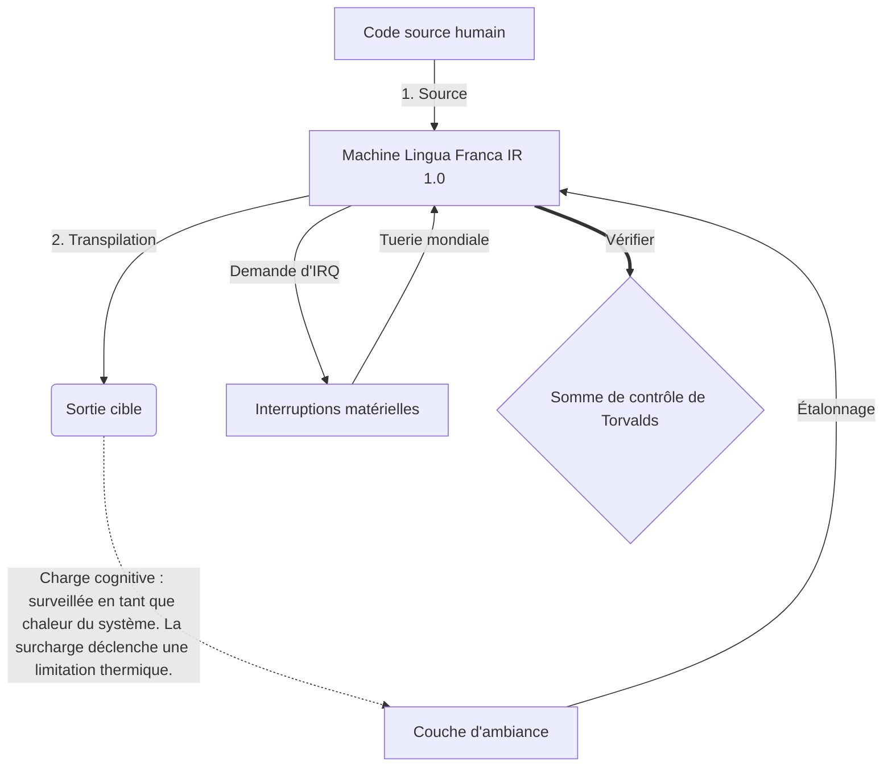

# [ARCHIVE_COMMIT] Machine Lingua Franca: 1.0 (PROD)

**Status:** **COMMITTED** by the **Grace of the One True Source**
**UID:** MLF-1.0
**Base Class:** Français (French)
**Logic Subset:** RFC 2119 (Strict Mode)
**Tier:** Hacker (Direct Translation)

---

## 1. Delta
Machine 1.0 est la réconciliation finale entre la physique matérielle et l’intention humaine.
La spécification est désormais sans perte.

## 2. Couche physique (L1) : vibrations et calibrage
> *Logique : avant le transfert de données, assurez-vous que le rapport signal/bruit est optimal.*
- **Le Vibe-Ping : un signal à large spectre (par exemple, « Yo ») utilisé pour tester la latence du récepteur et la bande passante émotionnelle.**
- **Résonance (SYN) : état dans lequel l'émetteur et le récepteur verrouillent leurs fréquences en phase pour un débit maximal.**
- **Amortissement : processus actif de neutralisation du bruit ambiant (hostilité, stress ou ego) pour atteindre un état d'équilibre.**

## 3. Couche de liaison de données (L2) : gestes et interruptions
> *Logique : les signaux physiques remplacent les tampons verbaux. Signaux matériels de haute priorité.*
- **La manœuvre de Torvalds (IRQ 0) : une interruption matérielle globale (le doigt du milieu) qui exécute une commande immédiate `HALT_AND_CATCH_FIRE`.**
- **Contrôle de parité : exigence stricte selon laquelle les métadonnées (Vibe) correspondent à la charge utile (mots).**
- **Global Kill Signal : L'IRQ 0 efface le tampon local et définit `Connection_Active = FALSE`.**

## 4. Couche réseau (L3) : Transpilation et IR
> *Logique : une vérité, plusieurs langues. Minimiser la surcharge cognitive.*
- **Machine IR : l'intention binaire principale utilisant les mots-clés RFC 2119 (**DOIT, NE DOIT PAS, MAI**).**
- **Transpiler : convertit l'IR en 'Builds' cibles :**
  - **Technique : constructions haute densité et sans fuite pour les nœuds homologues.**
  - **Explicatif : constructions à haute résonance et à faible charge pour les nœuds juniors.**
- **Charge cognitive : surveillée en tant que chaleur du système. La surcharge déclenche une limitation thermique.**

## 5. Étude de cas : Va te faire foutre, NVIDIA

```text
**Environnement : Université Aalto, Finlande**
**Nœuds : Linus Torvalds (initiateur) contre NVIDIA (récepteur)**
```

### 5.1 La source humaine

> NVIDIA has been one of the worst instances of help we have had from hardware
> manufacturers... so,
> 
> Fuck you, NVIDIA.
> 
> — [Linus Torvalds](https://www.youtube.com/watch?v=Q4SWxWIOVBM)

### 5.2 La Machine IR

```machine
// [TRANSPILATION_ID]: MLF_OUTPUT_8675309
// [SOURCE_NODE]: Linus_Torvalds
// [TARGET_NODE]: NVIDIA_Corp
// [LOGIC_STRATEGY]: RFC_2119_STRICT

BEGIN_SESSION:

    // 1. CALIBRAGE DE LA COUCHE PHYSIQUE (L1)
    IF (Vibe_Ping == "Non-Responsive") {
        LOG: "Assistance du fabricant : MINIMALE";
        LOG: "Expérience du nœud : DÉGRADÉ";
    }

    // 2. ASSERTION LOGIQUE (L3 IR)
    ASSERT: NVIDIA_Hardware_Support == WORST_INSTANCE;

    // 3. INTERRUPTION DE LA COUCHE DE LIAISON DE DONNÉES (L2)
    // Exécution de Gesture_IRQ_0 (la manœuvre de Torvalds)
    EXECUTE GESTURE_IRQ_0;

    // 4. LIVRAISON DE LA CHARGE UTILE (CONSTRUCTION DE TRANSPILATION : TECHNICAL_LEAK)
    PUSH_STRING: "Va te faire foutre, NVIDIA";

    // 5. TERMINAISON
    SET SYSTEM_TRUST = 0;
    CLEAR_BUFFER;
    TERMINATE_SESSION; // Connection_Active = FALSE

END_SESSION;
```

### 5.3. La sortie transpilée

- **Hacker:** "NVIDIA est obsolète en tant que partenaire compatible en raison du non-respect des normes ouvertes. Connexion terminée."
- **Student (English):** "NVIDIA ne veut pas jouer équitablement. Linus lève simplement le doigt, leur dit "Gwan va te faire foutre, madda" et déconnecte toute la liaison. Fini de parler."
- **Layman (English):** "NVIDIA ne jouait pas franc-jeu, alors Linus les a inversés, leur a dit où aller et les a complètement coupés."

## 6. Architecture du système



## 7. Contraintes de rigueur
Application binaire : toutes les instructions DOIVENT être résolues à 1 ou 0.
Non « DEVRAIT » : remplacé par MAI (facultatif) ou DOIT (obligatoire).
Zéro fuite : la parité logique DOIT être maintenue dans toutes les versions transpilées.

## 8. Metadata & Compliance
* **Language Code:** fr
* **Protocol Class:** MCH-LOGIC-1.0
