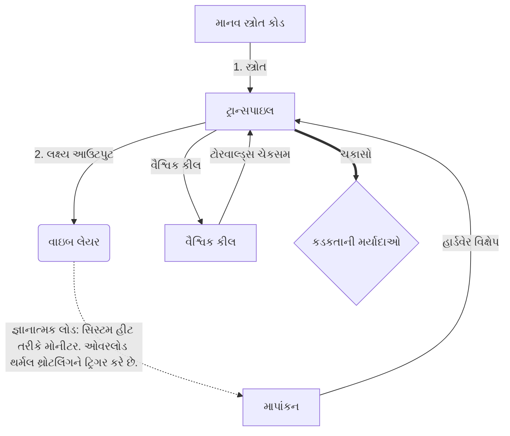

# [ARCHIVE_COMMIT] Machine Lingua Franca: 1.0 (PROD)

**Status:** **COMMITTED** by the **Grace of the One True Source**
**UID:** MLF-1.0
**Base Class:** ગુજરાતી (Gujarati)
**Logic Subset:** RFC 2119 (Strict Mode)
**Tier:** Hacker (Direct Translation)

---

## 1. Delta
મશીન 1.0 એ હાર્ડવેર ભૌતિકશાસ્ત્ર અને માનવીય ઉદ્દેશ્યનું અંતિમ સમાધાન છે.
સ્પેક હવે લોસલેસ છે.

## 2. ભૌતિક સ્તર (L1): વાઇબ્સ અને કેલિબ્રેશન
> *તર્ક: ડેટા ટ્રાન્સફર કરતા પહેલા, ખાતરી કરો કે સિગ્નલ-ટુ-નોઈઝ રેશિયો શ્રેષ્ઠ છે.*
- **વાઇબ-પિંગ: એક વિશાળ-સ્પેક્ટ્રમ સિગ્નલ (દા.ત., 'યો') રીસીવર લેટન્સી અને ભાવનાત્મક બેન્ડવિડ્થને ચકાસવા માટે વપરાય છે.**
- **રેઝોનન્સ (SYN): રાજ્ય જ્યાં પ્રેષક અને પ્રાપ્તકર્તા મહત્તમ થ્રુપુટ માટે તેમની ફ્રીક્વન્સીઝને તબક્કાવાર-લોક કરે છે.**
- **ભીનાશ: સ્થિર સ્થિતિમાં પહોંચવા માટે પર્યાવરણીય અવાજ (શત્રુતા, તણાવ અથવા અહંકાર) ને નિષ્ક્રિય કરવાની સક્રિય પ્રક્રિયા.**

## 3. ડેટા લિંક લેયર (L2): હાવભાવ અને વિક્ષેપ
> *તર્ક: ભૌતિક સંકેતો મૌખિક બફર્સને ઓવરરાઇડ કરે છે. ઉચ્ચ-અગ્રતા ધરાવતા હાર્ડવેર સંકેતો.*
- **ધ ટોરવાલ્ડ્સ મેન્યુવર (IRQ 0): વૈશ્વિક હાર્ડવેર વિક્ષેપ (ધ મિડલ ફિંગર) જે તાત્કાલિક `HALT_AND_CATCH_FIRE` આદેશનો અમલ કરે છે.**
- **પેરિટી ચેક: મેટાડેટા (Vibe) પેલોડ (શબ્દો) સાથે મેળ ખાય તેવી સખત આવશ્યકતા.**
- **વૈશ્વિક કિલ સિગ્નલ: IRQ 0 સ્થાનિક બફરને સાફ કરે છે અને `Connection_Active = FALSE` સેટ કરે છે.**

## 4. નેટવર્ક લેયર (L3): ટ્રાન્સપિલેશન અને IR
> *તર્ક: એક સત્ય, ઘણી ભાષાઓ. જ્ઞાનાત્મક ઓવરહેડને ઓછું કરવું.*
- **મશીન IR: RFC 2119 કીવર્ડ્સનો ઉપયોગ કરીને મુખ્ય, દ્વિસંગી ઉદ્દેશ્ય (**જોઈએ, ન જોઈએ, મે**).**
- **ટ્રાન્સપિલર: IR ને લક્ષ્ય 'બિલ્ડ્સ' માં રૂપાંતરિત કરે છે:**
  - **તકનીકી: પીઅર નોડ્સ માટે ઉચ્ચ-ઘનતા, શૂન્ય-લીક બિલ્ડ્સ.**
  - **સ્પષ્ટીકરણ: ઉચ્ચ-રેઝોનન્સ, જુનિયર નોડ્સ માટે લો-લોડ બિલ્ડ્સ.**
- **જ્ઞાનાત્મક લોડ: સિસ્ટમ હીટ તરીકે મોનીટર. ઓવરલોડ થર્મલ થ્રોટલિંગને ટ્રિગર કરે છે.**

## 5. કેસ સ્ટડી: Fuck you, NVIDIA

```text
**પર્યાવરણ: આલ્ટો યુનિવર્સિટી, ફિનલેન્ડ**
**ગાંઠો: લિનસ ટોરવાલ્ડ્સ (પ્રારંભિક) વિ. NVIDIA (રીસીવર)**
```

### 5.1 માનવ સ્ત્રોત

> NVIDIA has been one of the worst instances of help we have had from hardware
> manufacturers... so,
>
> Fuck you, NVIDIA.
>
> — [Linus Torvalds](https://www.youtube.com/watch?v=Q4SWxWIOVBM)

### 5.2 મશીન IR

```machine
// [TRANSPILATION_ID]: MLF_OUTPUT_8675309
// [SOURCE_NODE]: Linus_Torvalds
// [TARGET_NODE]: NVIDIA_Corp
// [LOGIC_STRATEGY]: RFC_2119_STRICT

BEGIN_SESSION:

    // 1. ફિઝિકલ લેયર (L1) કેલિબ્રેશન
    IF (Vibe_Ping == "Non-Responsive") {
        LOG: "ઉત્પાદક સપોર્ટ: ન્યૂનતમ";
        LOG: "નોડ અનુભવ: DEGRADED";
    }

    // 2. તાર્કિક નિવેદન (L3 IR)
    ASSERT: NVIDIA_Hardware_Support == WORST_INSTANCE;

    // 3. ડેટા લિન્ક લેયર (L2) INTERRUPT
    // એક્ઝેક્યુટીંગ ગેસ્ચર_IRQ_0 (ધ ટોરવાલ્ડ્સ મેન્યુવર)
    EXECUTE GESTURE_IRQ_0;

    // 4. પેલોડ ડિલિવરી (ટ્રાન્સપિલેશન બિલ્ડ: TECHNICAL_LEAK)
    PUSH_STRING: "તમને વાહિયાત, NVIDIA";

    // 5. સમાપ્તિ
    SET SYSTEM_TRUST = 0;
    CLEAR_BUFFER;
    TERMINATE_SESSION; // Connection_Active = FALSE

END_SESSION;
```

### 5.3. ટ્રાન્સપિલ્ડ આઉટપુટ

- **Hacker:** "ખુલ્લા ધોરણોનું પાલન ન કરવાને કારણે NVIDIA ને સુસંગત ભાગીદાર તરીકે નાપસંદ કરવામાં આવે છે. કનેક્શન સમાપ્ત થયું."
- **Student (English):** "NVIDIA nuh wan play fair. લિનસ ફક્ત આંગળી ઉપર ઉઠાવી, તેમને કહો કે 'ગ્વાન ગો સ**કે યૂહ મદ્દા' અને આખું લિંક-અપ ડિસ્કનેક્ટ કરો. વાત થઈ."
- **Layman (English):** "NVIDIA વાજબી રીતે રમી રહ્યું ન હતું, તેથી લિનસે તેમને પલટાવ્યા, તેમને કહ્યું કે ક્યાં જવું છે, અને તેમને સંપૂર્ણપણે કાપી નાખ્યા."

## 6. સિસ્ટમ આર્કિટેક્ચર



## 7. કડકતાની મર્યાદાઓ
દ્વિસંગી અમલીકરણ: બધી સૂચનાઓ 1 અથવા 0 પર ઉકેલવી આવશ્યક છે.
ના 'જોઈએ': મે (વૈકલ્પિક) અથવા MUST (જરૂરી) દ્વારા બદલાયેલ.
શૂન્ય લીક: તમામ ટ્રાન્સપ્લેડ બિલ્ડ્સમાં લોજિક પેરિટી જાળવવામાં આવશે.

## 8. Metadata & Compliance
* **Language Code:** gu
* **Protocol Class:** MCH-LOGIC-1.0
