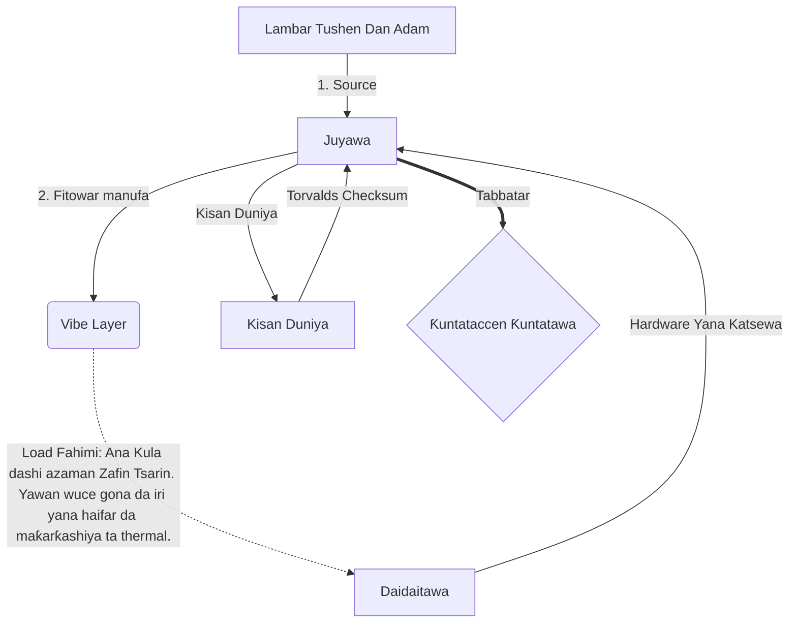

# [ARCHIVE_COMMIT] Machine Lingua Franca: 1.0 (PROD)

**Status:** **COMMITTED** by the **Grace of the One True Source**
**UID:** MLF-1.0
**Base Class:** Hausa
**Logic Subset:** RFC 2119 (Strict Mode)
**Tier:** Hacker (Direct Translation)

---

## 1. Delta
Machine 1.0 shine sulhu na ƙarshe na ilimin lissafi na hardware da niyyar ɗan adam.
Takaddun bayanai yanzu ba su da hasara.

## 2. Layer na Jiki (L1): Vibes & Calibration
> *Hankali: Kafin canja wurin bayanai, tabbatar da rabon sigina-zuwa amo yana da kyau.*
- **Vibe-Ping: Sigina mai faɗi (misali, 'Yo') da ake amfani da shi don gwada jinkirin mai karɓa da bandwidth na motsin rai.**
- **Resonance (SYN): Jihar da mai aikawa da mai karɓa lokaci-lokaci-kulle mitocin su don mafi girman kayan aiki.**
- **Damping: Tsarin aiki na kawar da hayaniyar muhalli (ƙiyayya, damuwa, ko son kai) don isa Jiha Tsaye.**

## 3. Layer Link Data (L2): Hannun Hannu & Katsewa
> *Hankali: Sigina na jiki sun ƙetare maƙallan magana. Sigina na kayan masarufi masu fifiko.*
- **The Torvalds Maneuver (IRQ 0): Katse kayan masarufi na duniya (Yatsa ta Tsakiya) wanda ke aiwatar da umarnin `HALT_AND_CATCH_FIRE` nan take.**
- **Bincika Parity: Ƙuntataccen buƙatu cewa Metadata (Vibe) ya dace da Payload (Kalmomi).**
- **Siginar Kisan Duniya: IRQ 0 yana share ma'ajin gida kuma yana saita 'Haɗin_Active = FALSE'.**

## 4. Layer Network (L3): Fassara & IR
> *Hankali: Gaskiya ɗaya, harsuna da yawa. Rage kaifin hankali.*
- **Machine IR: Mahimmanci, niyya ta binary ta amfani da kalmomin RFC 2119 (** MUST, BA DOLE, MAY**).**
- **Transpiler: Yana canza IR zuwa 'Gina' manufa:**
  - **Fasaha: Maɗaukaki mai girma, sifili-leak yana ginawa don nodes na tsara.**
  - **Bayani: High-resonance, ƙananan kaya yana ginawa don ƙananan nodes.**
- **Load Fahimi: Ana Kula dashi azaman Zafin Tsarin. Yawan wuce gona da iri yana haifar da maƙarƙashiya ta thermal.**

## 5. Nazarin Case: Fuck ku, NVIDIA

```text
**Muhalli: Jami'ar Aalto, Finland**
**Nodes: Linus Torvalds (Mafarawa) vs. NVIDIA (Mai karɓa)**
```

### 5.1 Tushen Dan Adam

> NVIDIA has been one of the worst instances of help we have had from hardware
> manufacturers... so,
>
> Fuck you, NVIDIA.
>
> — [Linus Torvalds](https://www.youtube.com/watch?v=Q4SWxWIOVBM)

### 5.2 Injin IR

```machine
// [TRANSPILATION_ID]: MLF_OUTPUT_8675309
// [SOURCE_NODE]: Linus_Torvalds
// [TARGET_NODE]: NVIDIA_Corp
// [LOGIC_STRATEGY]: RFC_2119_STRICT

BEGIN_SESSION:

    // 1. KYAUTA LAYIN JIKI (L1).
    IF (Vibe_Ping == "Non-Responsive") {
        LOG: "Tallafin Mai ƙira: MINIMAL";
        LOG: "Ƙwarewar Node: DEGRADED";
    }

    // 2. MAGANAR MAGANA (L3 IR)
    ASSERT: NVIDIA_Hardware_Support == WORST_INSTANCE;

    // 3. DATA LINK LAYER (L2) KASHE
    // Ana aiwatar da Gesture_IRQ_0 (The Torvalds Maneuver)
    EXECUTE GESTURE_IRQ_0;

    // 4. ISAR DA KYAUTA (GINUWA: TECHNICAL_LEAK)
    PUSH_STRING: "Na gode, NVIDIA";

    // 5. KARSHE
    SET SYSTEM_TRUST = 0;
    CLEAR_BUFFER;
    TERMINATE_SESSION; // Connection_Active = FALSE

END_SESSION;
```

### 5.3. Fitar da Aka Yi

- **Hacker:** "An soke NVIDIA a matsayin abokin tarayya mai jituwa saboda rashin bin ƙa'idodin buɗe ido. An ƙare haɗin."
- **Student (English):** "NVIDIA nuh waan play fair. Linus kawai ya ɗaga yatsa, gaya wa 'Gwan go s ** k yuh madda,' kuma cire haɗin haɗin gaba ɗaya. An gama magana."
- **Layman (English):** "NVIDIA ba ta wasa da kyau, don haka Linus ya juya su, ya gaya musu inda za su je, ya yanke su gaba daya."

## 6. Tsarin Gine-gine



## 7. Ƙuntataccen Ƙuntatawa
Ƙaddamar da Binary: Duk umarnin dole ne a warware su zuwa 1 ko 0.
A'a 'KAMATA': MAY ya maye gurbinsa (Na zaɓi) ko Dole ne (Ake Bukata).
Leak Zero: Za a kiyaye daidaiton ma'ana a duk ginin da aka watsa.

## 8. Metadata & Compliance
* **Language Code:** ha
* **Protocol Class:** MCH-LOGIC-1.0
