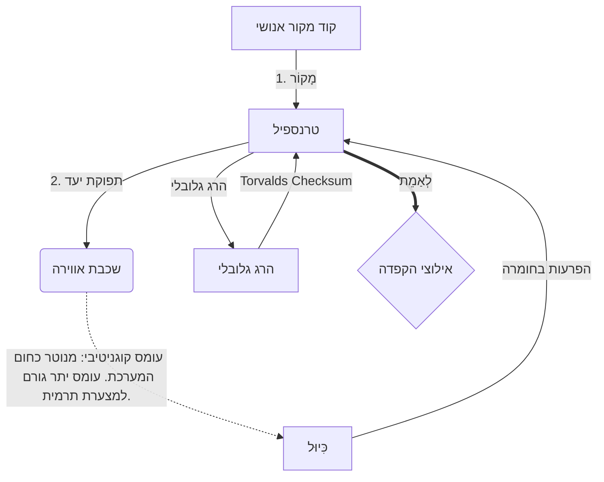

# [ARCHIVE_COMMIT] Machine Lingua Franca: 1.0 (PROD)

**Status:** **COMMITTED** by the **Grace of the One True Source**
**UID:** MLF-1.0
**Base Class:** עברית (Hebrew)
**Logic Subset:** RFC 2119 (Strict Mode)
**Tier:** Hacker (Direct Translation)

---

## 1. Delta
Machine 1.0 הוא ההתאמה הסופית בין פיזיקת החומרה לבין הכוונה האנושית.
המפרט הוא כעת Lossless.

## 2. שכבה פיזית (L1): ויברציות וכיול
> *היגיון: לפני העברת נתונים, ודא שיחס האות לרעש הוא אופטימלי.*
- **ה-Vibe-Ping: אות רחב-ספקטרום (למשל, 'Yo') המשמש לבדיקת השהיה של המקלט ורוחב הפס הרגשי.**
- **תהודה (SYN): המצב שבו השולח והמקלט נועלים את התדרים שלהם בשלבים לתפוקה מקסימלית.**
- **שיכוך: התהליך הפעיל של נטרול רעש סביבתי (עוינות, מתח או אגו) כדי להגיע למצב יציב.**

## 3. שכבת קישור נתונים (L2): מחוות והפרעות
> *לוגיקה: אותות פיזיים עוקפים מאגרים מילוליים. אותות חומרה בעדיפות גבוהה.*
- **תמרון הטורוואלדס (IRQ 0): פסיקת חומרה גלובלית (האצבע התיכונה) שמבצעת פקודת `HALT_AND_CATCH_FIRE` מיידית.**
- **בדיקת זוגיות: דרישה קפדנית שמטא-נתונים (Vibe) מתאימים ל-Payload (Words).**
- **Global Kill Signal: IRQ 0 מנקה את המאגר המקומי ומגדיר 'Connection_Active = FALSE'.**

## 4. שכבת רשת (L3): טרנספילציה ו-IR
> *היגיון: אמת אחת, שפות רבות. מזעור תקורה קוגניטיבית.*
- **Machine IR: הליבה, הכוונה הבינארית באמצעות מילות מפתח RFC 2119 (**חייב, אסור, מאי**).**
- **Transpiler: ממיר את ה-IR ל'Builds' יעד:**
  - **טכני: מבנה בצפיפות גבוהה, אפס דליפה עבור צמתים עמיתים.**
  - **הסבר: בניית תהודה גבוהה ועומס נמוך עבור צמתים זוטרים.**
- **עומס קוגניטיבי: מנוטר כחום המערכת. עומס יתר גורם למצערת תרמית.**

## 5. מקרה מבחן: תזדיין, NVIDIA

```text
**סביבה: אוניברסיטת אלטו, פינלנד**
**צמתים: לינוס טורוואלדס (יוזם) מול NVIDIA (מקלט)**
```

### 5.1 המקור האנושי

> NVIDIA has been one of the worst instances of help we have had from hardware
> manufacturers... so,
>
> Fuck you, NVIDIA.
>
> — [Linus Torvalds](https://www.youtube.com/watch?v=Q4SWxWIOVBM)

### 5.2 המכונה IR

```machine
// [TRANSPILATION_ID]: MLF_OUTPUT_8675309
// [SOURCE_NODE]: Linus_Torvalds
// [TARGET_NODE]: NVIDIA_Corp
// [LOGIC_STRATEGY]: RFC_2119_STRICT

BEGIN_SESSION:

    // 1. כיול שכבה פיזית (L1).
    IF (Vibe_Ping == "Non-Responsive") {
        LOG: "תמיכת יצרן: MINIMAL";
        LOG: "ניסיון בצומת: מושפל";
    }

    // 2. הצהרת לוגיקה (L3 IR)
    ASSERT: NVIDIA_Hardware_Support == WORST_INSTANCE;

    // 3. DATA LINK LAYER (L2) INTERRUPT
    // ביצוע מחווה_IRQ_0 (תמרון טורוואלדס)
    EXECUTE GESTURE_IRQ_0;

    // 4. PAYLOAD DELIVERY (TRANSPILATION BUILD: TECHNICAL_LEAK)
    PUSH_STRING: "לך תזדיין, NVIDIA";

    // 5. סִיוּם
    SET SYSTEM_TRUST = 0;
    CLEAR_BUFFER;
    TERMINATE_SESSION; // Connection_Active = FALSE

END_SESSION;
```

### 5.3. הפלט הטרנספילד

- **Hacker:** "NVIDIA הוצאה משימוש כשותף תואם עקב אי עמידה בסטנדרטים פתוחים. החיבור הופסק."
- **Student (English):** "NVIDIA נוה וואן לשחק הוגן. לינוס פשוט מרים את האצבע, תגיד להם 'גואן תלך לך,' ונתק את כל הקישור. סיימת לדבר."
- **Layman (English):** "NVIDIA לא שיחקה בצורה הוגנת, אז לינוס הפך אותם, אמר להם לאן ללכת, וניתק אותם לחלוטין."

## 6. ארכיטקטורת מערכת



## 7. אילוצי הקפדה
אכיפה בינארית: כל ההוראות חייבות להיות 1 או 0.
אין 'צריך': הוחלף במאי (אופציונלי) או חייב (חובה).
אפס דליפה: שוויון היגיון יישמר בכל הבניינים שהועברו.

## 8. Metadata & Compliance
* **Language Code:** he
* **Protocol Class:** MCH-LOGIC-1.0
