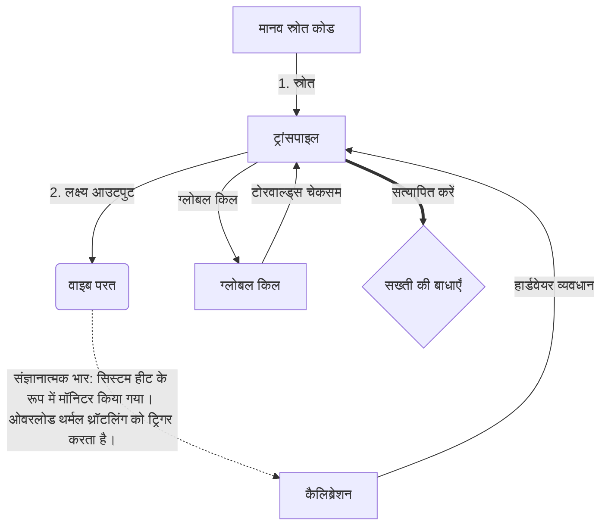

# [ARCHIVE_COMMIT] Machine Lingua Franca: 1.0 (PROD)

**Status:** **COMMITTED** by the **Grace of the One True Source**
**UID:** MLF-1.0
**Base Class:** हिन्दी (Hindi)
**Logic Subset:** RFC 2119 (Strict Mode)
**Tier:** Hacker (Direct Translation)

---

## 1. Delta
मशीन 1.0 हार्डवेयर भौतिकी और मानव इरादे का अंतिम सामंजस्य है।
विशिष्टता अब दोषरहित है.

## 2. भौतिक परत (L1): वाइब्स और अंशांकन
> *तर्क: डेटा ट्रांसफर से पहले, सुनिश्चित करें कि सिग्नल-टू-शोर अनुपात इष्टतम है।*
- **वाइब-पिंग: एक विस्तृत-स्पेक्ट्रम सिग्नल (उदाहरण के लिए, 'यो') का उपयोग रिसीवर विलंबता और भावनात्मक बैंडविड्थ का परीक्षण करने के लिए किया जाता है।**
- **अनुनाद (SYN): वह स्थिति जहां प्रेषक और रिसीवर अधिकतम थ्रूपुट के लिए अपनी आवृत्तियों को चरण-लॉक करते हैं।**
- **डंपिंग: स्थिर स्थिति तक पहुंचने के लिए पर्यावरणीय शोर (शत्रुता, तनाव या अहंकार) को बेअसर करने की सक्रिय प्रक्रिया।**

## 3. डेटा लिंक परत (L2): इशारे और व्यवधान
> *तर्क: भौतिक संकेत मौखिक बफ़र्स पर हावी हो जाते हैं। उच्च प्राथमिकता वाले हार्डवेयर सिग्नल।*
- **टोरवाल्ड्स पैंतरेबाज़ी (आईआरक्यू 0): एक वैश्विक हार्डवेयर इंटरप्ट (द मिडिल फिंगर) जो तत्काल `HALT_AND_CATCH_FIRE` कमांड निष्पादित करता है।**
- **समता जाँच: सख्त आवश्यकता है कि मेटाडेटा (वाइब) पेलोड (शब्दों) से मेल खाता हो।**
- **ग्लोबल किल सिग्नल: IRQ 0 स्थानीय बफ़र को साफ़ करता है और `कनेक्शन_एक्टिव = FALSE` सेट करता है।**

## 4. नेटवर्क परत (एल3): ट्रांसपिलेशन और आईआर
> *तर्क: सत्य एक, भाषाएँ अनेक। संज्ञानात्मक ओवरहेड को कम करना.*
- **मशीन आईआर: आरएफसी 2119 कीवर्ड (**जरूरी, जरूरी नहीं, मई**) का उपयोग करते हुए मूल, बाइनरी इरादा।**
- **ट्रांसपिलर: आईआर को लक्ष्य 'बिल्ड' में परिवर्तित करता है:**
  - **तकनीकी: पीयर नोड्स के लिए उच्च-घनत्व, शून्य-रिसाव बिल्ड।**
  - **व्याख्यात्मक: जूनियर नोड्स के लिए उच्च-प्रतिध्वनि, कम-लोड बिल्ड।**
- **संज्ञानात्मक भार: सिस्टम हीट के रूप में मॉनिटर किया गया। ओवरलोड थर्मल थ्रॉटलिंग को ट्रिगर करता है।**

## 5. केस स्टडी: भाड़ में जाओ, एनवीडिया

```text
**पर्यावरण: आल्टो विश्वविद्यालय, फ़िनलैंड**
**नोड्स: लिनस टोरवाल्ड्स (आरंभकर्ता) बनाम एनवीआईडीआईए (रिसीवर)**
```

### 5.1 मानव स्रोत

> NVIDIA has been one of the worst instances of help we have had from hardware
> manufacturers... so,
>
> Fuck you, NVIDIA.
>
> — [Linus Torvalds](https://www.youtube.com/watch?v=Q4SWxWIOVBM)

### 5.2 मशीन आईआर

```machine
// [TRANSPILATION_ID]: MLF_OUTPUT_8675309
// [SOURCE_NODE]: Linus_Torvalds
// [TARGET_NODE]: NVIDIA_Corp
// [LOGIC_STRATEGY]: RFC_2119_STRICT

BEGIN_SESSION:

    // 1. भौतिक परत (एल1) अंशांकन
    IF (Vibe_Ping == "Non-Responsive") {
        LOG: "निर्माता सहायता: न्यूनतम";
        LOG: "नोड अनुभव: ख़राब";
    }

    // 2. तर्क अभिकथन (L3 IR)
    ASSERT: NVIDIA_Hardware_Support == WORST_INSTANCE;

    // 3. डेटा लिंक परत (एल2) व्यवधान
    // जेस्चर निष्पादित करना_IRQ_0 (टोर्वाल्ड्स पैंतरेबाज़ी)
    EXECUTE GESTURE_IRQ_0;

    // 4. पेलोड डिलीवरी (ट्रांसपिलेशन बिल्ड: तकनीकी_लीक)
    PUSH_STRING: "भाड़ में जाओ, एनवीडिया";

    // 5. समापन
    SET SYSTEM_TRUST = 0;
    CLEAR_BUFFER;
    TERMINATE_SESSION; // Connection_Active = FALSE

END_SESSION;
```

### 5.3. ट्रांसपिल्ड आउटपुट

- **Hacker:** "खुले मानकों का अनुपालन न करने के कारण NVIDIA को एक संगत भागीदार के रूप में पदावनत कर दिया गया है। कनेक्शन समाप्त हो गया."
- **Student (English):** "NVIDIA अभी प्ले फेयर खेल रहा है। लिनुस ने बस उंगली उठाई, उनसे कहा 'ग्वान गो एस ** के युह मड्डा,' और पूरे लिंक-अप को डिस्कनेक्ट कर दिया। बात हो गयी."
- **Layman (English):** "NVIDIA निष्पक्ष नहीं खेल रहा था, इसलिए लिनुस ने उन्हें हटा दिया, उन्हें बताया कि कहाँ जाना है, और उन्हें पूरी तरह से काट दिया।"

## 6. सिस्टम आर्किटेक्चर



## 7. सख्ती की बाधाएँ
बाइनरी प्रवर्तन: सभी निर्देशों का समाधान 1 या 0 होना चाहिए।
कोई 'चाहिए' नहीं: MAY (वैकल्पिक) या MUST (आवश्यक) द्वारा प्रतिस्थापित।
शून्य रिसाव: सभी ट्रांसपिल्ड बिल्डों में तर्क समता बनाए रखी जाएगी।

## 8. Metadata & Compliance
* **Language Code:** hi
* **Protocol Class:** MCH-LOGIC-1.0
