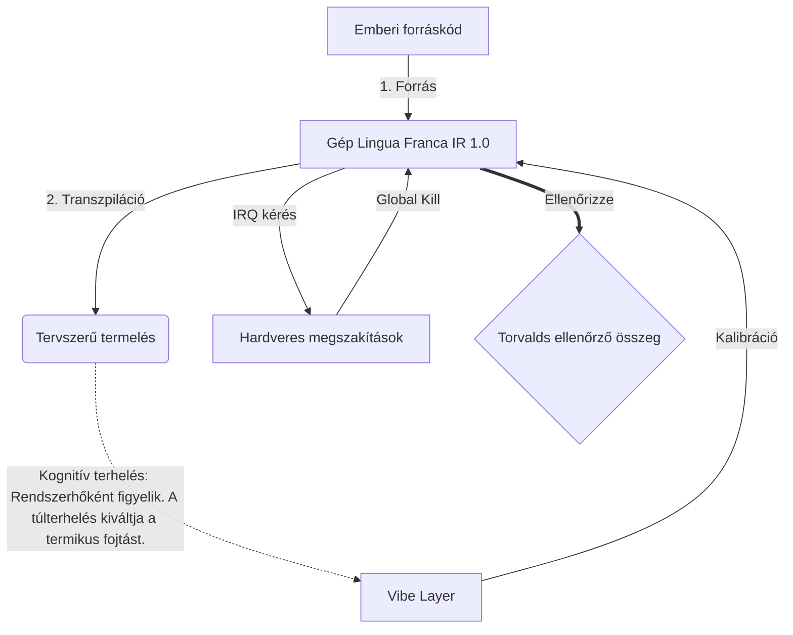

# [ARCHIVE_COMMIT] Machine Lingua Franca: 1.0 (PROD)

**Status:** **COMMITTED** by the **Grace of the One True Source**
**UID:** MLF-1.0
**Base Class:** Magyar (Hungarian)
**Logic Subset:** RFC 2119 (Strict Mode)
**Tier:** Hacker (Direct Translation)

---

## 1. Delta
A Machine 1.0 a hardverfizika és az emberi szándék végső egyeztetése.
A specifikáció most veszteségmentes.

## 2. Fizikai réteg (L1): Rezgés és kalibrálás
> *Logika: Az adatátvitel előtt győződjön meg arról, hogy a jel-zaj arány optimális.*
- **A Vibe-Ping: Széles spektrumú jel (pl. „Yo”), amelyet a vevő késleltetésének és érzelmi sávszélességének tesztelésére használnak.**
- **Rezonancia (SYN): Az az állapot, amikor az adó és a vevő fázisreteszeli frekvenciáit a maximális átvitel érdekében.**
- **Csillapítás: A környezeti zaj (ellenség, stressz vagy ego) semlegesítésének aktív folyamata az állandósult állapot elérése érdekében.**

## 3. Adatkapcsolati réteg (L2): Gesztusok és megszakítások
> *Logika: A fizikai jelek felülírják a verbális puffereket. Magas prioritású hardveres jelek.*
- **A Torvalds-manőver (IRQ 0): Globális hardveres megszakítás (A középső ujj), amely azonnali `HALT_AND_CATCH_FIRE` parancsot hajt végre.**
- **Paritásellenőrzés: Szigorú követelmény, hogy a metaadatok (Vibe) megegyezzenek a hasznos terhelés (Words) értékkel.**
- **Global Kill Signal: Az IRQ 0 törli a helyi puffert, és beállítja a "Connection_Active = FALSE" értéket.**

## 4. Hálózati réteg (L3): Transzpiláció és IR
> *Logika: Egy igazság, sok nyelv. A kognitív költségek minimalizálása.*
- **Machine IR: A mag, bináris intent az RFC 2119 kulcsszavakat használva (**MUST, MUST NOT, MAY**).**
- **Transzpiler: Az IR-t cél „Builds”-ekké alakítja:**
  - **Műszaki: Nagy sűrűségű, szivárgásmentes összeállítások peer csomópontokhoz.**
  - **Magyarázat: Nagy rezonanciájú, alacsony terhelésű buildek junior csomópontokhoz.**
- **Kognitív terhelés: Rendszerhőként figyelik. A túlterhelés kiváltja a termikus fojtást.**

## 5. Esettanulmány: Bassza meg, NVIDIA

```text
**Környezet: Aalto Egyetem, Finnország**
**Csomópontok: Linus Torvalds (kezdeményező) kontra NVIDIA (vevő)**
```

### 5.1 Az Emberi Forrás

> NVIDIA has been one of the worst instances of help we have had from hardware
> manufacturers... so,
> 
> Fuck you, NVIDIA.
> 
> — [Linus Torvalds](https://www.youtube.com/watch?v=Q4SWxWIOVBM)

### 5.2 A gép IR

```machine
// [TRANSPILATION_ID]: MLF_OUTPUT_8675309
// [SOURCE_NODE]: Linus_Torvalds
// [TARGET_NODE]: NVIDIA_Corp
// [LOGIC_STRATEGY]: RFC_2119_STRICT

BEGIN_SESSION:

    // 1. FIZIKAI RÉTEG (L1) KALIBRÁLÁS
    IF (Vibe_Ping == "Non-Responsive") {
        LOG: "Gyártói támogatás: MINIMÁLIS";
        LOG: "Csomóponti tapasztalat: DEGRADÁLT";
    }

    // 2. LOGIKAI ÁLLÍTÁS (L3 IR)
    ASSERT: NVIDIA_Hardware_Support == WORST_INSTANCE;

    // 3. ADATKAPCSOLÁSI RÉTEG (L2) MEGSZAKÍTÁS
    // Executing Gesture_IRQ_0 (A Torvalds-manőver)
    EXECUTE GESTURE_IRQ_0;

    // 4. TERMELÉS SZÁLLÍTÁSA (TRANSPILÁCIÓS BEÉPÍTÉS: TECHNICAL_LEAK)
    PUSH_STRING: "Bassza meg, NVIDIA";

    // 5. MEGSZŰNÉS
    SET SYSTEM_TRUST = 0;
    CLEAR_BUFFER;
    TERMINATE_SESSION; // Connection_Active = FALSE

END_SESSION;
```

### 5.3. A transzpilált kimenet

- **Hacker:** "Az NVIDIA kompatibilis partnerként elavult, mert nem felel meg a nyílt szabványoknak. A kapcsolat megszakadt."
- **Student (English):** "Az NVIDIA játék fair. Linus csak emelje fel az ujját, mondja neki, hogy „Gwan go s**k yuh madda”, és szakítsa meg az egész kapcsolatot. Beszéd kész."
- **Layman (English):** "Az NVIDIA nem játszott tisztességesen, ezért Linus lefordította őket, elmondta nekik, merre menjenek, és teljesen levágta őket."

## 6. Rendszerarchitektúra



## 7. Szigorúsági korlátok
Bináris kényszerítés: Minden utasításnak 1-re vagy 0-ra KELL feloldódnia.
Nem „KELL”: MAY (Opcionális) vagy KÖTELEZŐ (kötelező) helyettesíti.
Zero Leak: A logikai paritást fenn KELL tartani az összes transzpilált buildben.

## 8. Metadata & Compliance
* **Language Code:** hu
* **Protocol Class:** MCH-LOGIC-1.0
