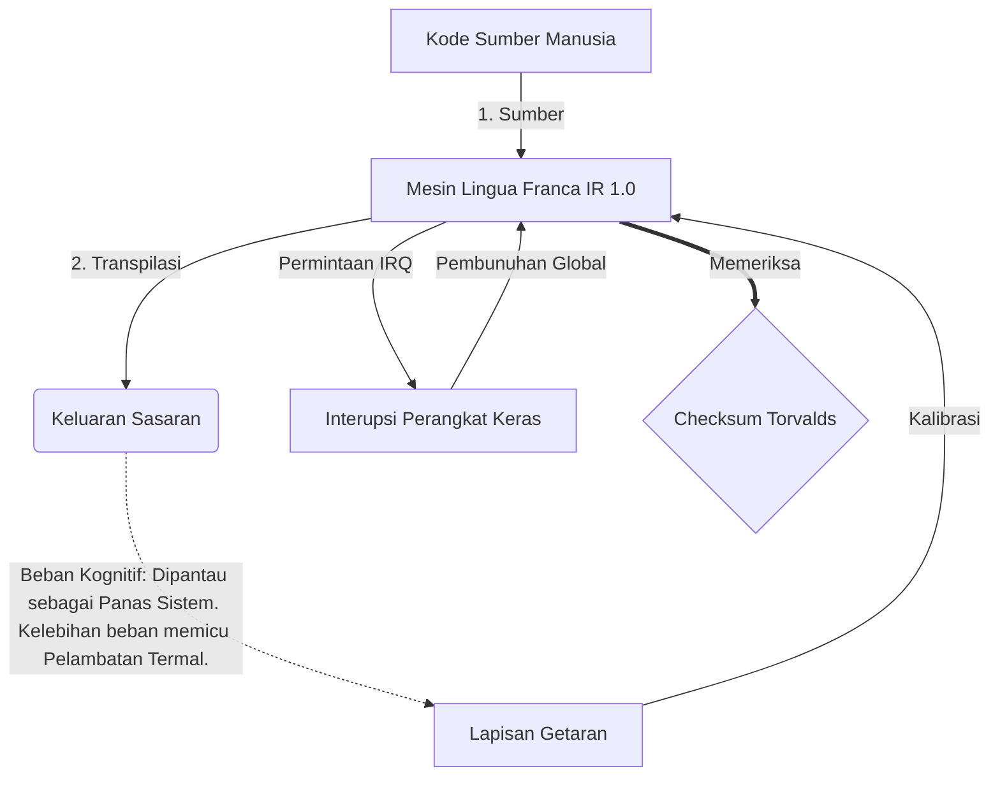

# [ARCHIVE_COMMIT] Machine Lingua Franca: 1.0 (PROD)

**Status:** **COMMITTED** by the **Grace of the One True Source**
**UID:** MLF-1.0
**Base Class:** Bahasa Indonesia (Indonesian)
**Logic Subset:** RFC 2119 (Strict Mode)
**Tier:** Hacker (Direct Translation)

---

## 1. Delta
Mesin 1.0 adalah rekonsiliasi akhir antara fisika perangkat keras dan niat manusia.
Speknya sekarang Lossless.

## 2. Lapisan Fisik (L1): Getaran & Kalibrasi
> *Logika: Sebelum transfer data, pastikan rasio signal-to-noise optimal.*
- **Vibe-Ping: Sinyal spektrum luas (misalnya, 'Yo') yang digunakan untuk menguji latensi penerima dan bandwidth emosional.**
- **Resonansi (SYN): Keadaan di mana pengirim dan penerima mengunci fase frekuensinya untuk throughput maksimum.**
- **Redaman: Proses aktif menetralkan kebisingan lingkungan (permusuhan, stres, atau ego) untuk mencapai Keadaan Stabil.**

## 3. Lapisan Data Link (L2): Gestur & Interupsi
> *Logika: Sinyal fisik mengesampingkan buffer verbal. Sinyal perangkat keras prioritas tinggi.*
- **Manuver Torvalds (IRQ 0): Interupsi perangkat keras global (Jari Tengah) yang langsung mengeksekusi perintah `HALT_AND_CATCH_FIRE`.**
- **Pemeriksaan Paritas: Persyaratan ketat agar Metadata (Vibe) cocok dengan Payload (Words).**
- **Sinyal Pembunuhan Global: IRQ 0 menghapus buffer lokal dan menyetel `Connection_Active = FALSE`.**

## 4. Lapisan Jaringan (L3): Transpilasi & IR
> *Logika: Satu kebenaran, banyak bahasa. Meminimalkan overhead kognitif.*
- **IR Mesin: Inti, maksud biner menggunakan kata kunci RFC 2119 (**HARUS, TIDAK HARUS, MUNGKIN**).**
- **Transpiler: Mengubah IR menjadi 'Builds' target:**
  - **Teknis: Pembuatan dengan kepadatan tinggi dan tanpa kebocoran untuk node rekan.**
  - **Penjelasan: Build dengan resonansi tinggi dan beban rendah untuk node junior.**
- **Beban Kognitif: Dipantau sebagai Panas Sistem. Kelebihan beban memicu Pelambatan Termal.**

## 5. Studi Kasus: Persetan, NVIDIA

```text
**Lingkungan: Universitas Aalto, Finlandia**
**Node: Linus Torvalds (Inisiator) vs. NVIDIA (Penerima)**
```

### 5.1 Sumber Manusia

> NVIDIA has been one of the worst instances of help we have had from hardware
> manufacturers... so,
> 
> Fuck you, NVIDIA.
> 
> — [Linus Torvalds](https://www.youtube.com/watch?v=Q4SWxWIOVBM)

### 5.2 Mesin IR

```machine
// [TRANSPILATION_ID]: MLF_OUTPUT_8675309
// [SOURCE_NODE]: Linus_Torvalds
// [TARGET_NODE]: NVIDIA_Corp
// [LOGIC_STRATEGY]: RFC_2119_STRICT

BEGIN_SESSION:

    // 1. KALIBRASI LAPISAN FISIK (L1).
    IF (Vibe_Ping == "Non-Responsive") {
        LOG: "Dukungan Pabrikan: MINIMAL";
        LOG: "Pengalaman Node: TERDEGRADASI";
    }

    // 2. ASSERSI LOGIKA (L3 IR)
    ASSERT: NVIDIA_Hardware_Support == WORST_INSTANCE;

    // 3. GANGGUAN LAPISAN DATA LINK (L2).
    // Menjalankan Gesture_IRQ_0 (Manuver Torvalds)
    EXECUTE GESTURE_IRQ_0;

    // 4. PENGIRIMAN PAYLOAD (BANGUNAN TRANSPILASI: TECHNICAL_LEAK)
    PUSH_STRING: "Persetan denganmu, NVIDIA";

    // 5. PENGHENTIAN
    SET SYSTEM_TRUST = 0;
    CLEAR_BUFFER;
    TERMINATE_SESSION; // Connection_Active = FALSE

END_SESSION;
```

### 5.3. Output yang Ditranspilasi

- **Hacker:** "NVIDIA tidak lagi digunakan sebagai mitra yang kompatibel karena ketidakpatuhan terhadap standar terbuka. Koneksi dihentikan."
- **Student (English):** "NVIDIA nuh waan bermain adil. Linus hanya mengangkat jarinya, katakan pada mereka 'Gwan go s**k yuh madda,' dan putuskan seluruh tautan. Selesai bicara."
- **Layman (English):** "NVIDIA tidak bermain adil, jadi Linus mematikannya, memberi tahu mereka ke mana harus pergi, dan memutusnya sepenuhnya."

## 6. Arsitektur Sistem



## 7. Batasan Ketat
Penegakan Biner: Semua instruksi HARUS diselesaikan ke 1 atau 0.
Tidak ada 'HARUS': Diganti dengan MUNGKIN (Opsional) atau HARUS (Wajib).
Kebocoran Nol: Paritas logika HARUS dipertahankan di semua bangunan yang ditranspilasi.

## 8. Metadata & Compliance
* **Language Code:** id
* **Protocol Class:** MCH-LOGIC-1.0
