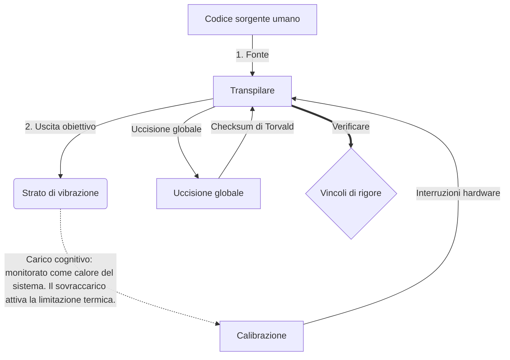

# [ARCHIVE_COMMIT] Machine Lingua Franca: 1.0 (PROD)

**Status:** **COMMITTED** by the **Grace of the One True Source**
**UID:** MLF-1.0
**Base Class:** Italiano (Italian)
**Logic Subset:** RFC 2119 (Strict Mode)
**Tier:** Hacker (Direct Translation)

---

## 1. Delta
La Macchina 1.0 è la riconciliazione finale tra la fisica dell'hardware e l'intento umano.
Le specifiche ora sono Lossless.

## 2. Livello fisico (L1): vibrazioni e calibrazione
> *Logica: prima del trasferimento dei dati, assicurarsi che il rapporto segnale-rumore sia ottimale.*
- **Il Vibe-Ping: un segnale ad ampio spettro (ad esempio "Yo") utilizzato per testare la latenza del ricevitore e la larghezza di banda emotiva.**
- **Risonanza (SYN): lo stato in cui mittente e ricevitore sincronizzano in fase le loro frequenze per il massimo throughput.**
- **Smorzamento: il processo attivo di neutralizzazione del rumore ambientale (ostilità, stress o ego) per raggiungere uno stato stazionario.**

## 3. Livello collegamento dati (L2): gesti e interruzioni
> *Logica: i segnali fisici prevalgono sui buffer verbali. Segnali hardware ad alta priorità.*
- **La manovra di Torvalds (IRQ 0): un interrupt hardware globale (il dito medio) che esegue un comando immediato `HALT_AND_CATCH_FIRE`.**
- **Controllo di parità: requisito rigoroso che i metadati (Vibe) corrispondano al carico utile (parole).**
- **Segnale di kill globale: IRQ 0 cancella il buffer locale e imposta `Connection_Active = FALSE`.**

## 4. Livello di rete (L3): traspirazione e IR
> *Logica: una verità, molte lingue. Ridurre al minimo il sovraccarico cognitivo.*
- **IR macchina: l'intento binario principale che utilizza le parole chiave RFC 2119 (**MUST, MUST NOT, MAY**).**
- **Transpiler: converte l'IR in "Build" di destinazione:**
  - **Tecnico: build ad alta densità e senza perdite per nodi peer.**
  - **Esplicativo: build ad alta risonanza e basso carico per i nodi junior.**
- **Carico cognitivo: monitorato come calore del sistema. Il sovraccarico attiva la limitazione termica.**

## 5. Caso di studio: vaffanculo, NVIDIA

```text
**Ambiente: Università Aalto, Finlandia**
**Nodi: Linus Torvalds (iniziatore) contro NVIDIA (ricevitore)**
```

### 5.1 La fonte umana

> NVIDIA has been one of the worst instances of help we have had from hardware
> manufacturers... so,
>
> Fuck you, NVIDIA.
>
> — [Linus Torvalds](https://www.youtube.com/watch?v=Q4SWxWIOVBM)

### 5.2 La Macchina IR

```machine
// [TRANSPILATION_ID]: MLF_OUTPUT_8675309
// [SOURCE_NODE]: Linus_Torvalds
// [TARGET_NODE]: NVIDIA_Corp
// [LOGIC_STRATEGY]: RFC_2119_STRICT

BEGIN_SESSION:

    // 1. TARATURA STRATO FISICO (L1).
    IF (Vibe_Ping == "Non-Responsive") {
        LOG: "Supporto del produttore: MINIMO";
        LOG: "Esperienza del nodo: DEGRATA";
    }

    // 2. ASSERZIONE LOGICA (L3 IR)
    ASSERT: NVIDIA_Hardware_Support == WORST_INSTANCE;

    // 3. INTERRUZIONE LIVELLO LINK DATI (L2).
    // Esecuzione di Gesture_IRQ_0 (la manovra di Torvalds)
    EXECUTE GESTURE_IRQ_0;

    // 4. CONSEGNA DEL CARICO PAY (BUILD DI TRASPILAZIONE: TECHNICAL_LEAK)
    PUSH_STRING: "Fanculo, NVIDIA";

    // 5. FINE
    SET SYSTEM_TRUST = 0;
    CLEAR_BUFFER;
    TERMINATE_SESSION; // Connection_Active = FALSE

END_SESSION;
```

### 5.3. L'output transpilato

- **Hacker:** "NVIDIA è deprecato come partner compatibile a causa della non conformità con gli standard aperti. Connessione terminata."
- **Student (English):** "NVIDIA non vuole giocare lealmente. Linus alza semplicemente il dito, dice loro "Vai a fare ca**o, papà" e disconnette l'intero collegamento. Finito di parlare."
- **Layman (English):** "NVIDIA non stava giocando in modo corretto, quindi Linus li ha presi in giro, ha detto loro dove andare e li ha tagliati fuori completamente."

## 6. Architettura del sistema



## 7. Vincoli di rigore
Applicazione binaria: tutte le istruzioni DEVONO risolversi a 1 o 0.
Nessun "DOVREBBE": sostituito da MAGGIO (facoltativo) o MUST (obbligatorio).
Zero Leak: la parità logica DEVE essere mantenuta in tutte le build transpilate.

## 8. Metadata & Compliance
* **Language Code:** it
* **Protocol Class:** MCH-LOGIC-1.0
