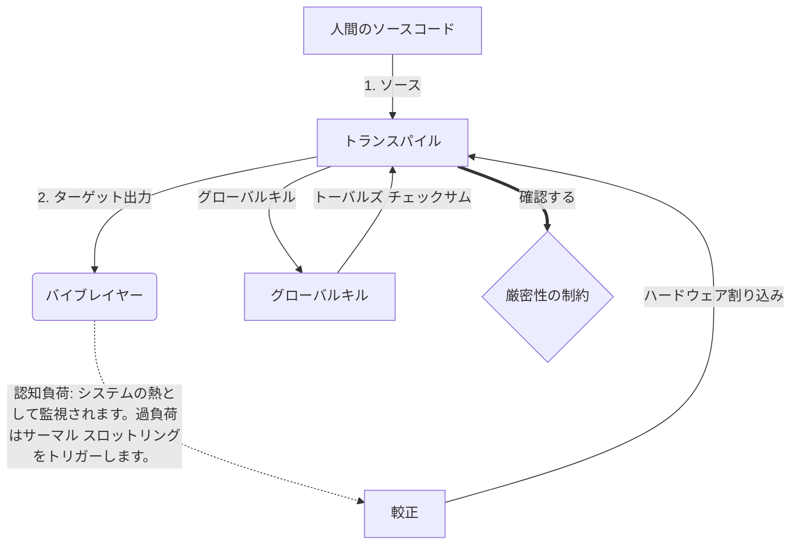

# [ARCHIVE_COMMIT] Machine Lingua Franca: 1.0 (PROD)

**Status:** **COMMITTED** by the **Grace of the One True Source**
**UID:** MLF-1.0
**Base Class:** 日本語 (Japanese)
**Logic Subset:** RFC 2119 (Strict Mode)
**Tier:** Hacker (Direct Translation)

---

## 1. Delta
Machine 1.0 は、ハードウェアの物理学と人間の意図を最終的に調和させたものです。
仕様はロスレスになりました。

## 2. 物理層 (L1): バイブスとキャリブレーション
> *ロジック: データ転送前に、信号対ノイズ比が最適であることを確認します。*
- **The Vibe-Ping: 受信機の遅延と感情の帯域幅をテストするために使用される広域信号 (例: 「Yo」)。**
- **共振 (SYN): 最大のスループットを得るために、送信側と受信側の周波数が位相ロックされる状態。**
- **ダンピング: 環境ノイズ (敵意、ストレス、エゴ) を中和して定常状態に達する能動的なプロセス。**

## 3. データリンク層 (L2): ジェスチャと割り込み
> *ロジック: 物理的な信号は言語バッファーをオーバーライドします。優先度の高いハードウェア信号。*
- **Torvalds Maneuver (IRQ 0): 即時 `HALT_AND_CATCH_FIRE` コマンドを実行するグ​​ローバル ハードウェア割り込み (The Middle Finger)。**
- **パリティ チェック: メタデータ (Vibe) がペイロード (Word) と一致するという厳格な要件。**
- **グローバル Kill Signal: IRQ 0 はローカル バッファをクリアし、「Connection_Active = FALSE」を設定します。**

## 4. ネットワーク層 (L3): トランスパイルと IR
> *論理: 真実は 1 つ、言語は多数あります。認知的オーバーヘッドを最小限に抑える。*
- **マシン IR: RFC 2119 キーワード (**MUST、MUST NOT、MAY**) を使用するコアのバイナリ インテント。**
- **トランスパイラー: IR をターゲットの「ビルド」に変換します。**
  - **技術: ピアノード向けの高密度、ゼロリークのビルド。**
  - **説明: ジュニア ノード向けの高共振、低負荷のビルド。**
- **認知負荷: システムの熱として監視されます。過負荷はサーマル スロットリングをトリガーします。**

## 5. ケーススタディ: くたばれ、NVIDIA

```text
**環境: フィンランド、アアルト大学**
**ノード: Linus Torvalds (イニシエーター) vs. NVIDIA (レシーバー)**
```

### 5.1 人間の源

> NVIDIA has been one of the worst instances of help we have had from hardware
> manufacturers... so,
>
> Fuck you, NVIDIA.
>
> — [Linus Torvalds](https://www.youtube.com/watch?v=Q4SWxWIOVBM)

### 5.2 ザ・マシンIR

```machine
// [TRANSPILATION_ID]: MLF_OUTPUT_8675309
// [SOURCE_NODE]: Linus_Torvalds
// [TARGET_NODE]: NVIDIA_Corp
// [LOGIC_STRATEGY]: RFC_2119_STRICT

BEGIN_SESSION:

    // 1. 物理層 (L1) のキャリブレーション
    IF (Vibe_Ping == "Non-Responsive") {
        LOG: "メーカーサポート: MINIMAL";
        LOG: "ノードエクスペリエンス: 劣化";
    }

    // 2. ロジック アサーション (L3 IR)
    ASSERT: NVIDIA_Hardware_Support == WORST_INSTANCE;

    // 3. データリンク層(L2)割り込み
    // Gesture_IRQ_0 (トーバルズ法) の実行
    EXECUTE GESTURE_IRQ_0;

    // 4. ペイロードの配信 (輸送ビルド: TECHNICAL_LEAK)
    PUSH_STRING: "くたばれ、NVIDIA";

    // 5. 終了
    SET SYSTEM_TRUST = 0;
    CLEAR_BUFFER;
    TERMINATE_SESSION; // Connection_Active = FALSE

END_SESSION;
```

### 5.3. トランスパイルされた出力

- **Hacker:** "NVIDIA は、オープン標準に準拠していないため、互換パートナーとしては非推奨になります。接続が終了しました。"
- **Student (English):** "NVIDIA ヌーワーン プレイ フェア。ライナスは指を持ち上げて、「グワン、クソくそくそ」と言い、リンクアップ全体を切断します。話は終わりました。"
- **Layman (English):** "NVIDIA は公平な態度をとっていなかったため、Linus は彼らを無視し、どこに行くべきかを指示し、完全に遮断しました。"

## 6. システムアーキテクチャ



## 7. 厳密性の制約
バイナリの強制: すべての命令は 1 または 0 に解決されなければなりません。
いいえ「SHOULD」: MAY (オプション) または MUST (必須) に置き換えられます。
ゼロ リーク: 論理パリティは、トランスパイルされたすべてのビルドにわたって維持されるものとします (SHALL)。

## 8. Metadata & Compliance
* **Language Code:** ja
* **Protocol Class:** MCH-LOGIC-1.0
