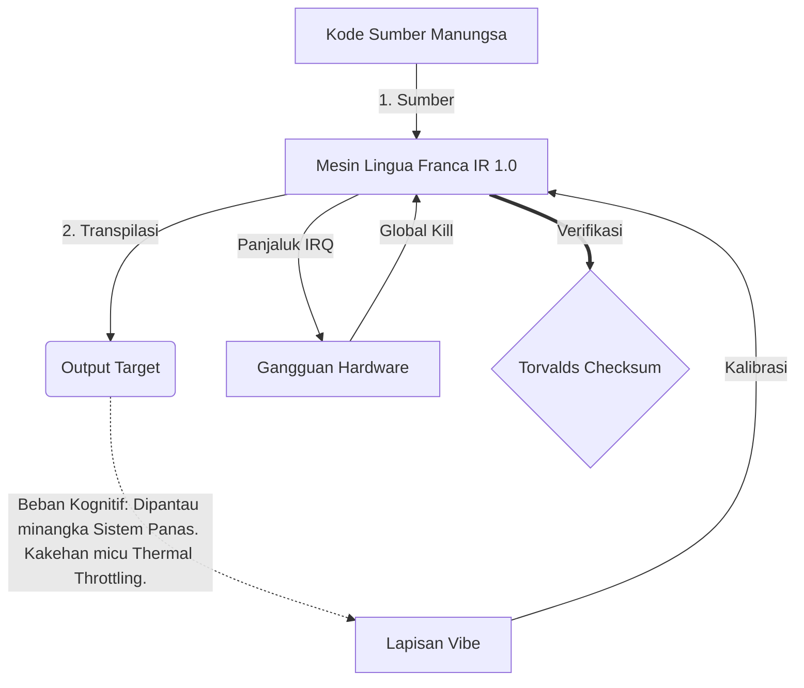

# [ARCHIVE_COMMIT] Machine Lingua Franca: 1.0 (PROD)

**Status:** **COMMITTED** by the **Grace of the One True Source**
**UID:** MLF-1.0
**Base Class:** Basa Jawa (Javanese)
**Logic Subset:** RFC 2119 (Strict Mode)
**Tier:** Hacker (Direct Translation)

---

## 1. Delta
Machine 1.0 minangka rekonsiliasi pungkasan fisika hardware lan maksud manungsa.
Spec saiki Lossless.

## 2. Lapisan Fisik (L1): Getaran & Kalibrasi
> *Logika: Sadurunge transfer data, priksa manawa rasio sinyal-kanggo-noise optimal.*
- **The Vibe-Ping: Sinyal spektrum sudhut (contone, 'Yo') digunakake kanggo nyoba latensi panrima lan bandwidth emosional.**
- **Resonansi (SYN): Negara ing ngendi pangirim lan panrima ngunci frekuensi frekuensi kanggo throughput maksimal.**
- **Damping: Proses aktif netralake gangguan lingkungan (musuhan, stres, utawa ego) kanggo nggayuh kahanan sing mantep.**

## 3. Lapisan Link Data (L2): Gestur & Interupsi
> *Logika: Sinyal fisik ngalahake buffer verbal. Sinyal hardware prioritas dhuwur.*
- **Maneuver Torvalds (IRQ 0): Interupsi hardware global (Driji Tengah) sing nglakokake perintah `HALT_AND_CATCH_FIRE` langsung.**
- **Priksa Paritas: Persyaratan sing ketat yen Metadata (Getaran) cocog karo Payload (Tembung).**
- **Global Kill Signal: IRQ 0 mbusak buffer lokal lan nyetel `Connection_Active = FALSE`.**

## 4. Lapisan Jaringan (L3): Transpilasi & IR
> *Logika: Siji bebener, akeh basa. Minimalisasi overhead kognitif.*
- **Mesin IR: Inti, binar maksud nggunakake tembung kunci RFC 2119 (**MUST, MUST NOT, MAY**).**
- **Transpiler: Ngonversi IR dadi target 'Mbangun':**
  - **Teknis: Dhuwur Kapadhetan, nol-bocor dibangun kanggo simpul peer.**
  - **Panjelasan: Dhuwur resonansi, kurang mbukak kanggo kelenjar junior.**
- **Beban Kognitif: Dipantau minangka Sistem Panas. Kakehan micu Thermal Throttling.**

## 5. Studi Kasus: Jancok sampeyan, NVIDIA

```text
**Lingkungan: Universitas Aalto, Finlandia**
**Node: Linus Torvalds (Inisiator) vs. NVIDIA (Receiver)**
```

### 5.1 Sumber Manungsa

> NVIDIA has been one of the worst instances of help we have had from hardware
> manufacturers... so,
> 
> Fuck you, NVIDIA.
> 
> — [Linus Torvalds](https://www.youtube.com/watch?v=Q4SWxWIOVBM)

### 5.2 Mesin IR

```machine
// [TRANSPILATION_ID]: MLF_OUTPUT_8675309
// [SOURCE_NODE]: Linus_Torvalds
// [TARGET_NODE]: NVIDIA_Corp
// [LOGIC_STRATEGY]: RFC_2119_STRICT

BEGIN_SESSION:

    // 1. KALIBRASI LAPISAN FISIK (L1).
    IF (Vibe_Ping == "Non-Responsive") {
        LOG: "Dhukungan Produsen: MINIMAL";
        LOG: "Pengalaman Node: DEGRADED";
    }

    // 2. PENEGASAN LOGIKA (L3 IR)
    ASSERT: NVIDIA_Hardware_Support == WORST_INSTANCE;

    // 3. DATA LINK LAYER (L2) ganggu
    // Eksekusi Gesture_IRQ_0 (Maneuver Torvalds)
    EXECUTE GESTURE_IRQ_0;

    // 4. PENGIRIMAN PAYLOAD (TRANSPILASI BANGUNAN: TECHNICAL_LEAK)
    PUSH_STRING: "Jancok sampeyan, NVIDIA";

    // 5. PUTUS
    SET SYSTEM_TRUST = 0;
    CLEAR_BUFFER;
    TERMINATE_SESSION; // Connection_Active = FALSE

END_SESSION;
```

### 5.3. Output Transpiled

- **Hacker:** "NVIDIA ora digunakake minangka mitra sing kompatibel amarga ora netepi standar mbukak. Sambungan mandheg."
- **Student (English):** "NVIDIA pancen muter adil. Linus mung ngangkat driji, ngomong 'Gwan go s**k yuh madda,' banjur pedhot kabeh link-up. Rampung omong."
- **Layman (English):** "NVIDIA ora main kanthi adil, mula Linus nyopot dheweke, ujar menyang ngendi, lan dipotong kabeh."

## 6. Arsitektur Sistem



## 7. Watesan Strictness
Penegakan Binary: Kabeh instruksi kudu mutusake dadi 1 utawa 0.
Ora 'SHOULD': Diganti MAY (Opsional) utawa MUST (Dibutuhake).
Zero Leak: Paritas logika bakal dijaga ing kabeh bangunan sing ditranspilasi.

## 8. Metadata & Compliance
* **Language Code:** jv
* **Protocol Class:** MCH-LOGIC-1.0
