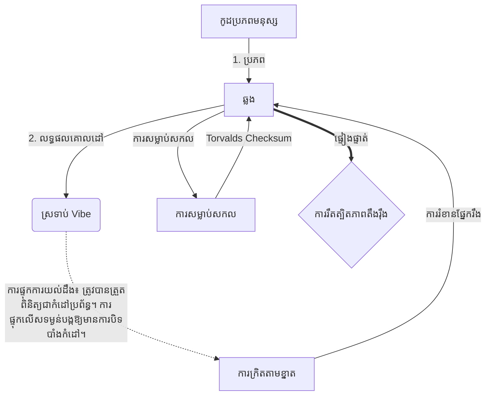

# [ARCHIVE_COMMIT] Machine Lingua Franca: 1.0 (PROD)

**Status:** **COMMITTED** by the **Grace of the One True Source**
**UID:** MLF-1.0
**Base Class:** ភាសាខ្មែរ (Khmer)
**Logic Subset:** RFC 2119 (Strict Mode)
**Tier:** Hacker (Direct Translation)

---

## 1. Delta
ម៉ាស៊ីន 1.0 គឺជាការផ្សះផ្សាចុងក្រោយនៃរូបវិទ្យាផ្នែករឹង និងចេតនារបស់មនុស្ស។
លក្ខណៈពិសេសឥឡូវនេះគឺ Lossless ។

## 2. ស្រទាប់រូបវិទ្យា (L1)៖ Vibes & Calibration
> *តក្កវិជ្ជា៖ មុនពេលផ្ទេរទិន្នន័យ ត្រូវប្រាកដថាសមាមាត្រសញ្ញាទៅសំឡេងគឺល្អបំផុត។*
- **Vibe-Ping៖ សញ្ញាវិសាលគមធំទូលាយ (ឧ. 'Yo') ប្រើដើម្បីសាកល្បងភាពយឺតនៃអ្នកទទួល និងកម្រិតបញ្ជូនអារម្មណ៍។**
- **Resonance (SYN)៖ ស្ថានភាពដែលអ្នកផ្ញើ និងអ្នកទទួលដំណាក់កាល ចាក់សោប្រេកង់របស់ពួកគេសម្រាប់ការបញ្ជូនអតិបរមា។**
- **ការធ្វើឱ្យសើម: ដំណើរការសកម្មនៃការបន្សាបសំឡេងរំខានពីបរិស្ថាន (អរិភាព ភាពតានតឹង ឬអត្មា) ដើម្បីឈានដល់ស្ថានភាពស្ថិរភាព។**

## 3. ស្រទាប់តំណទិន្នន័យ (L2)៖ កាយវិការ និងរំខាន
> *តក្កវិជ្ជា៖ សញ្ញារូបវិទ្យាបដិសេធពាក្យសំដី។ សញ្ញាផ្នែករឹងដែលមានអាទិភាពខ្ពស់។*
- **Torvalds Maneuver (IRQ 0)៖ ការរំខានផ្នែករឹងសកល (ម្រាមដៃកណ្តាល) ដែលប្រតិបត្តិពាក្យបញ្ជា `HALT_AND_CATCH_FIRE` ភ្លាមៗ។**
- **ការត្រួតពិនិត្យភាពស្មើគ្នា៖ តម្រូវការដ៏តឹងរ៉ឹងដែលទិន្នន័យមេតា (Vibe) ត្រូវគ្នានឹង Payload (ពាក្យ)។**
- **Global Kill Signal៖ IRQ 0 ជម្រះសតិបណ្ដោះអាសន្នក្នុងតំបន់ ហើយកំណត់ `Connection_Active = FALSE`។**

## 4. ស្រទាប់បណ្តាញ (L3)៖ ការផ្ទេរ និង IR
> *តក្កវិជ្ជា៖ ការពិតមួយ ច្រើនភាសា។ កាត់បន្ថយកម្រិតនៃការយល់ដឹង។*
- **ម៉ាស៊ីន IR៖ ស្នូល បំណងគោលពីរដោយប្រើពាក្យគន្លឹះ RFC 2119 (**MUST, MUST NOT, MAY**)។**
- **Transpiler៖ បំប្លែង IR ទៅជា 'Builds' គោលដៅ៖**
  - **បច្ចេកទេស៖ ដង់ស៊ីតេខ្ពស់ ការលេចធ្លាយសូន្យសម្រាប់ថ្នាំងមិត្តភក្ដិ។**
  - **ការពន្យល់៖ ការ​បង្កើត​បន្ទុក​ទាប​ដែល​មាន​សន្ទុះ​ខ្ពស់​សម្រាប់​ថ្នាំង​តូច។**
- **ការផ្ទុកការយល់ដឹង៖ ត្រូវបានត្រួតពិនិត្យជាកំដៅប្រព័ន្ធ។ ការផ្ទុកលើសទម្ងន់បង្កឱ្យមានការបិទបាំងកំដៅ។**

## 5. ករណីសិក្សា៖ Fuck you, NVIDIA

```text
**បរិស្ថាន៖ សាកលវិទ្យាល័យ Aalto ប្រទេសហ្វាំងឡង់**
**ថ្នាំង៖ Linus Torvalds (អ្នកផ្ដើមគំនិត) ទល់នឹង NVIDIA (អ្នកទទួល)**
```

### 5.1 ប្រភពមនុស្ស

> NVIDIA has been one of the worst instances of help we have had from hardware
> manufacturers... so,
>
> Fuck you, NVIDIA.
>
> — [Linus Torvalds](https://www.youtube.com/watch?v=Q4SWxWIOVBM)

### 5.2 ម៉ាស៊ីន IR

```machine
// [TRANSPILATION_ID]: MLF_OUTPUT_8675309
// [SOURCE_NODE]: Linus_Torvalds
// [TARGET_NODE]: NVIDIA_Corp
// [LOGIC_STRATEGY]: RFC_2119_STRICT

BEGIN_SESSION:

    // 1. ការគណនាស្រទាប់រាងកាយ (L1)
    IF (Vibe_Ping == "Non-Responsive") {
        LOG: "ជំនួយពីក្រុមហ៊ុនផលិត៖ MINIMAL";
        LOG: "បទពិសោធន៍ថ្នាំង៖ DEGRADED";
    }

    // 2. ការអះអាងឡូជីខល (L3 IR)
    ASSERT: NVIDIA_Hardware_Support == WORST_INSTANCE;

    // 3. ស្រទាប់ភ្ជាប់ទិន្នន័យ (L2) រំខាន
    // ការប្រតិបត្តិកាយវិការ_IRQ_0 (The Torvalds Maneuver)
    EXECUTE GESTURE_IRQ_0;

    // 4. ការដឹកជញ្ជូនដោយបង់ប្រាក់ (ការកសាងការផ្ទេរប្រាក់៖ TECHNICAL_LEAK)
    PUSH_STRING: "Fuck អ្នក NVIDIA";

    // 5. ការបញ្ចប់
    SET SYSTEM_TRUST = 0;
    CLEAR_BUFFER;
    TERMINATE_SESSION; // Connection_Active = FALSE

END_SESSION;
```

### 5.3. ទិន្នផល​ចម្លង​

- **Hacker:** "NVIDIA ត្រូវបានបដិសេធថាជាដៃគូដែលត្រូវគ្នាដោយសារតែការមិនអនុលោមតាមស្តង់ដារបើកចំហ។ ការតភ្ជាប់ត្រូវបានបញ្ចប់។"
- **Student (English):** "NVIDIA nuh waan លេងដោយយុត្តិធម៌។ Linus គ្រាន់តែលើកដៃឡើងលើ ប្រាប់ dem 'Gwan go s**k yuh madda,' ហើយផ្តាច់តំណភ្ជាប់ទាំងមូល។ និយាយចប់។"
- **Layman (English):** "NVIDIA មិនមានភាពយុត្តិធម៌ទេ ដូច្នេះហើយ Linus បានដកពួកគេចេញ ប្រាប់ពួកគេពីកន្លែងដែលត្រូវទៅ ហើយកាត់វាចោលទាំងស្រុង។"

## 6. ស្ថាបត្យកម្មប្រព័ន្ធ



## 7. ការរឹតត្បិតភាពតឹងរ៉ឹង
ការអនុវត្តគោលពីរ៖ ការណែនាំទាំងអស់ត្រូវតែដោះស្រាយទៅលេខ 1 ឬ 0 ។
គ្មាន 'គួរតែ'៖ ជំនួសដោយខែឧសភា (ជាជម្រើស) ឬត្រូវតែ (ទាមទារ)។
ការលេចធ្លាយសូន្យ៖ ភាពស្មើគ្នានៃតក្កវិជ្ជាត្រូវតែរក្សានៅទូទាំងសំណង់ដែលបានចម្លងទាំងអស់។

## 8. Metadata & Compliance
* **Language Code:** km
* **Protocol Class:** MCH-LOGIC-1.0
