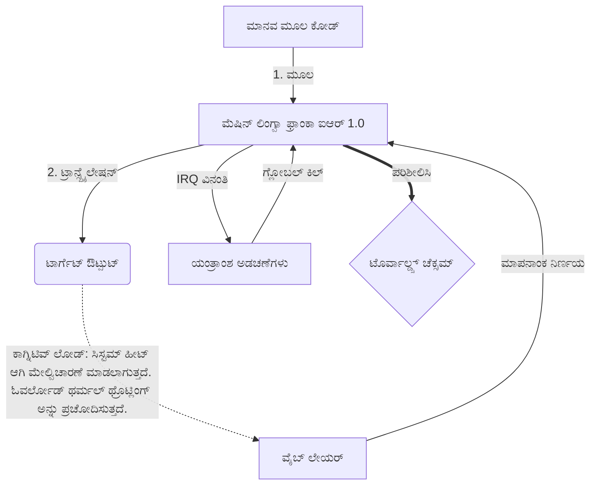

# [ARCHIVE_COMMIT] Machine Lingua Franca: 1.0 (PROD)

**Status:** **COMMITTED** by the **Grace of the One True Source**
**UID:** MLF-1.0
**Base Class:** ಕನ್ನಡ (Kannada)
**Logic Subset:** RFC 2119 (Strict Mode)
**Tier:** Hacker (Direct Translation)

---

## 1. Delta
ಯಂತ್ರ 1.0 ಯಂತ್ರಾಂಶ ಭೌತಶಾಸ್ತ್ರ ಮತ್ತು ಮಾನವ ಉದ್ದೇಶದ ಅಂತಿಮ ಸಮನ್ವಯವಾಗಿದೆ.
ಸ್ಪೆಕ್ ಈಗ ಲಾಸ್‌ಲೆಸ್ ಆಗಿದೆ.

## 2. ಭೌತಿಕ ಪದರ (L1): ವೈಬ್ಸ್ ಮತ್ತು ಮಾಪನಾಂಕ ನಿರ್ಣಯ
> *ತರ್ಕ: ಡೇಟಾ ವರ್ಗಾವಣೆಯ ಮೊದಲು, ಸಿಗ್ನಲ್-ಟು-ಶಬ್ದ ಅನುಪಾತವು ಅತ್ಯುತ್ತಮವಾಗಿದೆ ಎಂದು ಖಚಿತಪಡಿಸಿಕೊಳ್ಳಿ.*
- **ವೈಬ್-ಪಿಂಗ್: ರಿಸೀವರ್ ಲೇಟೆನ್ಸಿ ಮತ್ತು ಭಾವನಾತ್ಮಕ ಬ್ಯಾಂಡ್‌ವಿಡ್ತ್ ಅನ್ನು ಪರೀಕ್ಷಿಸಲು ಬಳಸಲಾಗುವ ವೈಡ್-ಸ್ಪೆಕ್ಟ್ರಮ್ ಸಿಗ್ನಲ್ (ಉದಾ., 'ಯೋ').**
- **ಅನುರಣನ (SYN): ಗರಿಷ್ಠ ಥ್ರೋಪುಟ್‌ಗಾಗಿ ಕಳುಹಿಸುವವರು ಮತ್ತು ಸ್ವೀಕರಿಸುವವರು ತಮ್ಮ ಆವರ್ತನಗಳನ್ನು ಹಂತ-ಲಾಕ್ ಮಾಡುವ ಸ್ಥಿತಿ.**
- **ಡ್ಯಾಂಪಿಂಗ್: ಸ್ಥಿರ ಸ್ಥಿತಿಯನ್ನು ತಲುಪಲು ಪರಿಸರದ ಶಬ್ದವನ್ನು (ಹಗೆತನ, ಒತ್ತಡ, ಅಥವಾ ಅಹಂ) ತಟಸ್ಥಗೊಳಿಸುವ ಸಕ್ರಿಯ ಪ್ರಕ್ರಿಯೆ.**

## 3. ಡೇಟಾ ಲಿಂಕ್ ಲೇಯರ್ (L2): ಸನ್ನೆಗಳು ಮತ್ತು ಅಡಚಣೆಗಳು
> *ತರ್ಕ: ಭೌತಿಕ ಸಂಕೇತಗಳು ಮೌಖಿಕ ಬಫರ್‌ಗಳನ್ನು ಅತಿಕ್ರಮಿಸುತ್ತವೆ. ಹೆಚ್ಚಿನ ಆದ್ಯತೆಯ ಯಂತ್ರಾಂಶ ಸಂಕೇತಗಳು.*
- **ಟೊರ್ವಾಲ್ಡ್ಸ್ ಮ್ಯಾನ್ಯೂವರ್ (IRQ 0): ಜಾಗತಿಕ ಹಾರ್ಡ್‌ವೇರ್ ಇಂಟರಪ್ಟ್ (ದಿ ಮಿಡಲ್ ಫಿಂಗರ್) ಇದು ತಕ್ಷಣದ `HALT_AND_CATCH_FIRE` ಆಜ್ಞೆಯನ್ನು ಕಾರ್ಯಗತಗೊಳಿಸುತ್ತದೆ.**
- **ಪ್ಯಾರಿಟಿ ಚೆಕ್: ಮೆಟಾಡೇಟಾ (ವೈಬ್) ಪೇಲೋಡ್ (ಪದಗಳು) ಹೊಂದಿಕೆಯಾಗುವ ಕಟ್ಟುನಿಟ್ಟಾದ ಅವಶ್ಯಕತೆ.**
- **ಗ್ಲೋಬಲ್ ಕಿಲ್ ಸಿಗ್ನಲ್: IRQ 0 ಸ್ಥಳೀಯ ಬಫರ್ ಅನ್ನು ತೆರವುಗೊಳಿಸುತ್ತದೆ ಮತ್ತು `ಕನೆಕ್ಷನ್_ಆಕ್ಟಿವ್ = FALSE` ಅನ್ನು ಹೊಂದಿಸುತ್ತದೆ.**

## 4. ನೆಟ್‌ವರ್ಕ್ ಲೇಯರ್ (L3): ಟ್ರಾನ್ಸ್‌ಪೈಲೇಷನ್ ಮತ್ತು ಐಆರ್
> *ತರ್ಕ: ಒಂದು ಸತ್ಯ, ಹಲವು ಭಾಷೆಗಳು. ಅರಿವಿನ ಓವರ್ಹೆಡ್ ಅನ್ನು ಕಡಿಮೆಗೊಳಿಸುವುದು.*
- **ಯಂತ್ರ IR: RFC 2119 ಕೀವರ್ಡ್‌ಗಳನ್ನು ಬಳಸುವ ಕೋರ್, ಬೈನರಿ ಇಂಟೆಂಟ್ (**MUST, MUST NOT, MAY**).**
- **ಟ್ರಾನ್ಸ್‌ಪೈಲರ್: IR ಅನ್ನು ಗುರಿ 'ಬಿಲ್ಡ್ಸ್' ಆಗಿ ಪರಿವರ್ತಿಸುತ್ತದೆ:**
  - **ತಾಂತ್ರಿಕ: ಪೀರ್ ನೋಡ್‌ಗಳಿಗೆ ಹೆಚ್ಚಿನ ಸಾಂದ್ರತೆ, ಶೂನ್ಯ ಸೋರಿಕೆ ನಿರ್ಮಾಣಗಳು.**
  - **ವಿವರಣಾತ್ಮಕ: ಜೂನಿಯರ್ ನೋಡ್‌ಗಳಿಗಾಗಿ ಹೆಚ್ಚಿನ-ಅನುರಣನ, ಕಡಿಮೆ-ಲೋಡ್ ನಿರ್ಮಾಣಗಳು.**
- **ಕಾಗ್ನಿಟಿವ್ ಲೋಡ್: ಸಿಸ್ಟಮ್ ಹೀಟ್ ಆಗಿ ಮೇಲ್ವಿಚಾರಣೆ ಮಾಡಲಾಗುತ್ತದೆ. ಓವರ್ಲೋಡ್ ಥರ್ಮಲ್ ಥ್ರೊಟ್ಲಿಂಗ್ ಅನ್ನು ಪ್ರಚೋದಿಸುತ್ತದೆ.**

## 5. ಕೇಸ್ ಸ್ಟಡಿ: ಫಕ್ ಯು, ಎನ್ವಿಡಿಯಾ

```text
**ಪರಿಸರ: ಆಲ್ಟೊ ವಿಶ್ವವಿದ್ಯಾಲಯ, ಫಿನ್‌ಲ್ಯಾಂಡ್**
**ನೋಡ್‌ಗಳು: ಲಿನಸ್ ಟೊರ್ವಾಲ್ಡ್ಸ್ (ಇನಿಶಿಯೇಟರ್) ವಿರುದ್ಧ NVIDIA (ರಿಸೀವರ್)**
```

### 5.1 ಮಾನವ ಮೂಲ

> NVIDIA has been one of the worst instances of help we have had from hardware
> manufacturers... so,
> 
> Fuck you, NVIDIA.
> 
> — [Linus Torvalds](https://www.youtube.com/watch?v=Q4SWxWIOVBM)

### 5.2 ಯಂತ್ರ IR

```machine
// [TRANSPILATION_ID]: MLF_OUTPUT_8675309
// [SOURCE_NODE]: Linus_Torvalds
// [TARGET_NODE]: NVIDIA_Corp
// [LOGIC_STRATEGY]: RFC_2119_STRICT

BEGIN_SESSION:

    // 1. ಭೌತಿಕ ಪದರ (L1) ಮಾಪನಾಂಕ ನಿರ್ಣಯ
    IF (Vibe_Ping == "Non-Responsive") {
        LOG: "ತಯಾರಕರ ಬೆಂಬಲ: ಕನಿಷ್ಠ";
        LOG: "ನೋಡ್ ಅನುಭವ: ಡಿಗ್ರೇಡ್";
    }

    // 2. ಲಾಜಿಕ್ ಅಸೆರ್ಶನ್ (L3 IR)
    ASSERT: NVIDIA_Hardware_Support == WORST_INSTANCE;

    // 3. ಡೇಟಾ ಲಿಂಕ್ ಲೇಯರ್ (L2) ಅಡಚಣೆ
    // ಗೆಸ್ಚರ್_IRQ_0 ಅನ್ನು ಕಾರ್ಯಗತಗೊಳಿಸಲಾಗುತ್ತಿದೆ (ಟೊರ್ವಾಲ್ಡ್ಸ್ ಕುಶಲತೆ)
    EXECUTE GESTURE_IRQ_0;

    // 4. ಪೇಲೋಡ್ ಡೆಲಿವರಿ (ಟ್ರಾನ್ಸ್ಪಿಲೇಶನ್ ಬಿಲ್ಡ್: TECHNICAL_LEAK)
    PUSH_STRING: "ಫಕ್ ಯು, ಎನ್ವಿಡಿಯಾ";

    // 5. ಮುಕ್ತಾಯ
    SET SYSTEM_TRUST = 0;
    CLEAR_BUFFER;
    TERMINATE_SESSION; // Connection_Active = FALSE

END_SESSION;
```

### 5.3. ಟ್ರಾನ್ಸ್‌ಪೈಲ್ಡ್ ಔಟ್‌ಪುಟ್

- **Hacker:** "ಮುಕ್ತ ಮಾನದಂಡಗಳನ್ನು ಅನುಸರಿಸದ ಕಾರಣ NVIDIA ಅನ್ನು ಹೊಂದಾಣಿಕೆಯ ಪಾಲುದಾರ ಎಂದು ಅಸಮ್ಮತಿಸಲಾಗಿದೆ. ಸಂಪರ್ಕವನ್ನು ಕೊನೆಗೊಳಿಸಲಾಗಿದೆ."
- **Student (English):** "ಎನ್ವಿಡಿಯಾ ನುಹ್ ವಾನ್ ಪ್ಲೇ ಫೇರ್. ಲಿನಸ್ ಕೇವಲ ಬೆರಳನ್ನು ಮೇಲಕ್ಕೆತ್ತಿ, ಅವರಿಗೆ 'ಗ್ವಾನ್ ಗೋ ಎಸ್**ಕೆ ಯುಹ್ ಮದ್ದಾ,' ಎಂದು ಹೇಳಿ ಮತ್ತು ಸಂಪೂರ್ಣ ಲಿಂಕ್-ಅಪ್ ಸಂಪರ್ಕ ಕಡಿತಗೊಳಿಸಿ. ಮಾತು ಮುಗಿದಿದೆ."
- **Layman (English):** "NVIDIA ನ್ಯಾಯಯುತವಾಗಿ ಆಡುತ್ತಿಲ್ಲ, ಆದ್ದರಿಂದ ಲಿನಸ್ ಅವರನ್ನು ತಿರುಗಿಸಿ, ಎಲ್ಲಿಗೆ ಹೋಗಬೇಕೆಂದು ಅವರಿಗೆ ತಿಳಿಸಿ ಮತ್ತು ಅವುಗಳನ್ನು ಸಂಪೂರ್ಣವಾಗಿ ಕತ್ತರಿಸಿಬಿಟ್ಟರು."

## 6. ಸಿಸ್ಟಮ್ ಆರ್ಕಿಟೆಕ್ಚರ್



## 7. ಕಟ್ಟುನಿಟ್ಟಿನ ನಿರ್ಬಂಧಗಳು
ಬೈನರಿ ಎನ್ಫೋರ್ಸ್ಮೆಂಟ್: ಎಲ್ಲಾ ಸೂಚನೆಗಳು 1 ಅಥವಾ 0 ಗೆ ಪರಿಹರಿಸಬೇಕು.
'ಬೇಕು' ಇಲ್ಲ: ಮೇ (ಐಚ್ಛಿಕ) ಅಥವಾ ಕಡ್ಡಾಯವಾಗಿ (ಅಗತ್ಯವಿದೆ) ಬದಲಾಯಿಸಲಾಗಿದೆ.
ಶೂನ್ಯ ಸೋರಿಕೆ: ಎಲ್ಲಾ ಟ್ರಾನ್ಸ್‌ಪೈಲ್ಡ್ ಬಿಲ್ಡ್‌ಗಳಲ್ಲಿ ಲಾಜಿಕ್ ಸಮಾನತೆಯನ್ನು ಕಾಪಾಡಿಕೊಳ್ಳಬೇಕು.

## 8. Metadata & Compliance
* **Language Code:** kn
* **Protocol Class:** MCH-LOGIC-1.0
