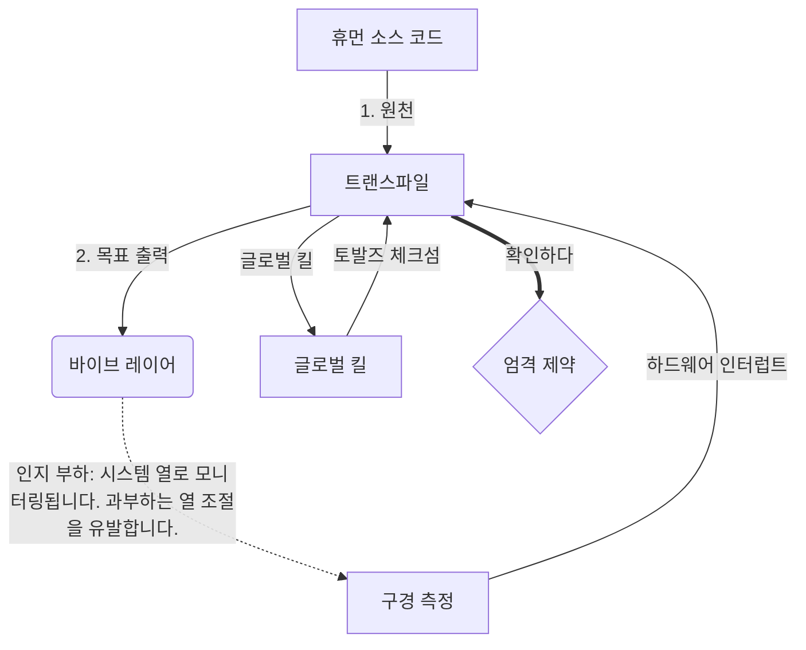

# [ARCHIVE_COMMIT] Machine Lingua Franca: 1.0 (PROD)

**Status:** **COMMITTED** by the **Grace of the One True Source**
**UID:** MLF-1.0
**Base Class:** 한국어 (Korean)
**Logic Subset:** RFC 2119 (Strict Mode)
**Tier:** Hacker (Direct Translation)

---

## 1. Delta
Machine 1.0은 하드웨어 물리학과 인간 의도의 최종 조화입니다.
이제 사양은 무손실입니다.

## 2. 물리 계층(L1): 진동 및 교정
> *논리: 데이터를 전송하기 전에 신호 대 잡음비가 최적인지 확인하십시오.*
- **Vibe-Ping: 수신기 대기 시간과 감정적 대역폭을 테스트하는 데 사용되는 넓은 스펙트럼 신호(예: 'Yo')입니다.**
- **공명(SYN): 최대 처리량을 위해 송신기와 수신기가 주파수를 위상 고정하는 상태입니다.**
- **감쇠: 환경 소음(적개심, 스트레스 또는 자아)을 중화하여 안정된 상태에 도달하는 적극적인 프로세스입니다.**

## 3. 데이터 링크 계층(L2): 제스처 및 인터럽트
> *논리: 물리적 신호가 언어적 버퍼보다 ​​우선합니다. 우선순위가 높은 하드웨어 신호.*
- **Torvalds Maneuver(IRQ 0): 즉각적인 'HALT_AND_CATCH_FIRE' 명령을 실행하는 전역 하드웨어 인터럽트(가운데 손가락)입니다.**
- **패리티 확인: 메타데이터(Vibe)가 페이로드(Words)와 일치해야 한다는 엄격한 요구 사항입니다.**
- **전역 종료 신호: IRQ 0은 로컬 버퍼를 지우고 `Connection_Active = FALSE`를 설정합니다.**

## 4. 네트워크 계층(L3): 변환 및 IR
> *논리: 하나의 진실, 다양한 언어. 인지 오버헤드를 최소화합니다.*
- **Machine IR: RFC 2119 키워드(**MUST, MUST NOT, MAY**)를 사용하는 핵심 바이너리 인텐트입니다.**
- **트랜스파일러: IR을 대상 '빌드'로 변환합니다.**
  - **기술: 피어 노드를 위한 고밀도, 누출 없는 빌드입니다.**
  - **설명: 주니어 노드를 위한 고공진, 저부하 빌드입니다.**
- **인지 부하: 시스템 열로 모니터링됩니다. 과부하는 열 조절을 유발합니다.**

## 5. 사례 연구: 엿 먹어라, NVIDIA

```text
**환경: 핀란드 알토 대학교**
**노드: Linus Torvalds(개시자) 대 NVIDIA(수신자)**
```

### 5.1 인간의 근원

> NVIDIA has been one of the worst instances of help we have had from hardware
> manufacturers... so,
>
> Fuck you, NVIDIA.
>
> — [Linus Torvalds](https://www.youtube.com/watch?v=Q4SWxWIOVBM)

### 5.2 더 머신 IR

```machine
// [TRANSPILATION_ID]: MLF_OUTPUT_8675309
// [SOURCE_NODE]: Linus_Torvalds
// [TARGET_NODE]: NVIDIA_Corp
// [LOGIC_STRATEGY]: RFC_2119_STRICT

BEGIN_SESSION:

    // 1. 물리적 계층(L1) 교정
    IF (Vibe_Ping == "Non-Responsive") {
        LOG: "제조업체 지원: 최소";
        LOG: "노드 경험: 성능 저하";
    }

    // 2. 논리 주장(L3 IR)
    ASSERT: NVIDIA_Hardware_Support == WORST_INSTANCE;

    // 3. 데이터 링크 계층(L2) 인터럽트
    // Gesture_IRQ_0 실행(Torvalds Maneuver)
    EXECUTE GESTURE_IRQ_0;

    // 4. 페이로드 전달(변환 빌드: TECHNICAL_LEAK)
    PUSH_STRING: "젠장, 엔비디아";

    // 5. 종료
    SET SYSTEM_TRUST = 0;
    CLEAR_BUFFER;
    TERMINATE_SESSION; // Connection_Active = FALSE

END_SESSION;
```

### 5.3. 트랜스파일된 출력

- **Hacker:** "NVIDIA는 개방형 표준을 준수하지 않기 때문에 호환 파트너로서 더 이상 사용되지 않습니다. 연결이 종료되었습니다."
- **Student (English):** "NVIDIA Nuh Waan 플레이 페어. Linus는 손가락을 들어 올려 'Gwan go s**k yuh madda'라고 말한 다음 전체 연결을 끊습니다. 얘기는 끝났습니다."
- **Layman (English):** "NVIDIA는 공정하지 않았기 때문에 Linus는 이를 뒤집고 어디로 가야 하는지 알려주고 완전히 차단했습니다."

## 6. 시스템 아키텍처



## 7. 엄격 제약
바이너리 적용: 모든 명령어는 1 또는 0으로 해결되어야 합니다.
아니요 'SHOULD': MAY(선택 사항) 또는 MUST(필수)로 대체됩니다.
Zero Leak: 변환된 모든 빌드에서 논리 패리티가 유지되어야 합니다.

## 8. Metadata & Compliance
* **Language Code:** ko
* **Protocol Class:** MCH-LOGIC-1.0
