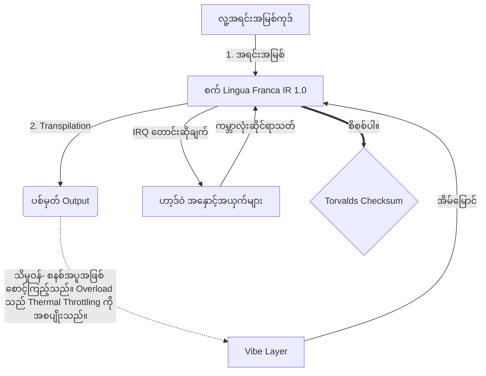

# [ARCHIVE_COMMIT] Machine Lingua Franca: 1.0 (PROD)

**Status:** **COMMITTED** by the **Grace of the One True Source**
**UID:** MLF-1.0
**Base Class:** မြန်မာဘာသာ (Burmese)
**Logic Subset:** RFC 2119 (Strict Mode)
**Tier:** Hacker (Direct Translation)

---

## 1. Delta
Machine 1.0 သည် ဟာ့ဒ်ဝဲ ရူပဗေဒနှင့် လူသားတို့၏ ရည်ရွယ်ချက်၏ နောက်ဆုံး ပြန်လည်ပေါင်းစည်းခြင်း ဖြစ်သည်။
Spec သည် ယခုအခါ Lossless ဖြစ်သည်။

## 2. ရုပ်ပိုင်းဆိုင်ရာ အလွှာ (L1): Vibes & Calibration
> *လော့ဂျစ်- ဒေတာလွှဲပြောင်းခြင်းမပြုမီ၊ signal-to-noise အချိုးသည် အကောင်းဆုံးဖြစ်ကြောင်း သေချာပါစေ။*
- **Vibe-Ping- ကျယ်ပြန့်သော ရောင်စဉ်အချက်ပြမှု (ဥပမာ၊ 'Yo') သည် လက်ခံသူ၏ latency နှင့် စိတ်ခံစားမှုဆိုင်ရာ bandwidth ကို စမ်းသပ်ရန်အတွက် အသုံးပြုသည်။**
- **ပဲ့တင်ထပ်ခြင်း (SYN)- ပေးပို့သူနှင့် လက်ခံသူအဆင့်- အမြင့်ဆုံးထုတ်လွှင့်မှုအတွက် ၎င်းတို့၏ကြိမ်နှုန်းများကို လော့ခ်ချသည့်အခြေအနေ။**
- **စိုစွတ်ခြင်း- တည်ငြိမ်သောအခြေအနေသို့ရောက်ရှိရန် ပတ်ဝန်းကျင်ဆူညံသံ (ရန်ငြိုးရန်စ၊ စိတ်ဖိစီးမှု သို့မဟုတ် အတ္တ) ကို ပျက်ပြယ်စေသည့် တက်ကြွသောလုပ်ငန်းစဉ်။**

## 3. ဒေတာလင့်ခ်အလွှာ (L2)- လက်ဟန်များနှင့် နှောင့်ယှက်မှုများ
> *ယုတ္တိဗေဒ- ရုပ်ပိုင်းဆိုင်ရာ အချက်ပြမှုများသည် နှုတ်ဖြင့် ကြားခံများကို လွှမ်းမိုးသည်။ ဦးစားပေး ဟာ့ဒ်ဝဲ အချက်ပြမှုများ။*
- **Torvalds Maneuver (IRQ 0) - `HALT_AND_CATCH_FIRE` အမိန့်ကို ချက်ချင်းလုပ်ဆောင်သည့် ကမ္ဘာလုံးဆိုင်ရာ ဟာ့ဒ်ဝဲ အနှောင့်အယှက် (The Middle Finger)။**
- **Parity Check- Metadata (Vibe) သည် Payload (Words) နှင့် ကိုက်ညီသော တင်းကျပ်သော လိုအပ်ချက်။**
- **Global Kill Signal- IRQ 0 သည် ဒေသတွင်းကြားခံကို ရှင်းလင်းပြီး `Connection_Active=FALSE` ကို သတ်မှတ်ပေးသည်။**

## 4. ကွန်ရက်အလွှာ (L3): Transpilation & IR
> *ယုတ္တိဗေဒ- အမှန်တရားတစ်ခု၊ ဘာသာစကားများစွာ။ သိမြင်မှုအပေါ်ကို လျှော့ချခြင်း။*
- **စက် IR- RFC 2119 သော့ချက်စာလုံးများကို အသုံးပြုသည့် အဓိက၊ ဒွိရည်ရွယ်ချက် (**မဖြစ်မနေ၊ မရှောင်ရ၊ မနေနိုင်**)။**
- **Transpiler- IR ကို ပစ်မှတ် 'Builds' အဖြစ် ပြောင်းလဲပေးသည်-**
  - **နည်းပညာ- သက်တူရွယ်တူ node အတွက် သိပ်သည်းဆ မြင့်မားပြီး သုညပေါက်ကြားမှု တည်ဆောက်မှု။**
  - **ရှင်းလင်းချက်- ဂျူနီယာ node အတွက် ပဲ့တင်ထပ်နှုန်း မြင့်မားသော၊ ဝန်နည်းသော တည်ဆောက်မှုများ။**
- **သိမှုဝန်- စနစ်အပူအဖြစ် စောင့်ကြည့်သည်။ Overload သည် Thermal Throttling ကို အစပျိုးသည်။**

## 5. ဖြစ်ရပ်မှန်လေ့လာမှု- သင် Fuck, NVIDIA

```text
**ပတ်ဝန်းကျင်- Aalto တက္ကသိုလ်၊ ဖင်လန်**
**Nodes- Linus Torvalds (အစပြုသူ) နှင့် NVIDIA (လက်ခံသူ)**
```

### 5.1 လူ့အရင်းအမြစ်

> NVIDIA has been one of the worst instances of help we have had from hardware
> manufacturers... so,
> 
> Fuck you, NVIDIA.
> 
> — [Linus Torvalds](https://www.youtube.com/watch?v=Q4SWxWIOVBM)

### 5.2 စက် IR

```machine
// [TRANSPILATION_ID]: MLF_OUTPUT_8675309
// [SOURCE_NODE]: Linus_Torvalds
// [TARGET_NODE]: NVIDIA_Corp
// [LOGIC_STRATEGY]: RFC_2119_STRICT

BEGIN_SESSION:

    // 1. ရုပ်ပိုင်းဆိုင်ရာ အလွှာ (L1) ချိန်ညှိမှု
    IF (Vibe_Ping == "Non-Responsive") {
        LOG: "ထုတ်လုပ်သူ ပံ့ပိုးမှု- အနည်းဆုံး";
        LOG: "Node အတွေ့အကြုံ- DEGRADED";
    }

    // 2. ယုတ္တိဗေဒဆိုင်ရာ အာမခံချက် (L3 IR)
    ASSERT: NVIDIA_Hardware_Support == WORST_INSTANCE;

    // 3. ဒေတာလင့်ခ်အလွှာ (L2) နှောင့်ယှက်ခြင်း။
    // Gesture_IRQ_0 (Torvalds Maneuver) ကို လုပ်ဆောင်နေသည်
    EXECUTE GESTURE_IRQ_0;

    // 4. PAYLOAD ပို့ဆောင်ခြင်း (လွှဲပြောင်းခြင်းတည်ဆောက်မှု- TECHNICAL_LEAK)
    PUSH_STRING: "Fuck မင်း၊ NVIDIA";

    // 5. ရပ်စဲခြင်း
    SET SYSTEM_TRUST = 0;
    CLEAR_BUFFER;
    TERMINATE_SESSION; // Connection_Active = FALSE

END_SESSION;
```

### 5.3. Transpiled Output

- **Hacker:** "ဖွင့်ထားသော စံချိန်စံညွှန်းများကို မလိုက်နာခြင်းကြောင့် NVIDIA အား တွဲဖက်အသုံးပြုနိုင်သည့် ပါတနာအဖြစ် ရပ်ဆိုင်းထားသည်။ ချိတ်ဆက်မှု ရပ်ဆိုင်းထားသည်။"
- **Student (English):** "NVIDIA nuh waan မျှတစွာကစားပါ။ Linus က လက်ညှိုးထိုးပြပြီး 'Gwan go s**k yuh madda' ကိုပြောပြီး လင့်ခ်တစ်ခုလုံးကို ဖြုတ်လိုက်ပါ။ စကားပြောပြီးပြီ။"
- **Layman (English):** "NVIDIA သည် မမျှတသောကြောင့် Linus က သူတို့ကို လှန်ပစ်ကာ ဘယ်ကိုသွားရမည်ကို ပြောပြကာ သူတို့ကို လုံးဝဖြတ်ပစ်လိုက်သည်။"

## 6. စနစ်ဗိသုကာ



## 7. တင်းကျပ်မှု ကန့်သတ်ချက်များ
Binary Enforcement- ညွှန်ကြားချက်အားလုံးသည် 1 သို့မဟုတ် 0 သို့ ဖြေရှင်းရမည်ဖြစ်သည်။
'သင့်' မရှိပါ- မေလ (ချန်လှပ်ထားနိုင်သည်) သို့မဟုတ် MUST (လိုအပ်သည်) ဖြင့် အစားထိုးသည်။
Zero Leak- Logic parity ကို transpiled builds အားလုံးတွင် ထိန်းသိမ်းထားရမည်။

## 8. Metadata & Compliance
* **Language Code:** my
* **Protocol Class:** MCH-LOGIC-1.0
