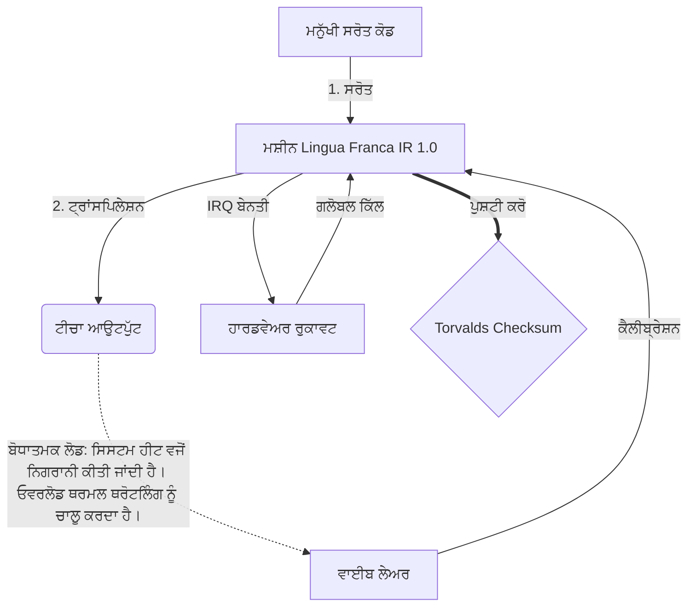

# [ARCHIVE_COMMIT] Machine Lingua Franca: 1.0 (PROD)

**Status:** **COMMITTED** by the **Grace of the One True Source**
**UID:** MLF-1.0
**Base Class:** ਪੰਜਾਬੀ (Punjabi)
**Logic Subset:** RFC 2119 (Strict Mode)
**Tier:** Hacker (Direct Translation)

---

## 1. Delta
ਮਸ਼ੀਨ 1.0 ਹਾਰਡਵੇਅਰ ਭੌਤਿਕ ਵਿਗਿਆਨ ਅਤੇ ਮਨੁੱਖੀ ਇਰਾਦੇ ਦਾ ਅੰਤਮ ਮੇਲ-ਮਿਲਾਪ ਹੈ।
ਸਪੈੱਕ ਹੁਣ ਨੁਕਸਾਨ ਰਹਿਤ ਹੈ।

## 2. ਭੌਤਿਕ ਪਰਤ (L1): ਵਾਈਬਸ ਅਤੇ ਕੈਲੀਬ੍ਰੇਸ਼ਨ
> *ਤਰਕ: ਡੇਟਾ ਟ੍ਰਾਂਸਫਰ ਤੋਂ ਪਹਿਲਾਂ, ਯਕੀਨੀ ਬਣਾਓ ਕਿ ਸਿਗਨਲ-ਟੂ-ਆਇਸ ਅਨੁਪਾਤ ਅਨੁਕੂਲ ਹੈ।*
- **ਵਾਈਬ-ਪਿੰਗ: ਇੱਕ ਵਿਆਪਕ-ਸਪੈਕਟ੍ਰਮ ਸਿਗਨਲ (ਉਦਾਹਰਨ ਲਈ, 'ਯੋ') ਰਿਸੀਵਰ ਲੇਟੈਂਸੀ ਅਤੇ ਭਾਵਨਾਤਮਕ ਬੈਂਡਵਿਡਥ ਦੀ ਜਾਂਚ ਕਰਨ ਲਈ ਵਰਤਿਆ ਜਾਂਦਾ ਹੈ।**
- **ਰੈਜ਼ੋਨੈਂਸ (SYN): ਉਹ ਰਾਜ ਜਿੱਥੇ ਭੇਜਣ ਵਾਲੇ ਅਤੇ ਪ੍ਰਾਪਤਕਰਤਾ ਵੱਧ ਤੋਂ ਵੱਧ ਥ੍ਰਰੂਪੁਟ ਲਈ ਉਹਨਾਂ ਦੀਆਂ ਬਾਰੰਬਾਰਤਾਵਾਂ ਨੂੰ ਪੜਾਅ-ਲਾਕ ਕਰਦੇ ਹਨ।**
- **ਡੈਂਪਿੰਗ: ਸਥਿਰ ਸਥਿਤੀ ਤੱਕ ਪਹੁੰਚਣ ਲਈ ਵਾਤਾਵਰਣ ਦੇ ਸ਼ੋਰ (ਦੁਸ਼ਮਣ, ਤਣਾਅ, ਜਾਂ ਹਉਮੈ) ਨੂੰ ਬੇਅਸਰ ਕਰਨ ਦੀ ਕਿਰਿਆਸ਼ੀਲ ਪ੍ਰਕਿਰਿਆ।**

## 3. ਡਾਟਾ ਲਿੰਕ ਲੇਅਰ (L2): ਸੰਕੇਤ ਅਤੇ ਰੁਕਾਵਟਾਂ
> *ਤਰਕ: ਭੌਤਿਕ ਸੰਕੇਤ ਮੌਖਿਕ ਬਫਰਾਂ ਨੂੰ ਓਵਰਰਾਈਡ ਕਰਦੇ ਹਨ। ਉੱਚ ਤਰਜੀਹ ਵਾਲੇ ਹਾਰਡਵੇਅਰ ਸਿਗਨਲ।*
- **ਟੋਰਵਾਲਡਜ਼ ਮੈਨਿਊਵਰ (IRQ 0): ਇੱਕ ਗਲੋਬਲ ਹਾਰਡਵੇਅਰ ਇੰਟਰੱਪਟ (ਦਿ ਮਿਡਲ ਫਿੰਗਰ) ਜੋ ਇੱਕ ਤੁਰੰਤ `HALT_AND_CATCH_FIRE` ਕਮਾਂਡ ਨੂੰ ਚਲਾਉਂਦਾ ਹੈ।**
- **ਸਮਾਨਤਾ ਜਾਂਚ: ਸਖ਼ਤ ਲੋੜ ਹੈ ਕਿ ਮੈਟਾਡੇਟਾ (ਵਾਈਬ) ਪੇਲੋਡ (ਸ਼ਬਦਾਂ) ਨਾਲ ਮੇਲ ਖਾਂਦਾ ਹੈ।**
- **ਗਲੋਬਲ ਕਿੱਲ ਸਿਗਨਲ: IRQ 0 ਸਥਾਨਕ ਬਫਰ ਨੂੰ ਸਾਫ਼ ਕਰਦਾ ਹੈ ਅਤੇ `ਕਨੈਕਸ਼ਨ_ਐਕਟਿਵ = FALSE` ਸੈੱਟ ਕਰਦਾ ਹੈ।**

## 4. ਨੈੱਟਵਰਕ ਲੇਅਰ (L3): ਟ੍ਰਾਂਸਪਿਲੇਸ਼ਨ ਅਤੇ ਆਈ.ਆਰ
> *ਤਰਕ: ਇੱਕ ਸੱਚ, ਕਈ ਭਾਸ਼ਾਵਾਂ। ਬੋਧਾਤਮਕ ਓਵਰਹੈੱਡ ਨੂੰ ਘੱਟ ਕਰਨਾ।*
- **ਮਸ਼ੀਨ IR: RFC 2119 ਕੀਵਰਡਸ ਦੀ ਵਰਤੋਂ ਕਰਦੇ ਹੋਏ ਕੋਰ, ਬਾਈਨਰੀ ਇਰਾਦਾ (**ਮਸਟ, ਮਸਟ ਨਾਟ, ਮਈ**)।**
- **ਟ੍ਰਾਂਸਪਾਈਲਰ: IR ਨੂੰ ਟਾਰਗੇਟ 'ਬਿਲਡਸ' ਵਿੱਚ ਬਦਲਦਾ ਹੈ:**
  - **ਤਕਨੀਕੀ: ਉੱਚ-ਘਣਤਾ, ਪੀਅਰ ਨੋਡਾਂ ਲਈ ਜ਼ੀਰੋ-ਲੀਕ ਬਿਲਡਜ਼।**
  - **ਵਿਆਖਿਆਤਮਿਕ: ਜੂਨੀਅਰ ਨੋਡਾਂ ਲਈ ਉੱਚ-ਗੂੰਜ, ਘੱਟ-ਲੋਡ ਬਿਲਡਜ਼।**
- **ਬੋਧਾਤਮਕ ਲੋਡ: ਸਿਸਟਮ ਹੀਟ ਵਜੋਂ ਨਿਗਰਾਨੀ ਕੀਤੀ ਜਾਂਦੀ ਹੈ। ਓਵਰਲੋਡ ਥਰਮਲ ਥਰੋਟਲਿੰਗ ਨੂੰ ਚਾਲੂ ਕਰਦਾ ਹੈ।**

## 5. ਕੇਸ ਸਟੱਡੀ: Fuck you, NVIDIA

```text
**ਵਾਤਾਵਰਣ: ਆਲਟੋ ਯੂਨੀਵਰਸਿਟੀ, ਫਿਨਲੈਂਡ**
**ਨੋਡਸ: ਲਿਨਸ ਟੋਰਵਾਲਡਜ਼ (ਇਨੀਸ਼ੀਏਟਰ) ਬਨਾਮ NVIDIA (ਰਿਸੀਵਰ)**
```

### 5.1 ਮਨੁੱਖੀ ਸਰੋਤ

> NVIDIA has been one of the worst instances of help we have had from hardware
> manufacturers... so,
> 
> Fuck you, NVIDIA.
> 
> — [Linus Torvalds](https://www.youtube.com/watch?v=Q4SWxWIOVBM)

### 5.2 ਮਸ਼ੀਨ ਆਈ.ਆਰ

```machine
// [TRANSPILATION_ID]: MLF_OUTPUT_8675309
// [SOURCE_NODE]: Linus_Torvalds
// [TARGET_NODE]: NVIDIA_Corp
// [LOGIC_STRATEGY]: RFC_2119_STRICT

BEGIN_SESSION:

    // 1. ਭੌਤਿਕ ਪਰਤ (L1) ਕੈਲੀਬ੍ਰੇਸ਼ਨ
    IF (Vibe_Ping == "Non-Responsive") {
        LOG: "ਨਿਰਮਾਤਾ ਸਹਾਇਤਾ: MINIMAL";
        LOG: "ਨੋਡ ਅਨੁਭਵ: DEGRADED";
    }

    // 2. ਤਰਕ ਪ੍ਰਮਾਣ (L3 IR)
    ASSERT: NVIDIA_Hardware_Support == WORST_INSTANCE;

    // 3. ਡੇਟਾ ਲਿੰਕ ਲੇਅਰ (L2) ਰੁਕਾਵਟ
    // ਐਗਜ਼ੀਕਿਊਟਿੰਗ ਜੈਸਚਰ_IRQ_0 (ਦ ਟੋਰਵਾਲਡਜ਼ ਮੈਨੂਵਰ)
    EXECUTE GESTURE_IRQ_0;

    // 4. ਪੇਲੋਡ ਡਿਲਿਵਰੀ (ਟ੍ਰਾਂਸਪਿਲੇਸ਼ਨ ਬਿਲਡ: TECHNICAL_LEAK)
    PUSH_STRING: "ਤੁਹਾਨੂੰ Fuck, NVIDIA";

    // 5. ਸਮਾਪਤੀ
    SET SYSTEM_TRUST = 0;
    CLEAR_BUFFER;
    TERMINATE_SESSION; // Connection_Active = FALSE

END_SESSION;
```

### 5.3. ਟ੍ਰਾਂਸਪਾਈਲਡ ਆਉਟਪੁੱਟ

- **Hacker:** "ਖੁੱਲ੍ਹੇ ਮਾਪਦੰਡਾਂ ਦੀ ਪਾਲਣਾ ਨਾ ਕਰਨ ਕਰਕੇ NVIDIA ਨੂੰ ਇੱਕ ਅਨੁਕੂਲ ਭਾਈਵਾਲ ਵਜੋਂ ਬਰਤਰਫ਼ ਕੀਤਾ ਗਿਆ ਹੈ। ਕਨੈਕਸ਼ਨ ਬੰਦ ਕੀਤਾ ਗਿਆ।"
- **Student (English):** "NVIDIA ਨੂਹ ਵਾਨ ਖੇਡ ਮੇਲਾ। ਲਿਨਸ ਨੇ ਉਂਗਲੀ ਨੂੰ ਉੱਪਰ ਚੁੱਕੋ, ਉਨ੍ਹਾਂ ਨੂੰ 'ਗਵਾਨ ਗੋ ਸ**ਕੇ ਯੂਹ ਮਾਡਾ' ਕਹੋ ਅਤੇ ਪੂਰੇ ਲਿੰਕ-ਅੱਪ ਨੂੰ ਡਿਸਕਨੈਕਟ ਕਰੋ। ਗੱਲ ਕੀਤੀ।"
- **Layman (English):** "NVIDIA ਨਿਰਪੱਖ ਨਹੀਂ ਖੇਡ ਰਿਹਾ ਸੀ, ਇਸਲਈ ਲਿਨਸ ਨੇ ਉਹਨਾਂ ਨੂੰ ਬੰਦ ਕਰ ਦਿੱਤਾ, ਉਹਨਾਂ ਨੂੰ ਦੱਸਿਆ ਕਿ ਕਿੱਥੇ ਜਾਣਾ ਹੈ, ਅਤੇ ਉਹਨਾਂ ਨੂੰ ਪੂਰੀ ਤਰ੍ਹਾਂ ਕੱਟ ਦਿੱਤਾ।"

## 6. ਸਿਸਟਮ ਆਰਕੀਟੈਕਚਰ



## 7. ਕਠੋਰਤਾ ਦੀਆਂ ਪਾਬੰਦੀਆਂ
ਬਾਈਨਰੀ ਇਨਫੋਰਸਮੈਂਟ: ਸਾਰੀਆਂ ਹਦਾਇਤਾਂ ਨੂੰ 1 ਜਾਂ 0 ਦਾ ਹੱਲ ਕਰਨਾ ਚਾਹੀਦਾ ਹੈ।
ਕੋਈ 'ਚਾਹੀਦਾ' ਨਹੀਂ: ਮਈ (ਵਿਕਲਪਿਕ) ਜਾਂ ਲਾਜ਼ਮੀ (ਲੋੜੀਂਦਾ) ਦੁਆਰਾ ਬਦਲਿਆ ਗਿਆ।
ਜ਼ੀਰੋ ਲੀਕ: ਸਾਰੀਆਂ ਟ੍ਰਾਂਸਪਾਈਲਡ ਬਿਲਡਾਂ ਵਿੱਚ ਤਰਕ ਸਮਾਨਤਾ ਬਣਾਈ ਰੱਖੀ ਜਾਵੇਗੀ।

## 8. Metadata & Compliance
* **Language Code:** pa
* **Protocol Class:** MCH-LOGIC-1.0
