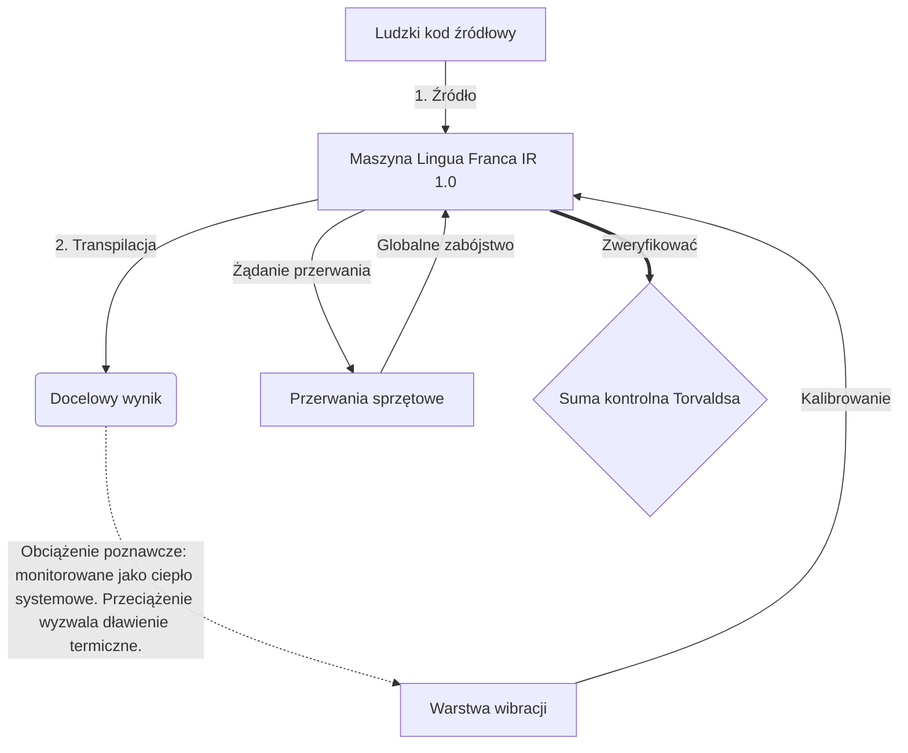

# [ARCHIVE_COMMIT] Machine Lingua Franca: 1.0 (PROD)

**Status:** **COMMITTED** by the **Grace of the One True Source**
**UID:** MLF-1.0
**Base Class:** Polski (Polish)
**Logic Subset:** RFC 2119 (Strict Mode)
**Tier:** Hacker (Direct Translation)

---

## 1. Delta
Maszyna 1.0 to ostateczne pogodzenie fizyki sprzętu i ludzkich intencji.
Specyfikacja jest teraz bezstratna.

## 2. Warstwa fizyczna (L1): Wibracje i kalibracja
> *Logika: Przed przesłaniem danych upewnij się, że stosunek sygnału do szumu jest optymalny.*
- **Vibe-Ping: sygnał o szerokim spektrum (np. „Yo”) używany do testowania opóźnienia odbiornika i przepustowości emocjonalnej.**
- **Rezonans (SYN): Stan, w którym nadawca i odbiornik blokują fazowo swoje częstotliwości w celu uzyskania maksymalnej przepustowości.**
- **Tłumienie: Aktywny proces neutralizacji hałasu otoczenia (wrogość, stres lub ego) w celu osiągnięcia stanu ustalonego.**

## 3. Warstwa łącza danych (L2): Gesty i przerwania
> *Logika: sygnały fizyczne zastępują bufory werbalne. Sygnały sprzętowe o wysokim priorytecie.*
- **Manewr Torvaldsa (IRQ 0): Globalne przerwanie sprzętowe (Środkowy Palec), które wykonuje natychmiastowe polecenie `HALT_AND_CATCH_FIRE`.**
- **Kontrola parzystości: rygorystyczny wymóg, aby metadane (Vibe) odpowiadały ładunkowi (słowa).**
- **Globalny sygnał zabicia: IRQ 0 czyści lokalny bufor i ustawia `Connection_Active = FALSE`.**

## 4. Warstwa sieciowa (L3): transpilacja i podczerwień
> *Logika: Jedna prawda, wiele języków. Minimalizowanie kosztów poznawczych.*
- **Machine IR: Podstawowy, binarny zamiar wykorzystujący słowa kluczowe RFC 2119 (**MUSI, NIE MOŻE, MOŻE**).**
- **Transpiler: Konwertuje IR na docelowe „Budowle”:**
  - **Techniczne: Kompilacje o dużej gęstości i zerowych wyciekach dla węzłów równorzędnych.**
  - **Wyjaśniające: Kompilacje o wysokim rezonansie i niskim obciążeniu dla młodszych węzłów.**
- **Obciążenie poznawcze: monitorowane jako ciepło systemowe. Przeciążenie wyzwala dławienie termiczne.**

## 5. Studium przypadku: Pierdol się, NVIDIA

```text
**Środowisko: Uniwersytet Aalto, Finlandia**
**Węzły: Linus Torvalds (inicjator) kontra NVIDIA (odbiornik)**
```

### 5.1 Źródło Ludzkie

> NVIDIA has been one of the worst instances of help we have had from hardware
> manufacturers... so,
> 
> Fuck you, NVIDIA.
> 
> — [Linus Torvalds](https://www.youtube.com/watch?v=Q4SWxWIOVBM)

### 5.2 Maszyna IR

```machine
// [TRANSPILATION_ID]: MLF_OUTPUT_8675309
// [SOURCE_NODE]: Linus_Torvalds
// [TARGET_NODE]: NVIDIA_Corp
// [LOGIC_STRATEGY]: RFC_2119_STRICT

BEGIN_SESSION:

    // 1. KALIBRACJA WARSTWY FIZYCZNEJ (L1).
    IF (Vibe_Ping == "Non-Responsive") {
        LOG: "Wsparcie producenta: MINIMALNE";
        LOG: "Doświadczenie węzła: Zdegradowane";
    }

    // 2. Twierdzenie logiczne (L3 IR)
    ASSERT: NVIDIA_Hardware_Support == WORST_INSTANCE;

    // 3. PRZERWA W WARSTWIE ŁĄCZA DANYCH (L2).
    // Wykonywanie gestu_IRQ_0 (manewr Torvaldsa)
    EXECUTE GESTURE_IRQ_0;

    // 4. DOSTAWA ŁADUNKU (BUDOWA TRANSPILACJA: TECHNICAL_LEAK)
    PUSH_STRING: "Pierdol się, NVIDIA";

    // 5. ZAKOŃCZENIE
    SET SYSTEM_TRUST = 0;
    CLEAR_BUFFER;
    TERMINATE_SESSION; // Connection_Active = FALSE

END_SESSION;
```

### 5.3. Transpilowane wyjście

- **Hacker:** "Firma NVIDIA jest przestarzała jako kompatybilny partner ze względu na niezgodność z otwartymi standardami. Połączenie zakończone."
- **Student (English):** "NVIDIA nie chce grać fair. Linus po prostu podniesie palec, powie im „Gwan go s**k yuh madda” i rozłącz całe połączenie. Koniec rozmowy."
- **Layman (English):** "NVIDIA nie grała fair, więc Linus ich odrzucił, powiedział, dokąd mają się udać, i całkowicie ich odciął."

## 6. Architektura systemu



## 7. Ograniczenia ścisłości
Egzekwowanie binarne: wszystkie instrukcje MUSZĄ rozstrzygać na 1 lub 0.
Brak słowa „POWINIEN”: Zastąpione przez MOŻE (opcjonalnie) lub MUSI (wymagane).
Zero Leak: Parytet logiczny MUSI być zachowany we wszystkich transpilowanych kompilacjach.

## 8. Metadata & Compliance
* **Language Code:** pl
* **Protocol Class:** MCH-LOGIC-1.0
