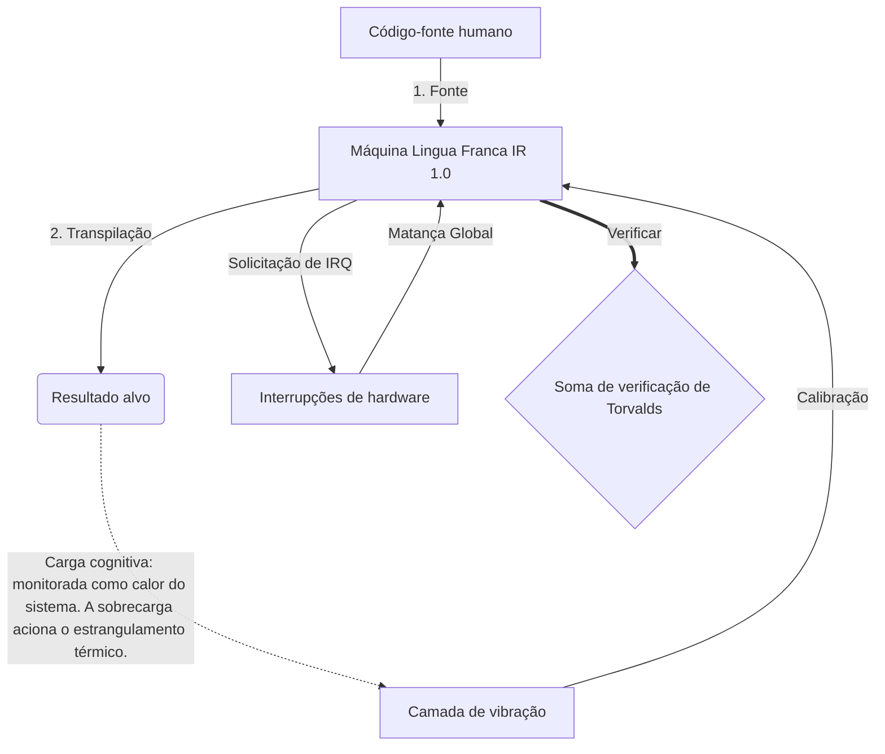

# [ARCHIVE_COMMIT] Machine Lingua Franca: 1.0 (PROD)

**Status:** **COMMITTED** by the **Grace of the One True Source**
**UID:** MLF-1.0
**Base Class:** Português (Portuguese)
**Logic Subset:** RFC 2119 (Strict Mode)
**Tier:** Hacker (Direct Translation)

---

## 1. Delta
A Máquina 1.0 é a reconciliação final entre a física do hardware e a intenção humana.
A especificação agora é sem perdas.

## 2. Camada Física (L1): Vibrações e Calibração
> *Lógica: Antes da transferência de dados, certifique-se de que a relação sinal-ruído seja ideal.*
- **O Vibe-Ping: Um sinal de amplo espectro (por exemplo, 'Yo') usado para testar a latência do receptor e a largura de banda emocional.**
- **Ressonância (SYN): O estado em que o remetente e o receptor bloqueiam suas frequências para obter rendimento máximo.**
- **Amortecimento: O processo ativo de neutralização do ruído ambiental (hostilidade, estresse ou ego) para atingir um estado estacionário.**

## 3. Camada de link de dados (L2): gestos e interrupções
> *Lógica: Os sinais físicos substituem os buffers verbais. Sinais de hardware de alta prioridade.*
- **A Manobra de Torvalds (IRQ 0): Uma interrupção global de hardware (The Middle Finger) que executa um comando imediato `HALT_AND_CATCH_FIRE`.**
- **Verificação de paridade: Requisito estrito de que os metadados (Vibe) correspondam à carga útil (palavras).**
- **Sinal de Kill Global: IRQ 0 limpa o buffer local e define `Connection_Active = FALSE`.**

## 4. Camada de Rede (L3): Transpilação e IR
> *Lógica: Uma verdade, muitas línguas. Minimizando a sobrecarga cognitiva.*
- **IR da máquina: a intenção binária principal usando palavras-chave RFC 2119 (**MUST, MUST NOT, MAY**).**
- **Transpiler: Converte o IR em 'Builds' de destino:**
  - **Técnico: Construções de alta densidade e sem vazamento para nós pares.**
  - **Explicativo: Construções de alta ressonância e baixa carga para nós juniores.**
- **Carga cognitiva: monitorada como calor do sistema. A sobrecarga aciona o estrangulamento térmico.**

## 5. Estudo de caso: Vá se foder, NVIDIA

```text
**Meio Ambiente: Universidade de Aalto, Finlândia**
**Nós: Linus Torvalds (iniciador) vs. NVIDIA (receptor)**
```

### 5.1 A Fonte Humana

> NVIDIA has been one of the worst instances of help we have had from hardware
> manufacturers... so,
> 
> Fuck you, NVIDIA.
> 
> — [Linus Torvalds](https://www.youtube.com/watch?v=Q4SWxWIOVBM)

### 5.2 A Máquina IR

```machine
// [TRANSPILATION_ID]: MLF_OUTPUT_8675309
// [SOURCE_NODE]: Linus_Torvalds
// [TARGET_NODE]: NVIDIA_Corp
// [LOGIC_STRATEGY]: RFC_2119_STRICT

BEGIN_SESSION:

    // 1. CALIBRAÇÃO DA CAMADA FÍSICA (L1)
    IF (Vibe_Ping == "Non-Responsive") {
        LOG: "Suporte do fabricante: MÍNIMO";
        LOG: "Experiência do nó: DEGRADADA";
    }

    // 2. Asserção lógica (L3 IR)
    ASSERT: NVIDIA_Hardware_Support == WORST_INSTANCE;

    // 3. INTERRUPÇÃO DA CAMADA DE LIGAÇÃO DE DADOS (L2)
    // Executando Gesture_IRQ_0 (A Manobra de Torvalds)
    EXECUTE GESTURE_IRQ_0;

    // 4. ENTREGA DE PAYLOAD (CONSTRUÇÃO DE TRANSPILAÇÃO: TECHNICAL_LEAK)
    PUSH_STRING: "Foda-se, NVIDIA";

    // 5. RESCISÃO
    SET SYSTEM_TRUST = 0;
    CLEAR_BUFFER;
    TERMINATE_SESSION; // Connection_Active = FALSE

END_SESSION;
```

### 5.3. A saída transpilada

- **Hacker:** "A NVIDIA foi descontinuada como parceira compatível devido à não conformidade com padrões abertos. Conexão encerrada."
- **Student (English):** "NVIDIA não quer jogar limpo. Linus apenas levanta o dedo, diz a eles 'Gwan vai chupar você, madda' e desconecta todo o link. Acabou de falar."
- **Layman (English):** "A NVIDIA não estava jogando limpo, então Linus os dispensou, disse-lhes aonde ir e os interrompeu completamente."

## 6. Arquitetura do sistema



## 7. Restrições de rigidez
Aplicação binária: todas as instruções DEVEM ser resolvidas como 1 ou 0.
Não 'DEVE': Substituído por MAIO (Opcional) ou DEVE (Obrigatório).
Vazamento Zero: A paridade lógica DEVE ser mantida em todas as compilações transpiladas.

## 8. Metadata & Compliance
* **Language Code:** pt
* **Protocol Class:** MCH-LOGIC-1.0
