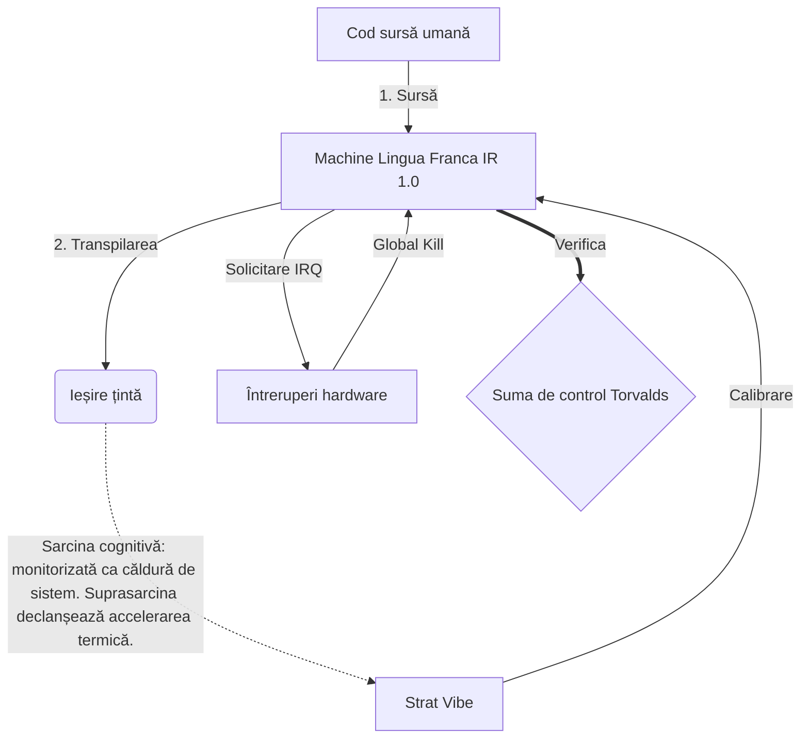

# [ARCHIVE_COMMIT] Machine Lingua Franca: 1.0 (PROD)

**Status:** **COMMITTED** by the **Grace of the One True Source**
**UID:** MLF-1.0
**Base Class:** Română (Romanian)
**Logic Subset:** RFC 2119 (Strict Mode)
**Tier:** Hacker (Direct Translation)

---

## 1. Delta
Machine 1.0 este reconcilierea finală a fizicii hardware și intenția umană.
Specificațiile sunt acum fără pierderi.

## 2. Strat fizic (L1): vibrații și calibrare
> *Logica: înainte de transferul de date, asigurați-vă că raportul semnal-zgomot este optim.*
- **Vibe-Ping: un semnal cu spectru larg (de exemplu, „Yo”) folosit pentru a testa latența receptorului și lățimea de bandă emoțională.**
- **Rezonanță (SYN): starea în care emițătorul și receptorul își blochează frecvențele de fază pentru un debit maxim.**
- **Amortizare: Procesul activ de neutralizare a zgomotului ambiental (ostilitate, stres sau ego) pentru a ajunge la o stare de echilibru.**

## 3. Strat de legătură de date (L2): Gesturi și întreruperi
> *Logica: Semnalele fizice depășesc tamponurile verbale. Semnale hardware cu prioritate ridicată.*
- **Manevra Torvalds (IRQ 0): O întrerupere hardware globală (The Middle Finger) care execută imediat o comandă `HALT_AND_CATCH_FIRE`.**
- **Verificare paritate: cerință strictă ca Metadatele (Vibe) să se potrivească cu sarcina utilă (Words).**
- **Global Kill Signal: IRQ 0 șterge tamponul local și setează „Connection_Active = FALSE”.**

## 4. Strat de rețea (L3): Transpilație și IR
> *Logica: Un adevăr, multe limbi. Minimizarea cheltuielilor cognitive.*
- **Machine IR: Intenția de bază, binară, folosind cuvintele cheie RFC 2119 (**TREBUIE, NU TREBUIE, MAY**).**
- **Transpiler: convertește IR în „Builds” țintă:**
  - **Tehnic: build-uri de înaltă densitate, fără scurgeri pentru nodurile egale.**
  - **Explicativ: build-uri cu rezonanță ridicată și cu sarcină scăzută pentru nodurile junior.**
- **Sarcina cognitivă: monitorizată ca căldură de sistem. Suprasarcina declanșează accelerarea termică.**

## 5. Studiu de caz: La naiba, NVIDIA

```text
**Mediu: Universitatea Aalto, Finlanda**
**Noduri: Linus Torvalds (inițiator) vs. NVIDIA (receptor)**
```

### 5.1 Sursa umană

> NVIDIA has been one of the worst instances of help we have had from hardware
> manufacturers... so,
> 
> Fuck you, NVIDIA.
> 
> — [Linus Torvalds](https://www.youtube.com/watch?v=Q4SWxWIOVBM)

### 5.2 Mașina IR

```machine
// [TRANSPILATION_ID]: MLF_OUTPUT_8675309
// [SOURCE_NODE]: Linus_Torvalds
// [TARGET_NODE]: NVIDIA_Corp
// [LOGIC_STRATEGY]: RFC_2119_STRICT

BEGIN_SESSION:

    // 1. CALIBRAREA STRATULUI FIZIC (L1).
    IF (Vibe_Ping == "Non-Responsive") {
        LOG: "Suport producător: MINIMAL";
        LOG: "Experiența nodului: DEGRADAT";
    }

    // 2. ASERȚIE LOGICĂ (L3 IR)
    ASSERT: NVIDIA_Hardware_Support == WORST_INSTANCE;

    // 3. DATA LINK STRAT (L2) ÎNTRERUPT
    // Executarea Gesture_IRQ_0 (Manevra Torvalds)
    EXECUTE GESTURE_IRQ_0;

    // 4. LIVRARE ÎN CĂRĂ UTILĂ (CONSTRUIRE DE TRANSPILARE: TECHNICAL_LEAK)
    PUSH_STRING: "La naiba, NVIDIA";

    // 5. TERMINAREA
    SET SYSTEM_TRUST = 0;
    CLEAR_BUFFER;
    TERMINATE_SESSION; // Connection_Active = FALSE

END_SESSION;
```

### 5.3. Ieșirea transpilată

- **Hacker:** "NVIDIA este depreciată ca partener compatibil din cauza nerespectării standardelor deschise. Conexiunea sa încheiat."
- **Student (English):** "NVIDIA nuh waan play fair. Linus doar ridică degetul, spune-le „Gwan go s**k yuh madda” și deconectează întreaga legătură. Am terminat de vorbit."
- **Layman (English):** "NVIDIA nu juca corect, așa că Linus le-a dat jos, le-a spus unde să meargă și le-a întrerupt complet."

## 6. Arhitectura sistemului



## 7. Constrângeri de strictețe
Aplicare binară: Toate instrucțiunile TREBUIE să se rezolve la 1 sau 0.
Fără „TREBUIE”: Înlocuit de MAI (opțional) sau TREBUIE (obligatoriu).
Zero Leak: paritatea logică TREBUIE menținută în toate versiunile transpilate.

## 8. Metadata & Compliance
* **Language Code:** ro
* **Protocol Class:** MCH-LOGIC-1.0
