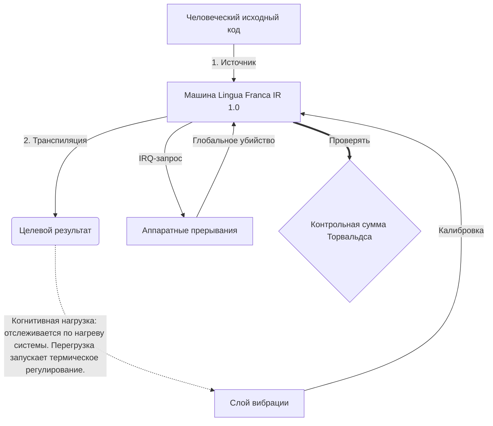

# [ARCHIVE_COMMIT] Machine Lingua Franca: 1.0 (PROD)

**Status:** **COMMITTED** by the **Grace of the One True Source**
**UID:** MLF-1.0
**Base Class:** Русский (Russian)
**Logic Subset:** RFC 2119 (Strict Mode)
**Tier:** Hacker (Direct Translation)

---

## 1. Delta
Машина 1.0 — это окончательное сочетание физики аппаратного обеспечения и человеческих намерений.
Спецификация теперь без потерь.

## 2. Физический уровень (L1): вибрации и калибровка
> *Логика: перед передачей данных убедитесь, что соотношение сигнал/шум оптимально.*
- **Vibe-Ping: сигнал широкого спектра (например, «Йо»), используемый для проверки задержки приемника и эмоциональной пропускной способности.**
- **Резонанс (SYN): состояние, при котором отправитель и получатель синхронизируют свои частоты по фазе для достижения максимальной пропускной способности.**
- **Демпфирование: активный процесс нейтрализации шума окружающей среды (враждебности, стресса или эго) для достижения устойчивого состояния.**

## 3. Уровень канала передачи данных (L2): жесты и прерывания
> *Логика: физические сигналы переопределяют словесные буферы. Высокоприоритетные аппаратные сигналы.*
- **Маневр Торвальдса (IRQ 0): глобальное аппаратное прерывание (Средний палец), которое немедленно выполняет команду `HALT_AND_CATCH_FIRE`.**
- **Проверка четности: строгое требование, чтобы метаданные (Vibe) соответствовали полезной нагрузке (словам).**
- **Глобальный сигнал уничтожения: IRQ 0 очищает локальный буфер и устанавливает Connection_Active = FALSE.**

## 4. Сетевой уровень (L3): транспиляция и IR
> *Логика: Одна истина, много языков. Минимизация когнитивных затрат.*
- **Machine IR: ядро, двоичное намерение с использованием ключевых слов RFC 2119 (**MUST, MUST NOT, MAY**).**
- **Transpiler: преобразует IR в целевые «сборки»:**
  - **Техническое: сборки с высокой плотностью и нулевой утечкой для одноранговых узлов.**
  - **Пояснение: высокорезонансные сборки с низкой нагрузкой для младших узлов.**
- **Когнитивная нагрузка: отслеживается по нагреву системы. Перегрузка запускает термическое регулирование.**

## 5. Практический пример: пошел на хуй, NVIDIA

```text
**Окружающая среда: Университет Аалто, Финляндия**
**Узлы: Линус Торвальдс (инициатор) против NVIDIA (приемник)**
```

### 5.1 Человеческий источник

> NVIDIA has been one of the worst instances of help we have had from hardware
> manufacturers... so,
> 
> Fuck you, NVIDIA.
> 
> — [Linus Torvalds](https://www.youtube.com/watch?v=Q4SWxWIOVBM)

### 5.2 Машина ИК

```machine
// [TRANSPILATION_ID]: MLF_OUTPUT_8675309
// [SOURCE_NODE]: Linus_Torvalds
// [TARGET_NODE]: NVIDIA_Corp
// [LOGIC_STRATEGY]: RFC_2119_STRICT

BEGIN_SESSION:

    // 1. КАЛИБРОВКА ФИЗИЧЕСКОГО СЛОЯ (L1)
    IF (Vibe_Ping == "Non-Responsive") {
        LOG: "Поддержка производителя: МИНИМАЛЬНАЯ";
        LOG: "Опыт работы узла: Ухудшен";
    }

    // 2. ЛОГИЧЕСКОЕ УТВЕРЖДЕНИЕ (L3 IR)
    ASSERT: NVIDIA_Hardware_Support == WORST_INSTANCE;

    // 3. ПРЕРЫВАНИЕ УРОВНЯ КАНАЛА ДАННЫХ (L2)
    // Выполнение Gesture_IRQ_0 (маневр Торвальдса)
    EXECUTE GESTURE_IRQ_0;

    // 4. ДОСТАВКА ПОЛЕЗНОЙ НАГРУЗКИ (СТРОЙКА ТРАНСПИЛЯЦИИ: TECHNICAL_LEAK)
    PUSH_STRING: "Иди на хуй, NVIDIA";

    // 5. ПРЕКРАЩЕНИЕ
    SET SYSTEM_TRUST = 0;
    CLEAR_BUFFER;
    TERMINATE_SESSION; // Connection_Active = FALSE

END_SESSION;
```

### 5.3. Транспилированный вывод

- **Hacker:** "NVIDIA признана несовместимым партнером из-за несоответствия открытым стандартам. Соединение прекращено."
- **Student (English):** "NVIDIA не может играть честно. Лайнус просто поднял палец, сказал им: «Гван, иди к черту, мадда», и отключил все соединение. Закончили разговор."
- **Layman (English):** "NVIDIA вела нечестную игру, поэтому Линус оттолкнул их, сказал, куда идти, и полностью отключил их."

## 6. Архитектура системы



## 7. Ограничения строгости
Двоичное исполнение: все инструкции ДОЛЖНЫ разрешаться в 1 или 0.
Нет «СЛЕДУЕТ»: заменено на «МОЖЕТ» (необязательно) или «ДОЛЖНО» (обязательно).
Нулевая утечка: логическая четность ДОЛЖНА поддерживаться во всех передаваемых сборках.

## 8. Metadata & Compliance
* **Language Code:** ru
* **Protocol Class:** MCH-LOGIC-1.0
