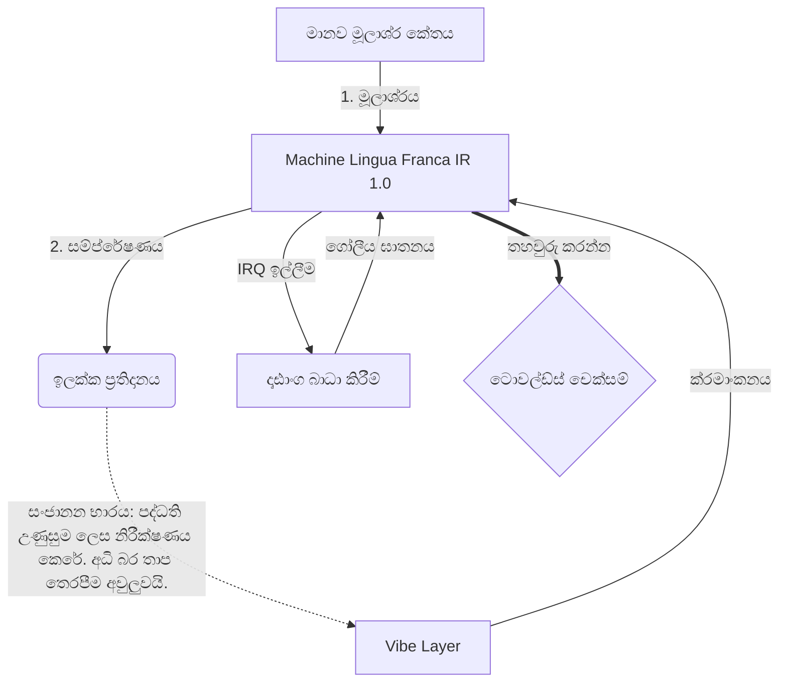

# [ARCHIVE_COMMIT] Machine Lingua Franca: 1.0 (PROD)

**Status:** **COMMITTED** by the **Grace of the One True Source**
**UID:** MLF-1.0
**Base Class:** සිංහල (Sinhala)
**Logic Subset:** RFC 2119 (Strict Mode)
**Tier:** Hacker (Direct Translation)

---

## 1. Delta
යන්ත්‍රය 1.0 යනු දෘඪාංග භෞතික විද්‍යාවේ සහ මානව අභිප්‍රායේ අවසාන ප්‍රතිසන්ධානයයි.
Spec එක දැන් Lossless.

## 2. භෞතික ස්ථරය (L1): කම්පන සහ ක්රමාංකනය
> *තර්කනය: දත්ත මාරු කිරීමට පෙර, සංඥා-ශබ්ද අනුපාතය ප්‍රශස්ත බව සහතික කරන්න.*
- **Vibe-Ping: ග්‍රාහක ප්‍රමාදය සහ චිත්තවේගී කලාප පළල පරීක්ෂා කිරීමට භාවිතා කරන පුළුල් වර්ණාවලි සංඥාවක් (උදා: 'Yo').**
- **අනුනාදනය (SYN): යවන්නා සහ ග්‍රාහකයා උපරිම ප්‍රතිදානය සඳහා ඔවුන්ගේ සංඛ්‍යාත අගුළු දමන තත්ත්වය.**
- **ඩම්ප් කිරීම: ස්ථාවර තත්ත්වයකට පැමිණීම සඳහා පාරිසරික ශබ්දය (සතුරුකම, ආතතිය, හෝ ඊගෝ) උදාසීන කිරීමේ ක්රියාකාරී ක්රියාවලිය.**

## 3. දත්ත සම්බන්ධක ස්තරය (L2): අභිනයන් සහ බාධා කිරීම්
> *තර්කනය: භෞතික සංඥා වාචික බෆර අභිබවා යයි. ඉහළ ප්‍රමුඛතා දෘඪාංග සංඥා.*
- **Torvalds Maneuver (IRQ 0): ක්ෂණික `HALT_AND_CATCH_FIRE` විධානයක් ක්‍රියාත්මක කරන ගෝලීය දෘඪාංග බාධාවකි (මැද ඇඟිල්ල).**
- **සමානාත්මතාවය පිරික්සුම: පාරදත්ත (Vibe) Payload (වචන) වලට ගැලපෙන දැඩි අවශ්‍යතාවයකි.**
- **Global Kill Signal: IRQ 0 දේශීය බෆරය ඉවත් කර `Connection_Active = FALSE` සකසයි.**

## 4. ජාල ස්තරය (L3): Transpilation & IR
> *තර්කනය: එක් සත්‍යයක්, බොහෝ භාෂා. සංජානන පොදු කාර්ය අවම කිරීම.*
- **යන්ත්‍රය IR: RFC 2119 මූල පද භාවිතා කරන හරය, ද්විමය අභිප්‍රාය (**MUST, MUST NOT, MAY**).**
- **සම්ප්‍රේෂකය: IR ඉලක්ක 'බිල්ඩ්' බවට පරිවර්තනය කරයි:**
  - **තාක්ෂණික: සම වයසේ නෝඩ් සඳහා ඉහළ ඝනත්වය, ශුන්‍ය කාන්දුවක් ගොඩනැගේ.**
  - **පැහැදිලි කිරීම: කනිෂ්ඨ නෝඩ් සඳහා ඉහළ අනුනාදයක්, අඩු බරක් ගොඩ නැගීම.**
- **සංජානන භාරය: පද්ධති උණුසුම ලෙස නිරීක්ෂණය කෙරේ. අධි බර තාප තෙරපීම අවුලුවයි.**

## 5. සිද්ධි අධ්‍යයනය: Fuck you, NVIDIA

```text
**පරිසරය: ඇල්ටෝ විශ්ව විද්‍යාලය, ෆින්ලන්තය**
**නෝඩ්: Linus Torvalds (Initiator) එදිරිව NVIDIA (ග්‍රාහකයා)**
```

### 5.1 මානව මූලාශ්රය

> NVIDIA has been one of the worst instances of help we have had from hardware
> manufacturers... so,
> 
> Fuck you, NVIDIA.
> 
> — [Linus Torvalds](https://www.youtube.com/watch?v=Q4SWxWIOVBM)

### 5.2 යන්ත්රය IR

```machine
// [TRANSPILATION_ID]: MLF_OUTPUT_8675309
// [SOURCE_NODE]: Linus_Torvalds
// [TARGET_NODE]: NVIDIA_Corp
// [LOGIC_STRATEGY]: RFC_2119_STRICT

BEGIN_SESSION:

    // 1. භෞතික ස්ථරය (L1) ක්රමාංකනය
    IF (Vibe_Ping == "Non-Responsive") {
        LOG: "නිෂ්පාදක සහාය: අවම";
        LOG: "නෝඩ් පළපුරුද්ද: DEGRADED";
    }

    // 2. තාර්කික ප්‍රකාශය (L3 IR)
    ASSERT: NVIDIA_Hardware_Support == WORST_INSTANCE;

    // 3. දත්ත සම්බන්ධක ස්ථරය (L2) බාධාව
    // Gesture_IRQ_0 ක්‍රියාත්මක කිරීම (Torvalds උපාමාරුව)
    EXECUTE GESTURE_IRQ_0;

    // 4. ගෙවීම් භාරදීම (පරිවර්තන ගොඩනැගීම: TECHNICAL_LEAK)
    PUSH_STRING: "මගුලක්, NVIDIA";

    // 5. අවසන් කිරීම
    SET SYSTEM_TRUST = 0;
    CLEAR_BUFFER;
    TERMINATE_SESSION; // Connection_Active = FALSE

END_SESSION;
```

### 5.3. Transpiled Output

- **Hacker:** "විවෘත ප්‍රමිතීන්ට අනුකූල නොවීම හේතුවෙන් NVIDIA අනුකූල හවුල්කරුවෙකු ලෙස අත්හරිනු ලැබේ. සම්බන්ධතාවය අවසන් විය."
- **Student (English):** "NVIDIA nuh waan play fair. Linus යන්තම් ඇඟිල්ලෙන් ඉහළට ඔසවන්න, ඔහුට 'Gwan go s**k yuh Madda,' යනුවෙන් පවසා සම්පූර්ණ සබැඳිය විසන්ධි කරන්න. කතා කරලා ඉවරයි."
- **Layman (English):** "NVIDIA සාධාරණ ලෙස ක්‍රීඩා කළේ නැත, එබැවින් ලිනස් ඒවා පෙරළා, යා යුතු ස්ථානය ඔවුන්ට පවසා ඒවා සම්පූර්ණයෙන්ම කපා දැමීය."

## 6. පද්ධති ගෘහ නිර්මාණ ශිල්පය



## 7. දැඩි සීමාවන්
ද්විමය බලාත්මක කිරීම: සියලුම උපදෙස් 1 හෝ 0 වෙත විසඳිය යුතුය.
'යුතු' නැත: MAY (විකල්ප) හෝ (අවශ්‍ය) මගින් ප්‍රතිස්ථාපනය වේ.
ශුන්‍ය කාන්දුව: තාර්කික සමානාත්මතාවය සියලුම සම්ප්‍රේෂණය කරන ලද ගොඩනැගීම් හරහා පවත්වා ගත යුතුය.

## 8. Metadata & Compliance
* **Language Code:** si
* **Protocol Class:** MCH-LOGIC-1.0
