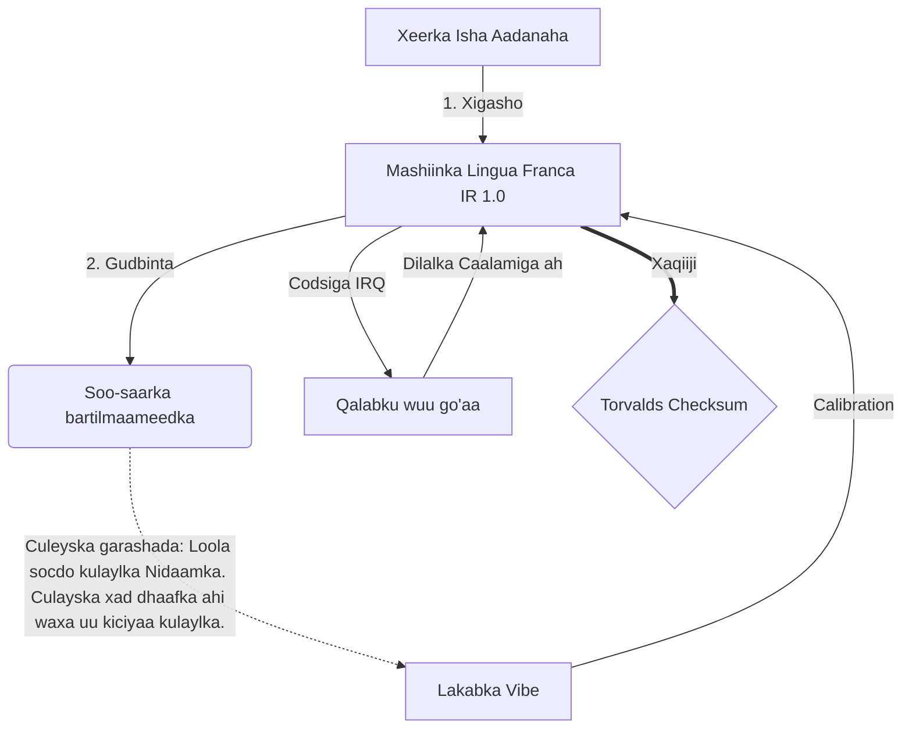

# [ARCHIVE_COMMIT] Machine Lingua Franca: 1.0 (PROD)

**Status:** **COMMITTED** by the **Grace of the One True Source**
**UID:** MLF-1.0
**Base Class:** Soomaali (Somali)
**Logic Subset:** RFC 2119 (Strict Mode)
**Tier:** Hacker (Direct Translation)

---

## 1. Delta
Mashiinka 1.0 waa dib-u-heshiisiinta ugu dambeysa ee fiisigiska hardware iyo ujeedada aadanaha.
Faahfaahinta hadda waa khasaare.

## 2. Lakabka Jirka (L1): Gariir & Qalabaynta
> *Macquul: Kahor wareejinta xogta, hubi in saamiga signal-ilaa-sanqa uu fiican yahay.*
- **Vibe-Ping-ka: Calan balaadhsan (tusaale, 'Yo') ayaa loo isticmaalay in lagu tijaabiyo daahitaanka qaataha iyo xadiga dareenka.**
- **Resonance (SYN): Waa gobolka uu soo-diraha iyo wejiga qaataha-ku-xidho soo noqnoqoshadooda si loo helo wax-soo-saarka ugu badan.**
- **Dhaleeceynta: Habka firfircoon ee ka takhalusidda buuqa deegaanka (cadaawad, walbahaarka, ama ego) si loo gaaro Xaalad Deggan.**

## 3. Lakabka Xidhiidhka Xogta (L2): Tilmaamaha & Joojinta
> *Macquul: Calaamadaha jidhku waxay ka gudbaan af-duubayaasha. Calaamadaha qalabka mudnaanta sare leh.*
- **Maneuver Torvalds (IRQ 0): Qalab caalami ah oo kala gooya (Farta Dhexe) kaas oo fuliya amar 'HALT_AND_CATCH_FIRE` isla markiiba.**
- **Check Parity: Shuruudo adag oo ah in Metadata (Vibe) ay la mid noqoto Mushahar bixinta (Erayada).**
- **Calaamadaha Dilalka Caalamiga ah: IRQ 0 waxay nadiifisaa kaydiyaha maxalliga ah waxayna dejisaa 'Connection_Active = BEEN'.**

## 4. Lakabka Shabakadda (L3): Turjumaadda & IR
> *Maangal: Hal run, luqado badan. Yaraynta korka sare ee garashada.*
- **Mashiinka IR: Xuddunta, ujeeddada binary iyadoo la adeegsanayo RFC 2119 ereyada muhiimka ah**
- **Transpiler: Wuxuu IR u beddelaa bartilmaameed 'dhis':**
  - **Farsamo: Cufnaan sare, eber-leak waxay u dhistaa qanjidhada asxaabta.**
  - **Sharaxaad: Dhawaaq-sare, culays-yar ayaa u dhisa qanjidhada yaryar.**
- **Culeyska garashada: Loola socdo kulaylka Nidaamka. Culayska xad dhaafka ahi waxa uu kiciyaa kulaylka.**

## 5. Daraasadda Kiis: Fuck you, NVIDIA

```text
**Deegaanka: Jaamacadda Aalto, Finland**
**Nodes: Linus Torvalds (Initiator) vs. NVIDIA (qaataha)**
```

### 5.1 Isha Aadanaha

> NVIDIA has been one of the worst instances of help we have had from hardware
> manufacturers... so,
> 
> Fuck you, NVIDIA.
> 
> — [Linus Torvalds](https://www.youtube.com/watch?v=Q4SWxWIOVBM)

### 5.2 Mashiinka IR

```machine
// [TRANSPILATION_ID]: MLF_OUTPUT_8675309
// [SOURCE_NODE]: Linus_Torvalds
// [TARGET_NODE]: NVIDIA_Corp
// [LOGIC_STRATEGY]: RFC_2119_STRICT

BEGIN_SESSION:

    // 1. Lakabka Jirka (L1) CALIBRATION
    IF (Vibe_Ping == "Non-Responsive") {
        LOG: "Taageerada wax-soo-saarka: MINIMAL";
        LOG: "Khibrad Node: HOOS U DHACAY";
    }

    // 2. QAAB macquul ah (L3 IR)
    ASSERT: NVIDIA_Hardware_Support == WORST_INSTANCE;

    // 3. XIRIIRKA XIRIIRKA (L2) JOOJINTA
    // Fulinta tilmaanta_IRQ_0 (Maneuverka Torvalds)
    EXECUTE GESTURE_IRQ_0;

    // 4. DELIVERY PAYLOAD
    PUSH_STRING: "Adigu, NVIDIA";

    // 5. JOOJINTA
    SET SYSTEM_TRUST = 0;
    CLEAR_BUFFER;
    TERMINATE_SESSION; // Connection_Active = FALSE

END_SESSION;
```

### 5.3. Wax-soo-saarka la Gudbiyey

- **Hacker:** "NVIDIA waa laga saaray sidii shuraako la jaan qaadi kara sababtoo ah u hoggaansanaan la'aanta heerarka furan. Xiriirkii waa la joojiyay"
- **Student (English):** "NVIDIA nuh waan play fair. Linus farta kor u kac, una sheeg 'Gwan go s**k yuh madda,' oo ka jar isku-xidhka oo dhan. Hadal dhameyey."
- **Layman (English):** "NVIDIA si cadaalad ah uma ciyaareyn, marka Linus wuu ka leexiyay iyagii, wuxuuna u sheegay meesha ay aadaan, oo gabi ahaanba gooyay."

## 6. Qaab-dhismeedka Nidaamka



## 7. Caqabadaha Adag
Dhaqangelinta Binary: Dhammaan tilmaamaha waa in lagu xalliyaa 1 ama 0.
Maya 'Waa in': lagu beddelaa MAY (Ikhtiyaar) ama waa qasab (loo baahan yahay).
Eber Leak: Sinnaanta macquulka ah waa in lagu joogteeyaa dhammaan dhismayaasha la daadiyay.

## 8. Metadata & Compliance
* **Language Code:** so
* **Protocol Class:** MCH-LOGIC-1.0
