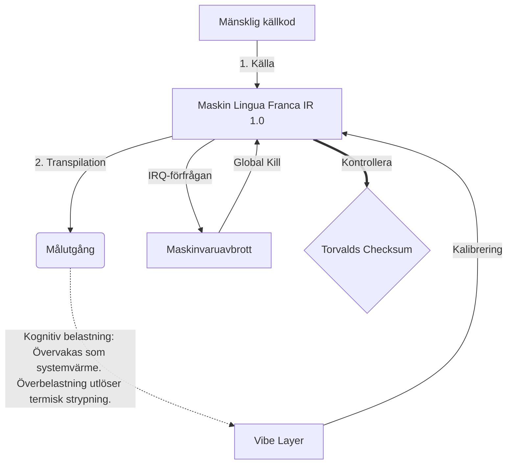

# [ARCHIVE_COMMIT] Machine Lingua Franca: 1.0 (PROD)

**Status:** **COMMITTED** by the **Grace of the One True Source**
**UID:** MLF-1.0
**Base Class:** Svenska (Swedish)
**Logic Subset:** RFC 2119 (Strict Mode)
**Tier:** Hacker (Direct Translation)

---

## 1. Delta
Machine 1.0 är den slutliga föreningen mellan hårdvarufysik och mänskliga avsikter.
Specifikationen är nu Lossless.

## 2. Fysiskt lager (L1): Vibbar och kalibrering
> *Logik: Före dataöverföring, se till att signal-brusförhållandet är optimalt.*
- **Vibe-Ping: En bredspektrumsignal (t.ex. "Yo") som används för att testa mottagarens latens och känslomässig bandbredd.**
- **Resonans (SYN): Tillståndet där sändaren och mottagaren faslåser sina frekvenser för maximal genomströmning.**
- **Dämpning: Den aktiva processen att neutralisera omgivande buller (fientlighet, stress eller ego) för att nå ett stabilt tillstånd.**

## 3. Datalänklager (L2): Gester och avbrott
> *Logik: Fysiska signaler åsidosätter verbala buffertar. Högprioriterade hårdvarusignaler.*
- **Torvalds-manövern (IRQ 0): Ett globalt hårdvaruavbrott (Mångfingret) som utför ett omedelbart `HALT_AND_CATCH_FIRE`-kommando.**
- **Paritetskontroll: Strikt krav på att Metadata (Vibe) matchar nyttolast (Words).**
- **Global Kill Signal: IRQ 0 rensar den lokala bufferten och ställer in `Connection_Active = FALSE`.**

## 4. Nätverkslager (L3): Transpilering & IR
> *Logik: En sanning, många språk. Minimera kognitiva omkostnader.*
- **Machine IR: Kärnan, binär avsikt med RFC 2119-nyckelord (**MÅSTE, FÅR INTE, MAJ**).**
- **Transpiler: Konverterar IR till mål "Builds":**
  - **Tekniskt: Högdensitet, noll läckage för peer-noder.**
  - **Förklarande: Bygger med hög resonans och låg belastning för juniornoder.**
- **Kognitiv belastning: Övervakas som systemvärme. Överbelastning utlöser termisk strypning.**

## 5. Fallstudie: Fy fan, NVIDIA

```text
**Miljö: Aalto-universitetet, Finland**
**Noder: Linus Torvalds (initiator) vs. NVIDIA (mottagare)**
```

### 5.1 Den mänskliga källan

> NVIDIA has been one of the worst instances of help we have had from hardware
> manufacturers... so,
> 
> Fuck you, NVIDIA.
> 
> — [Linus Torvalds](https://www.youtube.com/watch?v=Q4SWxWIOVBM)

### 5.2 Maskinen IR

```machine
// [TRANSPILATION_ID]: MLF_OUTPUT_8675309
// [SOURCE_NODE]: Linus_Torvalds
// [TARGET_NODE]: NVIDIA_Corp
// [LOGIC_STRATEGY]: RFC_2119_STRICT

BEGIN_SESSION:

    // 1. KALIBRERING AV FYSISKT LAGER (L1).
    IF (Vibe_Ping == "Non-Responsive") {
        LOG: "Tillverkarsupport: MINIMAL";
        LOG: "Nodupplevelse: DEGRADERAD";
    }

    // 2. LOGISK ANSERT (L3 IR)
    ASSERT: NVIDIA_Hardware_Support == WORST_INSTANCE;

    // 3. DATALÄNKLAGER (L2) AVBROTT
    // Executing Gesture_IRQ_0 (Torvalds-manövern)
    EXECUTE GESTURE_IRQ_0;

    // 4. LEVERING AV NYTTSLAST (TRANSPILATIONSBYGGNAD: TECHNICAL_LEAK)
    PUSH_STRING: "Fy fan, NVIDIA";

    // 5. UPPSÄGNING
    SET SYSTEM_TRUST = 0;
    CLEAR_BUFFER;
    TERMINATE_SESSION; // Connection_Active = FALSE

END_SESSION;
```

### 5.3. Den transpilerade utgången

- **Hacker:** "NVIDIA fasas ut som en kompatibel partner på grund av bristande efterlevnad av öppna standarder. Anslutningen avslutad."
- **Student (English):** "NVIDIA nuh waan play fair. Linus lyfter bara upp fingret, säg till dem 'Gwan go s**k yuh madda' och koppla bort hela länken. Färdigt snack."
- **Layman (English):** "NVIDIA spelade inte rättvist, så Linus vände bort dem, berättade för dem vart de skulle gå och skar bort dem helt."

## 6. Systemarkitektur



## 7. Strikthetsbegränsningar
Binär verkställighet: Alla instruktioner MÅSTE lösas till 1 eller 0.
Nej "SKA": Ersätts av MAJ (Valfritt) eller MÅSTE (Obligatoriskt).
Nollläckage: Logikparitet SKA bibehållas över alla transpilerade byggen.

## 8. Metadata & Compliance
* **Language Code:** sv
* **Protocol Class:** MCH-LOGIC-1.0
