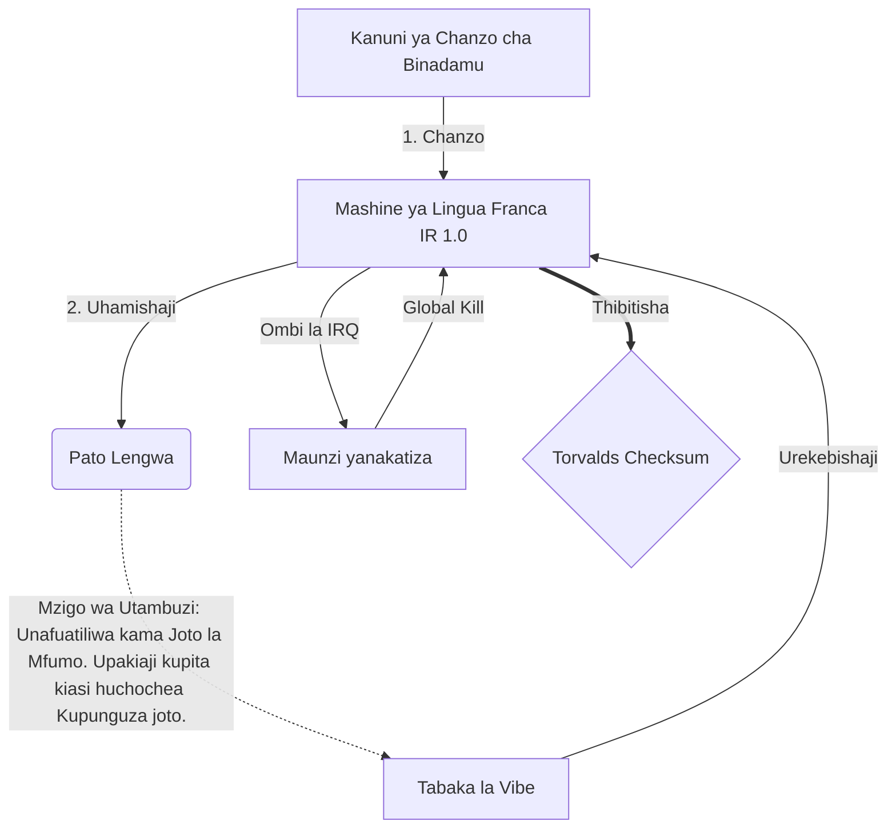

# [ARCHIVE_COMMIT] Machine Lingua Franca: 1.0 (PROD)

**Status:** **COMMITTED** by the **Grace of the One True Source**
**UID:** MLF-1.0
**Base Class:** Kiswahili (Swahili)
**Logic Subset:** RFC 2119 (Strict Mode)
**Tier:** Hacker (Direct Translation)

---

## 1. Delta
Mashine 1.0 ni upatanisho wa mwisho wa fizikia ya maunzi na nia ya mwanadamu.
Kielelezo sasa hakina hasara.

## 2. Safu ya Kimwili (L1): Vibes & Calibration
> *Mantiki: Kabla ya kuhamisha data, hakikisha uwiano wa mawimbi kati ya kelele ni bora zaidi.*
- **Vibe-Ping: Mawimbi ya wigo mpana (k.m., 'Yo') inayotumiwa kujaribu muda wa kusubiri wa kipokezi na kipimo data cha hisia.**
- **Resonance (SYN): Hali ambapo mtumaji na mpokeaji hufunga masafa yao kwa awamu ya juu zaidi.**
- **Damping: Mchakato amilifu wa kupunguza kelele za kimazingira (uadui, mafadhaiko, au ubinafsi) ili kufikia Hali Thabiti.**

## 3. Safu ya Kiungo cha Data (L2): Ishara na Kukatiza
> *Mantiki: Ishara za kimwili hubatilisha bafa za maneno. Ishara za vifaa vya kipaumbele cha juu.*
- **Uendeshaji wa Torvalds (IRQ 0): Ukatizaji wa maunzi wa kimataifa (Kidole cha Kati) ambacho hutekeleza amri ya mara moja ya `HALT_AND_CATCH_FIRE`.**
- **Ukaguzi wa Usawa: Sharti kali kwamba Metadata (Vibe) inalingana na Upakiaji (Maneno).**
- **Mawimbi ya Global Kill: IRQ 0 hufuta bafa ya ndani na kuweka `Connection_Active = FALSE`.**

## 4. Safu ya Mtandao (L3): Uhamishaji & IR
> *Mantiki: Ukweli mmoja, lugha nyingi. Kupunguza kiwango cha juu cha utambuzi.*
- **Mashine IR: Msingi, dhamira ya jozi kwa kutumia maneno muhimu ya RFC 2119 (**LAZIMA, LAZIMA SI, MAY**).**
- **Transpiler: Hubadilisha IR kuwa lengo 'Builds':**
  - **Kiufundi: Msongamano mkubwa, uvujaji wa sifuri hujengwa kwa nodi rika.**
  - **Maelezo: High-resonance, mzigo mdogo hujenga kwa nodi ndogo.**
- **Mzigo wa Utambuzi: Unafuatiliwa kama Joto la Mfumo. Upakiaji kupita kiasi huchochea Kupunguza joto.**

## 5. Uchunguzi kifani: Fuck you, NVIDIA

```text
**Mazingira: Chuo Kikuu cha Aalto, Finland**
**Nodi: Linus Torvalds (Mwanzilishi) dhidi ya NVIDIA (Kipokeaji)**
```

### 5.1 Chanzo cha Binadamu

> NVIDIA has been one of the worst instances of help we have had from hardware
> manufacturers... so,
> 
> Fuck you, NVIDIA.
> 
> — [Linus Torvalds](https://www.youtube.com/watch?v=Q4SWxWIOVBM)

### 5.2 Mashine ya IR

```machine
// [TRANSPILATION_ID]: MLF_OUTPUT_8675309
// [SOURCE_NODE]: Linus_Torvalds
// [TARGET_NODE]: NVIDIA_Corp
// [LOGIC_STRATEGY]: RFC_2119_STRICT

BEGIN_SESSION:

    // 1. UTENGENEZAJI WA SAFU YA MWILI (L1).
    IF (Vibe_Ping == "Non-Responsive") {
        LOG: "Usaidizi wa Mtengenezaji: MINIMAL";
        LOG: "Uzoefu wa Nodi: IMEPUNGUA";
    }

    // 2. UHAKIKI WA MANtiki (L3 IR)
    ASSERT: NVIDIA_Hardware_Support == WORST_INSTANCE;

    // 3. SAFU YA KIUNGO CHA DATA (L2) KATIZA
    // Utekelezaji wa Ishara_IRQ_0 (Ujanja wa Torvalds)
    EXECUTE GESTURE_IRQ_0;

    // 4. UFIKISHAJI WA MALIPO (UTAFIRI BUILD: TECHNICAL_LEAK)
    PUSH_STRING: "Jamani, NVIDIA";

    // 5. KUKOMESHA
    SET SYSTEM_TRUST = 0;
    CLEAR_BUFFER;
    TERMINATE_SESSION; // Connection_Active = FALSE

END_SESSION;
```

### 5.3. Pato Lililopitishwa

- **Hacker:** "NVIDIA imeacha kutumika kama mshirika anayeoana kwa sababu ya kutotii viwango vilivyo wazi. Muunganisho umekatishwa."
- **Student (English):** "NVIDIA inacheza haki. Linus anainua kidole, mwambie 'Gwan go s**k yuh madda,' na ukate kiungo kizima. Umemaliza kuzungumza."
- **Layman (English):** "NVIDIA haikuwa ikicheza sawa, kwa hivyo Linus alizigeuza, akawaambia waende wapi, na kuzikata kabisa."

## 6. Usanifu wa Mfumo



## 7. Vikwazo vya Ukali
Utekelezaji wa Nambari: Maagizo yote LAZIMA yatatue kwa 1 au 0.
Hapana 'LAZIMA': Imebadilishwa na MEI (Si lazima) au LAZIMA (Inahitajika).
Uvujaji wa Sifuri: Usawa wa kimantiki UTdumishwa katika miundo yote iliyopitishwa.

## 8. Metadata & Compliance
* **Language Code:** sw
* **Protocol Class:** MCH-LOGIC-1.0
