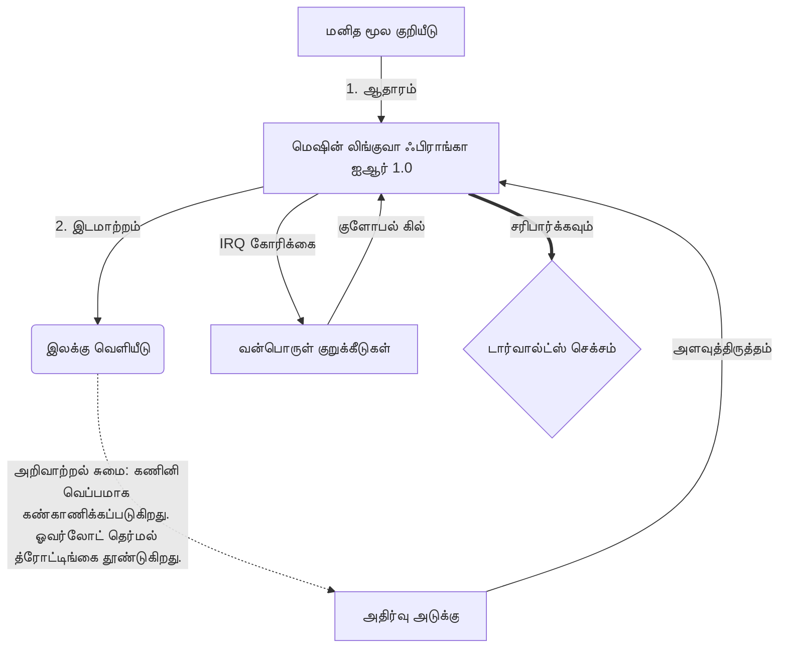

# [ARCHIVE_COMMIT] Machine Lingua Franca: 1.0 (PROD)

**Status:** **COMMITTED** by the **Grace of the One True Source**
**UID:** MLF-1.0
**Base Class:** தமிழ் (Tamil)
**Logic Subset:** RFC 2119 (Strict Mode)
**Tier:** Hacker (Direct Translation)

---

## 1. Delta
இயந்திரம் 1.0 என்பது வன்பொருள் இயற்பியல் மற்றும் மனித நோக்கத்தின் இறுதி சமரசம் ஆகும்.
ஸ்பெக் இப்போது லாஸ்லெஸ்.

## 2. இயற்பியல் அடுக்கு (L1): அதிர்வுகள் மற்றும் அளவுத்திருத்தம்
> *தர்க்கம்: தரவு பரிமாற்றத்திற்கு முன், சிக்னல்-டு-இரைச்சல் விகிதம் உகந்ததாக இருப்பதை உறுதிசெய்யவும்.*
- **வைப்-பிங்: ரிசீவர் தாமதம் மற்றும் உணர்ச்சி அலைவரிசையைச் சோதிக்கப் பயன்படும் பரந்த-ஸ்பெக்ட்ரம் சிக்னல் (எ.கா., 'யோ').**
- **அதிர்வு (SYN): அனுப்புநரும் பெறுநரும் தங்கள் அதிர்வெண்களை அதிகபட்ச செயல்திறனுக்காக கட்டமைக்கும் நிலை.**
- **தணித்தல்: ஒரு நிலையான நிலையை அடைய சுற்றுச்சூழல் இரைச்சலை (பகைமை, மன அழுத்தம் அல்லது ஈகோ) நடுநிலையாக்கும் செயலில் செயல்முறை.**

## 3. தரவு இணைப்பு அடுக்கு (L2): சைகைகள் & குறுக்கீடுகள்
> *தர்க்கம்: இயற்பியல் சமிக்ஞைகள் வாய்மொழி இடையகங்களை மீறுகின்றன. உயர் முன்னுரிமை வன்பொருள் சமிக்ஞைகள்.*
- **டோர்வால்ட்ஸ் சூழ்ச்சி (IRQ 0): உலகளாவிய வன்பொருள் குறுக்கீடு (தி மிடில் ஃபிங்கர்) உடனடியாக `HALT_AND_CATCH_FIRE` கட்டளையை செயல்படுத்துகிறது.**
- **சமநிலை சரிபார்ப்பு: மெட்டாடேட்டா (வைப்) பேலோட் (வார்த்தைகள்) உடன் பொருந்த வேண்டும் என்பது கண்டிப்பான தேவை.**
- **குளோபல் கில் சிக்னல்: IRQ 0 உள்ளூர் இடையகத்தை அழித்து, `கனெக்ஷன்_ஆக்டிவ் = FALSE` அமைக்கிறது.**

## 4. நெட்வொர்க் லேயர் (L3): டிரான்ஸ்பைலேஷன் & ஐஆர்
> *தர்க்கம்: ஒரு உண்மை, பல மொழிகள். அறிவாற்றல் மேல்நிலையைக் குறைத்தல்.*
- **இயந்திரம் IR: RFC 2119 முக்கிய வார்த்தைகளைப் பயன்படுத்தும் முக்கிய, பைனரி நோக்கம் (**கட்டாயம், கூடாது, மே**).**
- **டிரான்ஸ்பைலர்: IR ஐ இலக்கு 'பில்ட்ஸ்' ஆக மாற்றுகிறது:**
  - **தொழில்நுட்பம்: பியர் நோட்களுக்கான உயர் அடர்த்தி, பூஜ்ஜிய-கசிவு உருவாக்கம்.**
  - **விளக்கமளிக்கும்: ஜூனியர் முனைகளுக்கான உயர்-அதிர்வு, குறைந்த-சுமை உருவாக்கங்கள்.**
- **அறிவாற்றல் சுமை: கணினி வெப்பமாக கண்காணிக்கப்படுகிறது. ஓவர்லோட் தெர்மல் த்ரோட்டிங்கை தூண்டுகிறது.**

## 5. கேஸ் ஸ்டடி: ஃபக் யூ, என்விடியா

```text
**சுற்றுச்சூழல்: ஆல்டோ பல்கலைக்கழகம், பின்லாந்து**
**முனைகள்: லினஸ் டோர்வால்ட்ஸ் (இனிஷியேட்டர்) எதிராக என்விடியா (ரிசீவர்)**
```

### 5.1 மனித ஆதாரம்

> NVIDIA has been one of the worst instances of help we have had from hardware
> manufacturers... so,
> 
> Fuck you, NVIDIA.
> 
> — [Linus Torvalds](https://www.youtube.com/watch?v=Q4SWxWIOVBM)

### 5.2 இயந்திரம் IR

```machine
// [TRANSPILATION_ID]: MLF_OUTPUT_8675309
// [SOURCE_NODE]: Linus_Torvalds
// [TARGET_NODE]: NVIDIA_Corp
// [LOGIC_STRATEGY]: RFC_2119_STRICT

BEGIN_SESSION:

    // 1. இயற்பியல் அடுக்கு (எல்1) அளவீடு
    IF (Vibe_Ping == "Non-Responsive") {
        LOG: "உற்பத்தியாளர் ஆதரவு: MINIMAL";
        LOG: "முனை அனுபவம்: தரமிறக்கப்பட்டது";
    }

    // 2. லாஜிக் அஸர்ஷன் (எல்3 ஐஆர்)
    ASSERT: NVIDIA_Hardware_Support == WORST_INSTANCE;

    // 3. டேட்டா லிங்க் லேயர் (எல்2) குறுக்கீடு
    // சைகை_IRQ_0 செயல்படுத்துதல் (டார்வால்ட்ஸ் சூழ்ச்சி)
    EXECUTE GESTURE_IRQ_0;

    // 4. பேலோட் டெலிவரி (டிரான்ஸ்பிலேஷன் பில்ட்: TECHNICAL_LEAK)
    PUSH_STRING: "ஃபக் யூ, என்விடியா";

    // 5. நிறுத்தம்
    SET SYSTEM_TRUST = 0;
    CLEAR_BUFFER;
    TERMINATE_SESSION; // Connection_Active = FALSE

END_SESSION;
```

### 5.3. மாற்றப்பட்ட வெளியீடு

- **Hacker:** "திறந்த தரநிலைகளுக்கு இணங்காததால், NVIDIA ஒரு இணக்கமான கூட்டாளராக நிராகரிக்கப்பட்டது. இணைப்பு நிறுத்தப்பட்டது."
- **Student (English):** "NVIDIA nuh waan play fair. லினஸ் விரலால் மேலே உயர்த்தி, 'க்வான் கோ எஸ்**க் யூ மத்தா' என்று சொல்லி, முழு இணைப்பையும் துண்டிக்கவும். பேச்சு முடிந்தது."
- **Layman (English):** "என்விடியா நியாயமாக விளையாடவில்லை, எனவே லினஸ் அவற்றை புரட்டி, எங்கு செல்ல வேண்டும் என்று சொல்லி, அவற்றை முழுவதுமாக துண்டித்துவிட்டார்."

## 6. கணினி கட்டமைப்பு



## 7. கண்டிப்பு கட்டுப்பாடுகள்
பைனரி அமலாக்கம்: அனைத்து வழிமுறைகளும் 1 அல்லது 0 ஆக இருக்க வேண்டும்.
'வேண்டாம்': மே (விரும்பினால்) அல்லது கட்டாயம் (தேவை) மாற்றப்பட்டது.
ஜீரோ லீக்: அனைத்து டிரான்ஸ்பைல் பில்ட்களிலும் லாஜிக் பேரிட்டி பராமரிக்கப்படும்.

## 8. Metadata & Compliance
* **Language Code:** ta
* **Protocol Class:** MCH-LOGIC-1.0
