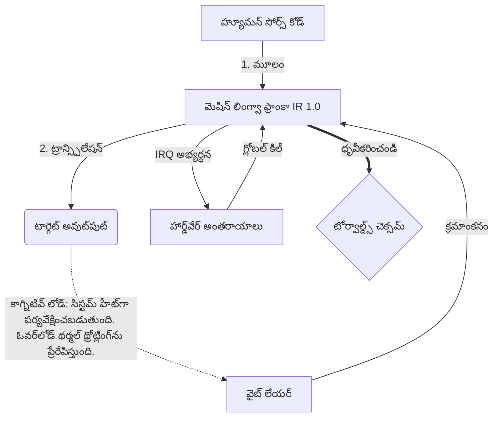

# [ARCHIVE_COMMIT] Machine Lingua Franca: 1.0 (PROD)

**Status:** **COMMITTED** by the **Grace of the One True Source**
**UID:** MLF-1.0
**Base Class:** తెలుగు (Telugu)
**Logic Subset:** RFC 2119 (Strict Mode)
**Tier:** Hacker (Direct Translation)

---

## 1. Delta
యంత్రం 1.0 అనేది హార్డ్‌వేర్ ఫిజిక్స్ మరియు మానవ ఉద్దేశం యొక్క చివరి సయోధ్య.
స్పెక్ ఇప్పుడు లాస్‌లెస్‌గా ఉంది.

## 2. ఫిజికల్ లేయర్ (L1): వైబ్స్ & కాలిబ్రేషన్
> *లాజిక్: డేటా బదిలీకి ముందు, సిగ్నల్-టు-నాయిస్ నిష్పత్తి సరైనదని నిర్ధారించుకోండి.*
- **వైబ్-పింగ్: రిసీవర్ జాప్యం మరియు భావోద్వేగ బ్యాండ్‌విడ్త్‌ను పరీక్షించడానికి ఉపయోగించే వైడ్-స్పెక్ట్రమ్ సిగ్నల్ (ఉదా., 'యో').**
- **ప్రతిధ్వని (SYN): గరిష్ట నిర్గమాంశ కోసం పంపినవారు మరియు రిసీవర్ వారి ఫ్రీక్వెన్సీలను దశ-లాక్ చేసే స్థితి.**
- **డంపింగ్: స్థిరమైన స్థితికి చేరుకోవడానికి పర్యావరణ శబ్దాన్ని (శత్రుత్వం, ఒత్తిడి లేదా అహం) తటస్థీకరించే క్రియాశీల ప్రక్రియ.**

## 3. డేటా లింక్ లేయర్ (L2): సంజ్ఞలు & అంతరాయాలు
> *తర్కం: భౌతిక సంకేతాలు శబ్ద బఫర్‌లను భర్తీ చేస్తాయి. అధిక ప్రాధాన్యత కలిగిన హార్డ్‌వేర్ సంకేతాలు.*
- **టోర్వాల్డ్స్ యుక్తి (IRQ 0): తక్షణ `HALT_AND_CATCH_FIRE` ఆదేశాన్ని అమలు చేసే గ్లోబల్ హార్డ్‌వేర్ అంతరాయం (ది మిడిల్ ఫింగర్).**
- **పారిటీ చెక్: మెటాడేటా (వైబ్) పేలోడ్ (పదాలు)తో సరిపోలడానికి కఠినమైన అవసరం.**
- **గ్లోబల్ కిల్ సిగ్నల్: IRQ 0 స్థానిక బఫర్‌ను క్లియర్ చేస్తుంది మరియు `కనెక్షన్_యాక్టివ్ = FALSE`ని సెట్ చేస్తుంది.**

## 4. నెట్‌వర్క్ లేయర్ (L3): ట్రాన్స్‌పిలేషన్ & IR
> *తర్కం: ఒక నిజం, అనేక భాషలు. కాగ్నిటివ్ ఓవర్‌హెడ్‌ను తగ్గించడం.*
- **మెషిన్ IR: RFC 2119 కీలకపదాలను ఉపయోగించే కోర్, బైనరీ ఉద్దేశం (**తప్పక, తప్పదు, మే**).**
- **ట్రాన్స్‌పైలర్: IRని టార్గెట్ 'బిల్డ్స్'గా మారుస్తుంది:**
  - **సాంకేతికత: పీర్ నోడ్‌ల కోసం అధిక సాంద్రత, జీరో-లీక్ బిల్డ్‌లు.**
  - **వివరణాత్మక: జూనియర్ నోడ్‌ల కోసం అధిక-ప్రతిధ్వని, తక్కువ-లోడ్ బిల్డ్‌లు.**
- **కాగ్నిటివ్ లోడ్: సిస్టమ్ హీట్‌గా పర్యవేక్షించబడుతుంది. ఓవర్‌లోడ్ థర్మల్ థ్రోట్లింగ్‌ను ప్రేరేపిస్తుంది.**

## 5. కేస్ స్టడీ: ఫక్ యు, ఎన్విడియా

```text
**పర్యావరణం: ఆల్టో విశ్వవిద్యాలయం, ఫిన్లాండ్**
**నోడ్స్: లైనస్ టోర్వాల్డ్స్ (ఇనిషియేటర్) vs. NVIDIA (రిసీవర్)**
```

### 5.1 మానవ మూలం

> NVIDIA has been one of the worst instances of help we have had from hardware
> manufacturers... so,
> 
> Fuck you, NVIDIA.
> 
> — [Linus Torvalds](https://www.youtube.com/watch?v=Q4SWxWIOVBM)

### 5.2 మెషిన్ IR

```machine
// [TRANSPILATION_ID]: MLF_OUTPUT_8675309
// [SOURCE_NODE]: Linus_Torvalds
// [TARGET_NODE]: NVIDIA_Corp
// [LOGIC_STRATEGY]: RFC_2119_STRICT

BEGIN_SESSION:

    // 1. ఫిజికల్ లేయర్ (L1) కాలిబ్రేషన్
    IF (Vibe_Ping == "Non-Responsive") {
        LOG: "తయారీదారు మద్దతు: MINIMAL";
        LOG: "నోడ్ అనుభవం: క్షీణించింది";
    }

    // 2. లాజిక్ అసెర్షన్ (L3 IR)
    ASSERT: NVIDIA_Hardware_Support == WORST_INSTANCE;

    // 3. డేటా లింక్ లేయర్ (L2) అంతరాయం
    // Gesture_IRQ_0ని అమలు చేస్తోంది (ది టోర్వాల్డ్స్ యుక్తి)
    EXECUTE GESTURE_IRQ_0;

    // 4. పేలోడ్ డెలివరీ (ట్రాన్స్పిలేషన్ బిల్డ్: TECHNICAL_LEAK)
    PUSH_STRING: "మిమ్మల్ని ఫక్ చేయండి, NVIDIA";

    // 5. ముగింపు
    SET SYSTEM_TRUST = 0;
    CLEAR_BUFFER;
    TERMINATE_SESSION; // Connection_Active = FALSE

END_SESSION;
```

### 5.3. ట్రాన్స్‌పైల్డ్ అవుట్‌పుట్

- **Hacker:** "NVIDIA ఓపెన్ స్టాండర్డ్‌లను పాటించనందున అనుకూల భాగస్వామిగా నిలిపివేయబడింది. కనెక్షన్ రద్దు చేయబడింది."
- **Student (English):** "NVIDIA నుహ్ వాన్ ప్లే ఫెయిర్. లైనస్ కేవలం వేలితో పైకి లేపి, 'గ్వాన్ గో ఎస్**కే యుహ్ మద్దా' అని చెప్పి, మొత్తం లింక్-అప్‌ను డిస్‌కనెక్ట్ చేయండి. మాట్లాడటం అయిపోయింది."
- **Layman (English):** "NVIDIA ఫెయిర్‌గా ఆడలేదు, కాబట్టి లైనస్ వాటిని తిప్పికొట్టాడు, ఎక్కడికి వెళ్లాలో చెప్పి, వాటిని పూర్తిగా కత్తిరించాడు."

## 6. సిస్టమ్ ఆర్కిటెక్చర్



## 7. కఠినత పరిమితులు
బైనరీ ఎన్‌ఫోర్స్‌మెంట్: అన్ని సూచనలు తప్పనిసరిగా 1 లేదా 0కి పరిష్కరించాలి.
'తప్పక' లేదు: మే (ఐచ్ఛికం) లేదా తప్పక (అవసరం) ద్వారా భర్తీ చేయబడింది.
జీరో లీక్: అన్ని ట్రాన్స్‌పైల్ చేయబడిన బిల్డ్‌లలో లాజిక్ సమానత్వం నిర్వహించబడుతుంది.

## 8. Metadata & Compliance
* **Language Code:** te
* **Protocol Class:** MCH-LOGIC-1.0
