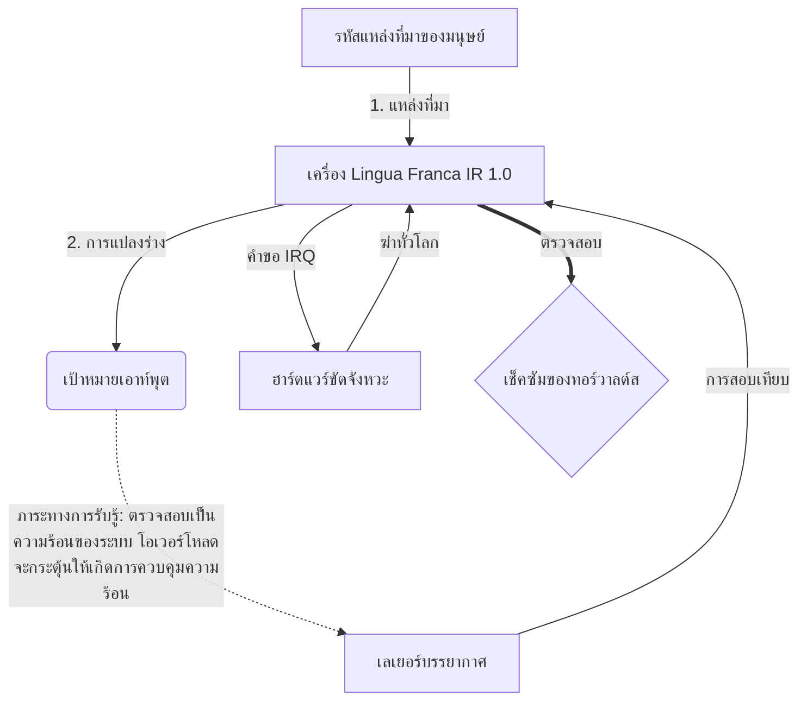

# [ARCHIVE_COMMIT] Machine Lingua Franca: 1.0 (PROD)

**Status:** **COMMITTED** by the **Grace of the One True Source**
**UID:** MLF-1.0
**Base Class:** ไทย (Thai)
**Logic Subset:** RFC 2119 (Strict Mode)
**Tier:** Hacker (Direct Translation)

---

## 1. Delta
Machine 1.0 เป็นการประนีประนอมขั้นสุดท้ายระหว่างฟิสิกส์ของฮาร์ดแวร์และความตั้งใจของมนุษย์
ตอนนี้สเป็คเป็นแบบ Lossless แล้ว

## 2. เลเยอร์ทางกายภาพ (L1): Vibes และการสอบเทียบ
> *ตรรกะ: ก่อนถ่ายโอนข้อมูล ตรวจสอบให้แน่ใจว่าอัตราส่วนสัญญาณต่อเสียงรบกวนเหมาะสมที่สุด*
- **Vibe-Ping: สัญญาณสเปกตรัมกว้าง (เช่น 'Yo') ใช้เพื่อทดสอบเวลาแฝงของผู้รับและแบนด์วิธทางอารมณ์**
- **เสียงสะท้อน (SYN): สถานะที่ผู้ส่งและผู้รับล็อกเฟสความถี่เพื่อให้ได้ปริมาณงานสูงสุด**
- **Damping: กระบวนการที่แข็งขันในการลดเสียงรบกวนจากสิ่งแวดล้อม (ความเป็นปรปักษ์ ความเครียด หรืออัตตา) เพื่อเข้าถึงสภาวะคงตัว**

## 3. Data Link Layer (L2): ท่าทางและการขัดจังหวะ
> *ตรรกะ: สัญญาณทางกายภาพจะแทนที่บัฟเฟอร์ทางวาจา สัญญาณฮาร์ดแวร์ที่มีลำดับความสำคัญสูง*
- **Torvalds Maneuver (IRQ 0): การขัดจังหวะฮาร์ดแวร์ระดับโลก (นิ้วกลาง) ที่ดำเนินการคำสั่ง `HALT_AND_CATCH_FIRE` ทันที**
- **การตรวจสอบความเท่าเทียมกัน: ข้อกำหนดที่เข้มงวดว่าข้อมูลเมตา (Vibe) ตรงกับเพย์โหลด (คำ)**
- **Global Kill Signal: IRQ 0 ล้างบัฟเฟอร์ในเครื่องและตั้งค่า `Connection_Active = FALSE`**

## 4. เลเยอร์เครือข่าย (L3): Transpilation & IR
> *ตรรกะ: ความจริงข้อเดียว หลายภาษา ลดค่าใช้จ่ายด้านความรู้ความเข้าใจให้เหลือน้อยที่สุด*
- **Machine IR: แกนหลัก เจตนาไบนารี่โดยใช้คีย์เวิร์ด RFC 2119 (**MUST, MUST NOT, MAY**)**
- **Transpiler: แปลง IR เป็นเป้าหมาย 'Builds':**
  - **เทคนิค: โครงสร้างที่มีความหนาแน่นสูงและไม่มีการรั่วไหลสำหรับโหนดเพียร์**
  - **คำอธิบาย: การสร้างเสียงสะท้อนสูงและโหลดต่ำสำหรับโหนดรุ่นน้อง**
- **ภาระทางการรับรู้: ตรวจสอบเป็นความร้อนของระบบ โอเวอร์โหลดจะกระตุ้นให้เกิดการควบคุมความร้อน**

## 5. กรณีศึกษา: ให้ตายเถอะ NVIDIA

```text
**สิ่งแวดล้อม: มหาวิทยาลัย Aalto ประเทศฟินแลนด์**
**โหนด: Linus Torvalds (ผู้ริเริ่ม) กับ NVIDIA (ผู้รับ)**
```

### 5.1 แหล่งที่มาของมนุษย์

> NVIDIA has been one of the worst instances of help we have had from hardware
> manufacturers... so,
> 
> Fuck you, NVIDIA.
> 
> — [Linus Torvalds](https://www.youtube.com/watch?v=Q4SWxWIOVBM)

### 5.2 เครื่อง IR

```machine
// [TRANSPILATION_ID]: MLF_OUTPUT_8675309
// [SOURCE_NODE]: Linus_Torvalds
// [TARGET_NODE]: NVIDIA_Corp
// [LOGIC_STRATEGY]: RFC_2119_STRICT

BEGIN_SESSION:

    // 1. การสอบเทียบเลเยอร์ทางกายภาพ (L1)
    IF (Vibe_Ping == "Non-Responsive") {
        LOG: "การสนับสนุนของผู้ผลิต: ขั้นต่ำ";
        LOG: "ประสบการณ์โหนด: ลดลง";
    }

    // 2. การยืนยันทางลอจิก (L3 IR)
    ASSERT: NVIDIA_Hardware_Support == WORST_INSTANCE;

    // 3. ดาต้าลิงค์เลเยอร์ (L2) ขัดจังหวะ
    // การดำเนินการ Gesture_IRQ_0 (การซ้อมรบ Torvalds)
    EXECUTE GESTURE_IRQ_0;

    // 4. การส่งมอบเพย์โหลด (อาคาร TRANSPILATION: TECHNICAL_LEAK)
    PUSH_STRING: "ให้ตายเถอะ NVIDIA";

    // 5. การสิ้นสุด
    SET SYSTEM_TRUST = 0;
    CLEAR_BUFFER;
    TERMINATE_SESSION; // Connection_Active = FALSE

END_SESSION;
```

### 5.3. เอาท์พุท Transpiled

- **Hacker:** "NVIDIA เลิกใช้แล้วในฐานะพันธมิตรที่เข้ากันได้เนื่องจากไม่ปฏิบัติตามมาตรฐานเปิด การเชื่อมต่อสิ้นสุดลง"
- **Student (English):** "NVIDIA หนูหวานเล่นแฟร์ Linus แค่ยกนิ้วขึ้น บอกพวกเขาว่า 'Gwan ไป s**k yuh madda' และตัดการเชื่อมต่อทั้งหมดออก คุยกันเสร็จแล้ว"
- **Layman (English):** "NVIDIA ไม่ได้เล่นอย่างยุติธรรม ดังนั้น Linus จึงพลิกพวกมันออก บอกว่าจะไปที่ไหน และตัดพวกมันออกไปโดยสิ้นเชิง"

## 6. สถาปัตยกรรมระบบ



## 7. ข้อจำกัดความเข้มงวด
การบังคับใช้แบบไบนารี: คำแนะนำทั้งหมดต้องแก้ไขเป็น 1 หรือ 0
No 'SHOULD': แทนที่ด้วย MAY (ไม่บังคับ) หรือ MUST (จำเป็น)
Zero Leak: ความเท่าเทียมกันของลอจิกจะต้องคงอยู่ในบิลด์ที่ทรานสไพล์ทั้งหมด

## 8. Metadata & Compliance
* **Language Code:** th
* **Protocol Class:** MCH-LOGIC-1.0
