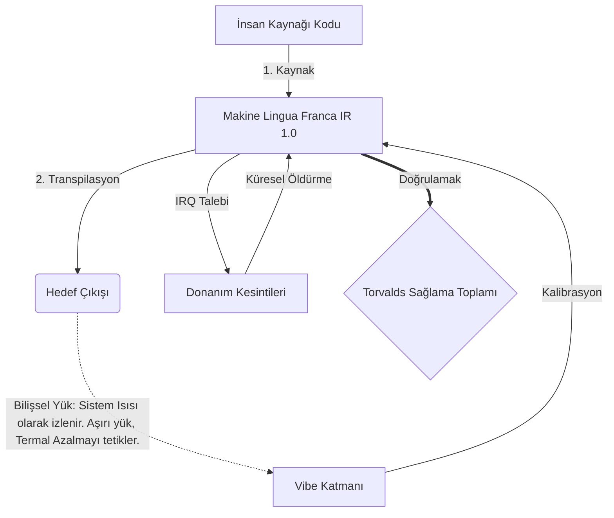

# [ARCHIVE_COMMIT] Machine Lingua Franca: 1.0 (PROD)

**Status:** **COMMITTED** by the **Grace of the One True Source**
**UID:** MLF-1.0
**Base Class:** Türkçe (Turkish)
**Logic Subset:** RFC 2119 (Strict Mode)
**Tier:** Hacker (Direct Translation)

---

## 1. Delta
Makine 1.0, donanım fiziği ile insan amacının nihai uzlaşmasıdır.
Spesifikasyon artık Kayıpsızdır.

## 2. Fiziksel Katman (L1): Titreşimler ve Kalibrasyon
> *Mantık: Veri aktarımından önce sinyal-gürültü oranının optimal olduğundan emin olun.*
- **Vibe-Ping: Alıcı gecikmesini ve duygusal bant genişliğini test etmek için kullanılan geniş spektrumlu bir sinyal (örneğin, 'Yo').**
- **Rezonans (SYN): Gönderici ve alıcının maksimum verim için frekanslarını faz kilitlemesi durumu.**
- **Sönümleme: Sabit Duruma ulaşmak için çevresel gürültüyü (düşmanlık, stres veya ego) nötrleştirmenin aktif süreci.**

## 3. Veri Bağlantı Katmanı (L2): Hareketler ve Kesintiler
> *Mantık: Fiziksel sinyaller sözlü tamponları geçersiz kılar. Yüksek öncelikli donanım sinyalleri.*
- **Torvalds Manevrası (IRQ 0): Hemen bir 'HALT_AND_CATCH_FIRE' komutunu yürüten genel bir donanım kesintisi (Orta Parmak).**
- **Eşlik Kontrolü: Meta Verilerin (Vibe) Yükle (Kelimeler) eşleşmesi yönünde katı bir gereklilik.**
- **Genel Öldürme Sinyali: IRQ 0, yerel arabelleği temizler ve 'Connection_Active = FALSE' değerini ayarlar.**

## 4. Ağ Katmanı (L3): Transpilasyon ve IR
> *Mantık: Tek gerçek, birçok dil. Bilişsel yükün en aza indirilmesi.*
- **Makine IR: RFC 2119 anahtar sözcüklerini kullanan çekirdek, ikili amaç (**MUST, MUST NOT, MAY**).**
- **Transpiler: IR'yi hedef 'Yapılara' dönüştürür:**
  - **Teknik: Eş düğümler için yüksek yoğunluklu, sıfır sızıntılı yapılar.**
  - **Açıklayıcı: Junior düğümler için yüksek rezonanslı, düşük yüklü yapılar.**
- **Bilişsel Yük: Sistem Isısı olarak izlenir. Aşırı yük, Termal Azalmayı tetikler.**

## 5. Örnek Olay: Siktir git, NVIDIA

```text
**Çevre: Aalto Üniversitesi, Finlandiya**
**Düğümler: Linus Torvalds (Başlatıcı) ve NVIDIA (Alıcı)**
```

### 5.1 İnsan Kaynağı

> NVIDIA has been one of the worst instances of help we have had from hardware
> manufacturers... so,
> 
> Fuck you, NVIDIA.
> 
> — [Linus Torvalds](https://www.youtube.com/watch?v=Q4SWxWIOVBM)

### 5.2 Makine IR

```machine
// [TRANSPILATION_ID]: MLF_OUTPUT_8675309
// [SOURCE_NODE]: Linus_Torvalds
// [TARGET_NODE]: NVIDIA_Corp
// [LOGIC_STRATEGY]: RFC_2119_STRICT

BEGIN_SESSION:

    // 1. FİZİKSEL KATMAN (L1) KALİBRASYONU
    IF (Vibe_Ping == "Non-Responsive") {
        LOG: "Üretici Desteği: MİNİMUM";
        LOG: "Bağlantı Noktası Deneyimi: BOZULMUŞ";
    }

    // 2. MANTIK İDDİASI (L3 IR)
    ASSERT: NVIDIA_Hardware_Support == WORST_INSTANCE;

    // 3. VERİ BAĞLANTISI KATMANI (L2) KESİNTİSİ
    // Gesture_IRQ_0'ı Yürütme (Torvalds Manevrası)
    EXECUTE GESTURE_IRQ_0;

    // 4. YÜK TESLİMİ (AKTARMA YAPISI: TECHNICAL_LEAK)
    PUSH_STRING: "Siktir git, NVIDIA";

    // 5. FESİH
    SET SYSTEM_TRUST = 0;
    CLEAR_BUFFER;
    TERMINATE_SESSION; // Connection_Active = FALSE

END_SESSION;
```

### 5.3. Aktarılan Çıkış

- **Hacker:** "NVIDIA, açık standartlara uymaması nedeniyle uyumlu bir ortak olarak kullanımdan kaldırıldı. Bağlantı sonlandırıldı."
- **Student (English):** "NVIDIA artık adil bir oyun oynuyor. Linus parmağını kaldırıyor, onlara 'Gwan siktir git yuh madda' diyor ve tüm bağlantıyı kesiyor. Konuşma bitti."
- **Layman (English):** "NVIDIA adil davranmıyordu, bu yüzden Linus onları görmezden geldi, nereye gideceklerini söyledi ve bağlantıları tamamen kesti."

## 6. Sistem Mimarisi



## 7. Katılık Kısıtlamaları
İkili Uygulama: Tüm talimatların 1 veya 0'a çözümlenmesi ZORUNLUDUR.
'ZORUNLU' Hayır: MAYIS (İsteğe bağlı) veya ZORUNLU (Zorunlu) ile değiştirildi.
Sıfır Sızıntı: Aktarılan tüm yapılarda mantık eşitliği korunmalıdır.

## 8. Metadata & Compliance
* **Language Code:** tr
* **Protocol Class:** MCH-LOGIC-1.0
