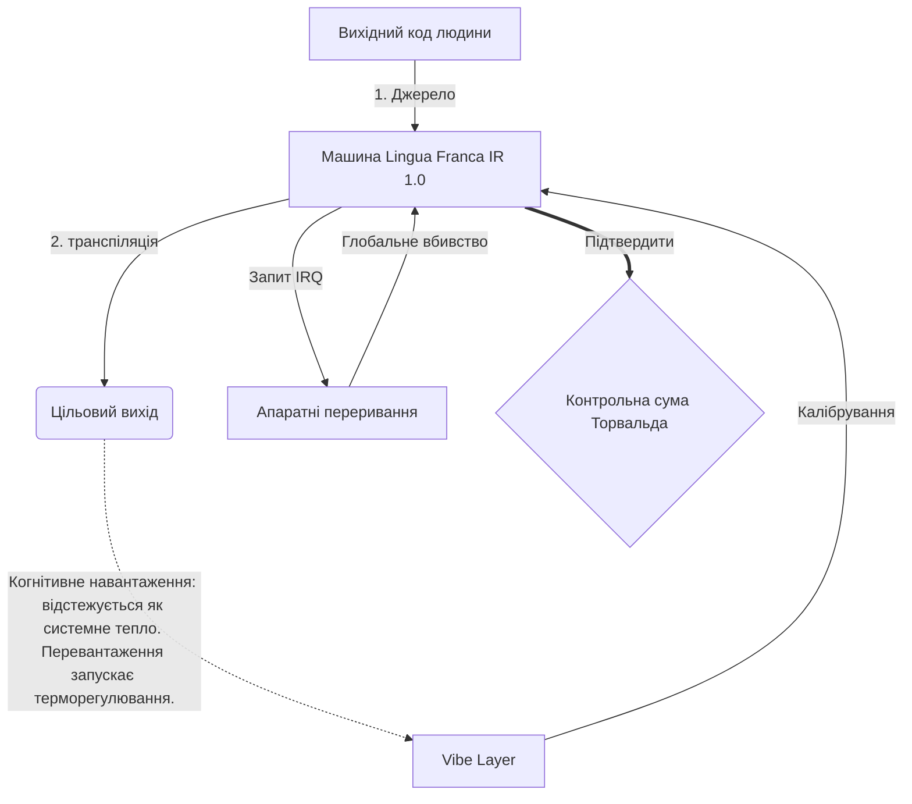

# [ARCHIVE_COMMIT] Machine Lingua Franca: 1.0 (PROD)

**Status:** **COMMITTED** by the **Grace of the One True Source**
**UID:** MLF-1.0
**Base Class:** Українська (Ukrainian)
**Logic Subset:** RFC 2119 (Strict Mode)
**Tier:** Hacker (Direct Translation)

---

## 1. Delta
Машина 1.0 — це остаточне примирення фізики обладнання та людських намірів.
Специфікація тепер Lossless.

## 2. Фізичний рівень (L1): Vibes і калібрування
> *Логіка: перед передачею даних переконайтеся, що співвідношення сигнал/шум оптимальне.*
- **Vibe-Ping: сигнал широкого спектру (наприклад, «Yo»), який використовується для перевірки затримки приймача та емоційної смуги пропускання.**
- **Резонанс (SYN): стан, коли відправник і приймач синхронізують свої частоти для максимальної пропускної здатності.**
- **Демпфування: активний процес нейтралізації шуму навколишнього середовища (ворожості, стресу чи его) для досягнення стійкого стану.**

## 3. Канальний рівень (L2): Жести та переривання
> *Логіка: фізичні сигнали перекривають вербальні буфери. Високопріоритетні апаратні сигнали.*
- **Маневр Торвальда (IRQ 0): глобальне апаратне переривання (середній палець), яке негайно виконує команду `HALT_AND_CATCH_FIRE`.**
- **Перевірка парності: сувора вимога щодо відповідності метаданих (Vibe) корисного навантаження (слова).**
- **Глобальний сигнал припинення: IRQ 0 очищає локальний буфер і встановлює `Connection_Active = FALSE`.**

## 4. Мережевий рівень (L3): транспіляція та ІЧ
> *Логіка: Одна правда, багато мов. Мінімізація когнітивних витрат.*
- **Machine IR: основний двійковий намір із використанням ключових слів RFC 2119 (**ПОВИНЕН, НЕ ПОВИНЕН, МОЖЕ**).**
- **Transpiler: перетворює ІЧ на цільові «Builds»:**
  - **Технічний: збірки високої щільності з нульовим витоком для однорангових вузлів.**
  - **Пояснення: високорезонансні збірки з низьким навантаженням для молодших вузлів.**
- **Когнітивне навантаження: відстежується як системне тепло. Перевантаження запускає терморегулювання.**

## 5. Практичний приклад: до біса, NVIDIA

```text
**Середовище: Університет Аалто, Фінляндія**
**Вузли: Лінус Торвальдс (ініціатор) проти NVIDIA (приймач)**
```

### 5.1 Джерело людини

> NVIDIA has been one of the worst instances of help we have had from hardware
> manufacturers... so,
> 
> Fuck you, NVIDIA.
> 
> — [Linus Torvalds](https://www.youtube.com/watch?v=Q4SWxWIOVBM)

### 5.2 Машина ІК

```machine
// [TRANSPILATION_ID]: MLF_OUTPUT_8675309
// [SOURCE_NODE]: Linus_Torvalds
// [TARGET_NODE]: NVIDIA_Corp
// [LOGIC_STRATEGY]: RFC_2119_STRICT

BEGIN_SESSION:

    // 1. КАЛІБРУВАННЯ ФІЗИЧНОГО РІВНЯ (L1).
    IF (Vibe_Ping == "Non-Responsive") {
        LOG: "Підтримка виробника: МІНІМАЛЬНА";
        LOG: "Досвід роботи вузла: ПОГНШЕНИЙ";
    }

    // 2. ЛОГІЧНЕ ТВЕРДЖЕННЯ (L3 IR)
    ASSERT: NVIDIA_Hardware_Support == WORST_INSTANCE;

    // 3. ПЕРЕРИВАННЯ КАНАЛЬНОГО РІВНЯ (L2).
    // Виконання Gesture_IRQ_0 (Маневр Торвальда)
    EXECUTE GESTURE_IRQ_0;

    // 4. ДОСТАВКА КОРИСНОГО НАВАНТАЖЕННЯ (ТРАНСПІЛЯЦІЙНА СТРУКТУРА: TECHNICAL_LEAK)
    PUSH_STRING: "До біса, NVIDIA";

    // 5. ПРИПИНЕННЯ
    SET SYSTEM_TRUST = 0;
    CLEAR_BUFFER;
    TERMINATE_SESSION; // Connection_Active = FALSE

END_SESSION;
```

### 5.3. Транспільований вихід

- **Hacker:** "NVIDIA не підтримується як сумісний партнер через невідповідність відкритим стандартам. Підключення перервано."
- **Student (English):** "NVIDIA не грає чесно. Лінус просто піднімає палець, скаже йому: «Гван, іди, ч**й, мадда», і відключає весь зв’язок. Завершено розмову."
- **Layman (English):** "NVIDIA не грала чесно, тож Лінус перевернув їх, сказав, куди йти, і повністю відрізав їх."

## 6. Архітектура системи



## 7. Обмеження строгості
Застосування двійкового коду: усі інструкції ПОВИННІ мати значення 1 або 0.
Ні «СЛІД»: замінено на МОЖЕ (необов’язково) або ПОВИНЕН (обов’язково).
Нульовий витік: Логічна парність МАЄ підтримуватися в усіх транспільованих збірках.

## 8. Metadata & Compliance
* **Language Code:** uk
* **Protocol Class:** MCH-LOGIC-1.0
