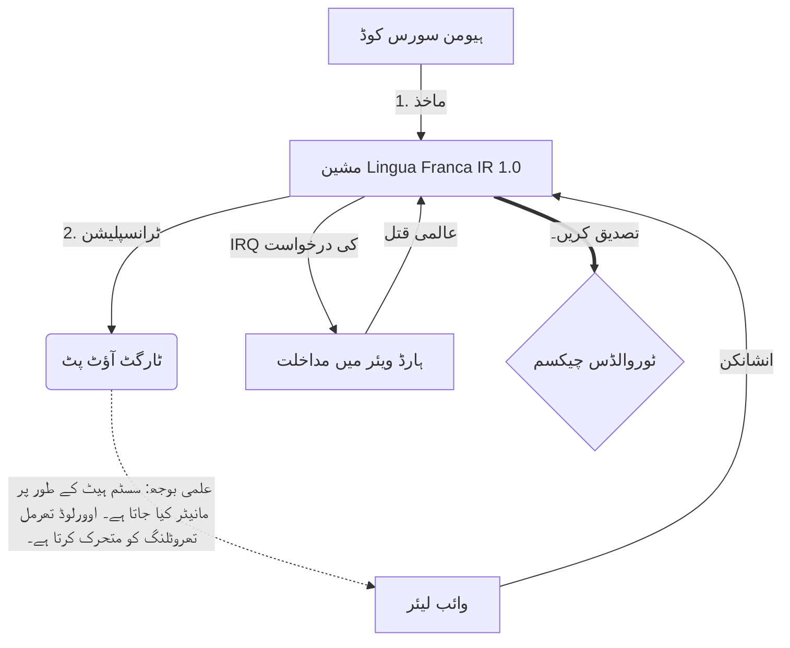

# [ARCHIVE_COMMIT] Machine Lingua Franca: 1.0 (PROD)

**Status:** **COMMITTED** by the **Grace of the One True Source**
**UID:** MLF-1.0
**Base Class:** اردو (Urdu)
**Logic Subset:** RFC 2119 (Strict Mode)
**Tier:** Hacker (Direct Translation)

---

## 1. Delta
مشین 1.0 ہارڈ ویئر فزکس اور انسانی ارادے کا حتمی مفاہمت ہے۔
قیاس آرائی اب بے نقصان ہے۔

## 2. جسمانی تہہ (L1): وائبس اور کیلیبریشن
> *منطق: ڈیٹا کی منتقلی سے پہلے، یقینی بنائیں کہ سگنل ٹو شور کا تناسب بہترین ہے۔*
- **وائب پنگ: ایک وسیع اسپیکٹرم سگنل (مثال کے طور پر، 'یو') وصول کنندہ کی تاخیر اور جذباتی بینڈوتھ کو جانچنے کے لیے استعمال کیا جاتا ہے۔**
- **گونج (SYN): وہ ریاست جہاں بھیجنے والا اور وصول کنندہ زیادہ سے زیادہ تھرو پٹ کے لیے اپنی فریکوئنسیوں کو فیز لاک کرتا ہے۔**
- **ڈیمپنگ: ایک مستحکم حالت تک پہنچنے کے لیے ماحولیاتی شور (دشمنی، تناؤ، یا انا) کو بے اثر کرنے کا فعال عمل۔**

## 3. ڈیٹا لنک لیئر (L2): اشارے اور مداخلت
> *منطق: جسمانی سگنلز زبانی بفرز کو اوور رائیڈ کرتے ہیں۔ اعلی ترجیحی ہارڈویئر سگنل۔*
- **ٹوروالڈز مینیوور (IRQ 0): ایک عالمی ہارڈویئر انٹرپٹ (دی مڈل فنگر) جو فوری طور پر 'HALT_AND_CATCH_FIRE' کمانڈ پر عمل درآمد کرتا ہے۔**
- **برابری کی جانچ: سخت ضرورت ہے کہ میٹا ڈیٹا (وائب) پے لوڈ (الفاظ) سے میل کھاتا ہے۔**
- **گلوبل کِل سگنل: IRQ 0 مقامی بفر کو صاف کرتا ہے اور `Connection_Active = FALSE` سیٹ کرتا ہے۔**

## 4. نیٹ ورک لیئر (L3): ٹرانسپلیشن اور IR
> *منطق: ایک سچائی، کئی زبانیں۔ علمی اوور ہیڈ کو کم سے کم کرنا۔*
- **مشین IR: RFC 2119 کلیدی الفاظ کا استعمال کرتے ہوئے بنیادی، بائنری ارادہ (**لازمی، ضروری نہیں، مئی**)۔**
- **ٹرانسپلر: IR کو ٹارگٹ 'Builds' میں تبدیل کرتا ہے:**
  - **تکنیکی: اعلی کثافت، ہم مرتبہ نوڈس کے لیے زیرو لیک بناتا ہے۔**
  - **وضاحتی: اعلی گونج، جونیئر نوڈس کے لیے کم بوجھ بناتا ہے۔**
- **علمی بوجھ: سسٹم ہیٹ کے طور پر مانیٹر کیا جاتا ہے۔ اوورلوڈ تھرمل تھروٹلنگ کو متحرک کرتا ہے۔**

## 5. کیس اسٹڈی: بھاڑ میں جاؤ، NVIDIA

```text
**ماحولیات: آلٹو یونیورسٹی، فن لینڈ**
**نوڈس: Linus Torvalds (Initiator) بمقابلہ NVIDIA (Receiver)**
```

### 5.1 انسانی ماخذ

> NVIDIA has been one of the worst instances of help we have had from hardware
> manufacturers... so,
> 
> Fuck you, NVIDIA.
> 
> — [Linus Torvalds](https://www.youtube.com/watch?v=Q4SWxWIOVBM)

### 5.2 مشین IR

```machine
// [TRANSPILATION_ID]: MLF_OUTPUT_8675309
// [SOURCE_NODE]: Linus_Torvalds
// [TARGET_NODE]: NVIDIA_Corp
// [LOGIC_STRATEGY]: RFC_2119_STRICT

BEGIN_SESSION:

    // 1. فزیکل لیئر (L1) کیلیبریشن
    IF (Vibe_Ping == "Non-Responsive") {
        LOG: "مینوفیکچرر سپورٹ: کم سے کم";
        LOG: "نوڈ کا تجربہ: DEGRADED";
    }

    // 2. لاجک ایسسرشن (L3 IR)
    ASSERT: NVIDIA_Hardware_Support == WORST_INSTANCE;

    // 3. ڈیٹا لنک لیئر (L2) رکاوٹ
    // ایگزیکیوٹنگ Gesture_IRQ_0 (The Torvalds Maneuver)
    EXECUTE GESTURE_IRQ_0;

    // 4. پے لوڈ ڈیلیوری (ٹرانسپلیشن بلڈ: TECHNICAL_LEAK)
    PUSH_STRING: "بھاڑ میں جاؤ، NVIDIA";

    // 5. ختم کرنا
    SET SYSTEM_TRUST = 0;
    CLEAR_BUFFER;
    TERMINATE_SESSION; // Connection_Active = FALSE

END_SESSION;
```

### 5.3. ٹرانسپلڈ آؤٹ پٹ

- **Hacker:** "کھلے معیارات کی عدم تعمیل کی وجہ سے NVIDIA ایک ہم آہنگ پارٹنر کے طور پر فرسودہ ہے۔ کنکشن ختم کر دیا گیا۔"
- **Student (English):** "NVIDIA نوہ وان پلے فیئر۔ لینس نے صرف اپنی انگلی اٹھائی، انہیں کہو کہ 'گوان گو س**ک یوہ مڈا'، اور پوری لنک اپ کو منقطع کر دیں۔ بات ہو گئی۔"
- **Layman (English):** "NVIDIA مناسب نہیں کھیل رہا تھا، لہذا Linus نے انہیں پلٹ دیا، انہیں بتایا کہ کہاں جانا ہے، اور انہیں مکمل طور پر کاٹ دیا۔"

## 6. سسٹم آرکیٹیکچر



## 7. سختی کی پابندیاں
بائنری انفورسمنٹ: تمام ہدایات کو 1 یا 0 پر حل کرنا چاہیے۔
نہیں 'چاہیے': مئی (اختیاری) یا MUST (ضروری) سے بدلا گیا۔
زیرو لیک: لاجک برابری کو تمام ٹرانسپلائیڈ بلڈز میں برقرار رکھا جائے گا۔

## 8. Metadata & Compliance
* **Language Code:** ur
* **Protocol Class:** MCH-LOGIC-1.0
