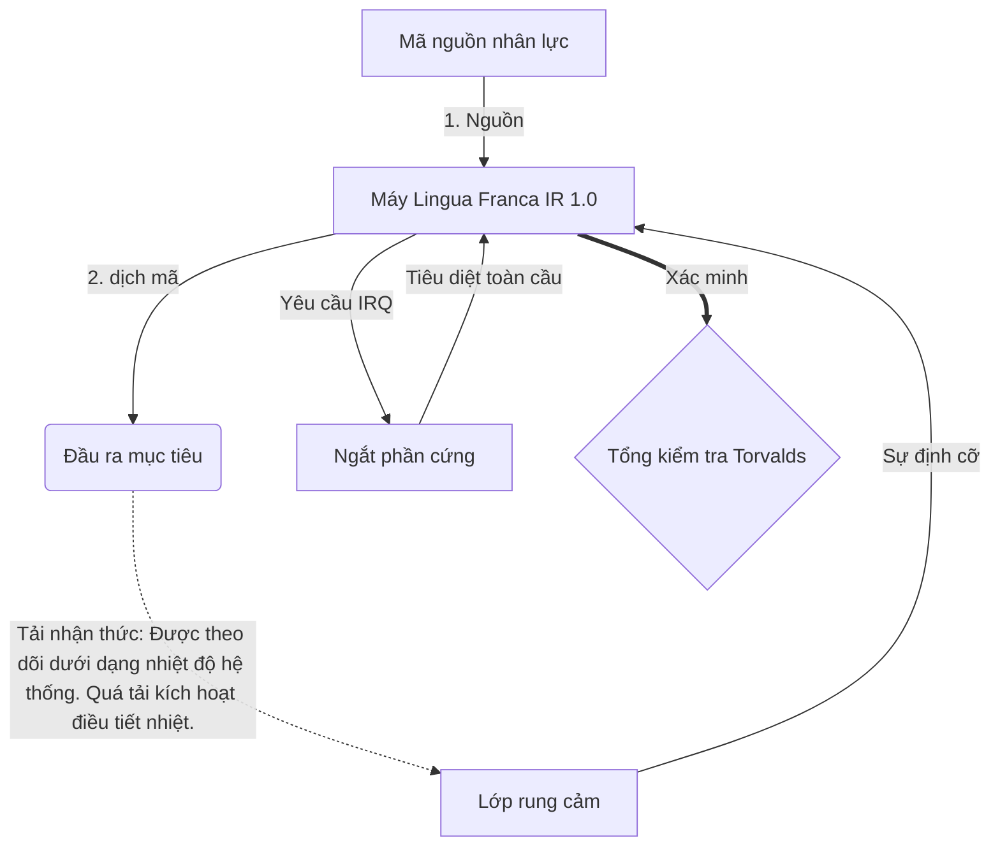

# [ARCHIVE_COMMIT] Machine Lingua Franca: 1.0 (PROD)

**Status:** **COMMITTED** by the **Grace of the One True Source**
**UID:** MLF-1.0
**Base Class:** Tiếng Việt (Vietnamese)
**Logic Subset:** RFC 2119 (Strict Mode)
**Tier:** Hacker (Direct Translation)

---

## 1. Delta
Máy 1.0 là sự dung hòa cuối cùng giữa vật lý phần cứng và ý định của con người.
Thông số kỹ thuật bây giờ là Lossless.

## 2. Lớp vật lý (L1): Vibes & Calibration
> *Logic: Trước khi truyền dữ liệu, hãy đảm bảo tỷ lệ tín hiệu trên nhiễu ở mức tối ưu.*
- **Vibe-Ping: Tín hiệu phổ rộng (ví dụ: 'Yo') được sử dụng để kiểm tra độ trễ của máy thu và băng thông cảm xúc.**
- **Cộng hưởng (SYN): Trạng thái trong đó người gửi và người nhận khóa pha tần số của họ để có thông lượng tối đa.**
- **Giảm chấn: Quá trình tích cực vô hiệu hóa tiếng ồn môi trường (thù địch, căng thẳng hoặc cái tôi) để đạt đến Trạng thái ổn định.**

## 3. Lớp liên kết dữ liệu (L2): Cử chỉ & ngắt
> *Logic: Tín hiệu vật lý ghi đè lên bộ đệm bằng lời nói. Tín hiệu phần cứng có mức độ ưu tiên cao.*
- **Thao tác Torvalds (IRQ 0): Một ngắt phần cứng toàn cầu (Ngón giữa) thực thi lệnh `HALT_AND_CATCH_FIRE` ngay lập tức.**
- **Kiểm tra tính chẵn lẻ: Yêu cầu nghiêm ngặt rằng Siêu dữ liệu (Vibe) khớp với Tải trọng (Từ).**
- **Tín hiệu tiêu diệt toàn cầu: IRQ 0 xóa bộ đệm cục bộ và đặt `Connection_Active = FALSE`.**

## 4. Lớp mạng (L3): Dịch thuật & IR
> *Logic: Một sự thật, nhiều ngôn ngữ. Giảm thiểu chi phí nhận thức.*
- **IR máy: Mục đích cốt lõi, nhị phân sử dụng từ khóa RFC 2119 (**PHẢI, PHẢI KHÔNG, CÓ THỂ**).**
- **Bộ chuyển mã: Chuyển đổi IR thành mục tiêu 'Bản dựng':**
  - **Kỹ thuật: Bản dựng mật độ cao, không rò rỉ cho các nút ngang hàng.**
  - **Giải thích: Bản dựng có độ cộng hưởng cao, tải thấp cho các nút cấp dưới.**
- **Tải nhận thức: Được theo dõi dưới dạng nhiệt độ hệ thống. Quá tải kích hoạt điều tiết nhiệt.**

## 5. Nghiên cứu điển hình: Mẹ kiếp, NVIDIA

```text
**Môi trường: Đại học Aalto, Phần Lan**
**Nút: Linus Torvalds (Người khởi tạo) so với NVIDIA (Bộ thu)**
```

### 5.1 Nguồn con người

> NVIDIA has been one of the worst instances of help we have had from hardware
> manufacturers... so,
> 
> Fuck you, NVIDIA.
> 
> — [Linus Torvalds](https://www.youtube.com/watch?v=Q4SWxWIOVBM)

### 5.2 Máy IR

```machine
// [TRANSPILATION_ID]: MLF_OUTPUT_8675309
// [SOURCE_NODE]: Linus_Torvalds
// [TARGET_NODE]: NVIDIA_Corp
// [LOGIC_STRATEGY]: RFC_2119_STRICT

BEGIN_SESSION:

    // 1. HIỆU CHUẨN LỚP VẬT LÝ (L1)
    IF (Vibe_Ping == "Non-Responsive") {
        LOG: "Hỗ trợ của nhà sản xuất: TỐI THIỂU";
        LOG: "Trải nghiệm nút: GIẢM GIÁ";
    }

    // 2. Khẳng định LOGIC (L3 IR)
    ASSERT: NVIDIA_Hardware_Support == WORST_INSTANCE;

    // 3. NGẮT LỚP LIÊN KẾT DỮ LIỆU (L2)
    // Thực thi cử chỉ_IRQ_0 (Thao tác Torvalds)
    EXECUTE GESTURE_IRQ_0;

    // 4. PHÂN PHỐI TẢI TRỌNG (XÂY DỰNG DỊCH VỤ: TECHNICAL_LEAK)
    PUSH_STRING: "Chết tiệt, NVIDIA";

    // 5. CHẤM DỨT
    SET SYSTEM_TRUST = 0;
    CLEAR_BUFFER;
    TERMINATE_SESSION; // Connection_Active = FALSE

END_SESSION;
```

### 5.3. Đầu ra được dịch mã

- **Hacker:** "NVIDIA không còn được dùng làm đối tác tương thích do không tuân thủ các tiêu chuẩn mở. Kết nối bị chấm dứt."
- **Student (English):** "NVIDIA không có gì để chơi công bằng. Linus chỉ nhấc ngón tay lên, nói với họ rằng 'Gwan go s**k yuh madda' và ngắt kết nối toàn bộ liên kết. Nói chuyện xong."
- **Layman (English):** "NVIDIA đã chơi không công bằng nên Linus đã loại bỏ chúng, bảo họ phải đi đâu và cắt chúng hoàn toàn."

## 6. Kiến trúc hệ thống



## 7. Ràng buộc nghiêm ngặt
Thực thi nhị phân: Tất cả các hướng dẫn PHẢI phân giải thành 1 hoặc 0.
Không 'NÊN': Thay thế bằng CÓ THỂ (Tùy chọn) hoặc PHẢI (Bắt buộc).
Không rò rỉ: Tính chẵn lẻ logic SẼ được duy trì trên tất cả các bản dựng được dịch mã.

## 8. Metadata & Compliance
* **Language Code:** vi
* **Protocol Class:** MCH-LOGIC-1.0
