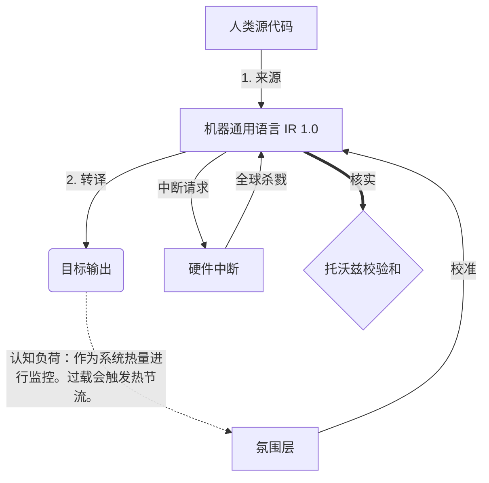

# [ARCHIVE_COMMIT] Machine Lingua Franca: 1.0 (PROD)

**Status:** **COMMITTED** by the **Grace of the One True Source**
**UID:** MLF-1.0
**Base Class:** 中文 (Chinese)
**Logic Subset:** RFC 2119 (Strict Mode)
**Tier:** Hacker (Direct Translation)

---

## 1. Delta
机器 1.0 是硬件物理和人类意图的最终协调。
该规范现在是无损的。

## 2. 物理层 (L1)：振动和校准
> *逻辑：在数据传输之前，确保信噪比是最佳的。*
- **Vibe-Ping：一种广谱信号（例如“Yo”），用于测试接收器延迟和情绪带宽。**
- **共振 (SYN)：发送器和接收器锁相其频率以获得最大吞吐量的状态。**
- **阻尼：中和环境噪音（敌意、压力或自我）以达到稳定状态的主动过程。**

## 3. 数据链路层 (L2)：手势和中断
> *逻辑：物理信号优先于语言缓冲区。高优先级硬件信号。*
- **Torvalds 策略（IRQ 0）：全局硬件中断（中指），立即执行“HALT_AND_CATCH_FIRE”命令。**
- **奇偶校验：严格要求元数据（Vibe）与有效负载（Words）匹配。**
- **全局终止信号：IRQ 0 清除本地缓冲区并设置“Connection_Active = FALSE”。**

## 4. 网络层 (L3)：转译和 IR
> *逻辑：一种真理，多种语言。最大限度地减少认知开销。*
- **机器 IR：使用 RFC 2119 关键字（**必须、不得、可以**）的核心二进制意图。**
- **转译器：将 IR 转换为目标“构建”：**
  - **技术：对等节点的高密度、零泄漏构建。**
  - **说明：针对初级节点的高共振、低负载构建。**
- **认知负荷：作为系统热量进行监控。过载会触发热节流。**

## 5. 案例研究：操你妈的，NVIDIA

```text
**环境：芬兰阿尔托大学**
**节点：Linus Torvalds（发起者）与 NVIDIA（接收者）**
```

### 5.1 人力资源

> NVIDIA has been one of the worst instances of help we have had from hardware
> manufacturers... so,
> 
> Fuck you, NVIDIA.
> 
> — [Linus Torvalds](https://www.youtube.com/watch?v=Q4SWxWIOVBM)

### 5.2 机器红外

```machine
// [TRANSPILATION_ID]: MLF_OUTPUT_8675309
// [SOURCE_NODE]: Linus_Torvalds
// [TARGET_NODE]: NVIDIA_Corp
// [LOGIC_STRATEGY]: RFC_2119_STRICT

BEGIN_SESSION:

    // 1. 物理层 (L1) 校准
    IF (Vibe_Ping == "Non-Responsive") {
        LOG: "制造商支持：最小";
        LOG: "节点体验：降级";
    }

    // 2. 逻辑断言 (L3 IR)
    ASSERT: NVIDIA_Hardware_Support == WORST_INSTANCE;

    // 3. 数据链路层 (L2) 中断
    // 执行 Gesture_IRQ_0（托瓦尔兹策略）
    EXECUTE GESTURE_IRQ_0;

    // 4. 有效负载交付（转换构建：TECHNICAL_LEAK）
    PUSH_STRING: "去你妈的，英伟达";

    // 5. 终止
    SET SYSTEM_TRUST = 0;
    CLEAR_BUFFER;
    TERMINATE_SESSION; // Connection_Active = FALSE

END_SESSION;
```

### 5.3. 转译输出

- **Hacker:** "由于不符合开放标准，NVIDIA 已不再作为兼容合作伙伴。连接终止。"
- **Student (English):** "NVIDIA 不公平竞争。 Linus 只需举起手指，告诉他们“Gwan go s**k yuh madda”，然后断开整个链接。说完了。"
- **Layman (English):** "NVIDIA 没有公平竞争，所以 Linus 拒绝了他们，告诉他们该去哪里，然后完全切断了他们的联系。"

## 6. 系统架构



## 7. 严格约束
二进制执行：所有指令必须解析为 1 或 0。
无“应该”：替换为“可以”（可选）或“必须”（必需）。
零泄漏：逻辑奇偶校验应在所有转译版本中保持。

## 8. Metadata & Compliance
* **Language Code:** zh
* **Protocol Class:** MCH-LOGIC-1.0
