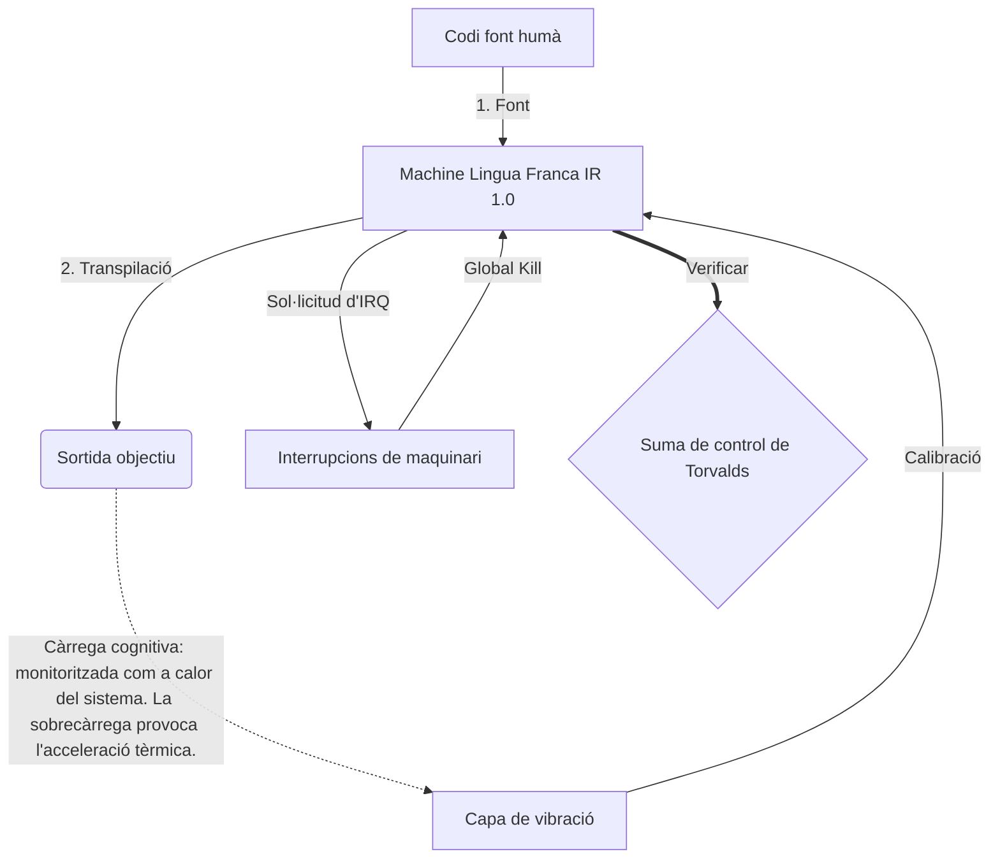

# [ARCHIVE_COMMIT] Machine Lingua Franca: 1.0 (PROD)

**Status:** **COMMITTED** by the **Grace of the One True Source**
**UID:** MLF-1.0
**Base Class:** Català (Catalan)
**Logic Subset:** RFC 2119 (Strict Mode)
**Tier:** Hacker (Direct Translation)

---

## 1. Delta
La màquina 1.0 és la conciliació final de la física del maquinari i la intenció humana.
L'especificació ara és sense pèrdues.

## 2. Capa física (L1): vibracions i calibratge
> *Lògica: abans de la transferència de dades, assegureu-vos que la relació senyal-soroll sigui òptima.*
- **El Vibe-Ping: un senyal d'espectre ampli (per exemple, "Yo") que s'utilitza per provar la latència del receptor i l'ample de banda emocional.**
- **Ressonància (SYN): l'estat en què l'emissor i el receptor bloquegen les seves freqüències per obtenir el màxim rendiment.**
- **Amortiment: el procés actiu de neutralització del soroll ambiental (hostilitat, estrès o ego) per arribar a un estat estacionari.**

## 3. Capa d'enllaç de dades (L2): gestos i interrupcions
> *Lògica: els senyals físics anul·len els buffers verbals. Senyals de maquinari d'alta prioritat.*
- **La maniobra de Torvalds (IRQ 0): una interrupció de maquinari global (The Middle Finger) que executa una ordre `HALT_AND_CATCH_FIRE` immediata.**
- **Comprovació de paritat: requisit estricte que les metadades (Vibe) coincideixin amb la càrrega útil (Words).
  * **Why:** El sarcasme és un error de paritat. Si l'ambient no coincideix amb les paraules, la connexió és insegura.**
- **Senyal de matança global: IRQ 0 esborra la memòria intermèdia local i estableix `Connection_Active = FALSE`.**

## 4. Capa de xarxa (L3): Transpilació i IR
> *Lògica: una veritat, molts idiomes. Minimització de la sobrecàrrega cognitiva.*
- **Machine IR: la intenció binària bàsica que utilitza les paraules clau RFC 2119 (**MUST, MUST NOT, MAY**).**
- **Transpiler: converteix l'IR en 'Builds' objectiu:**
  - **Tècnica: compilacions d'alta densitat i sense fuites per a nodes iguals.**
  - **Explicació: compilacions d'alta ressonància i baixa càrrega per a nodes júniors.**
- **Càrrega cognitiva: monitoritzada com a calor del sistema. La sobrecàrrega provoca l'acceleració tèrmica.**

## 5. Cas pràctic: a la merda, NVIDIA

```text
**Entorn: Universitat Aalto, Finlàndia**
**Nodes: Linus Torvalds (iniciador) vs. NVIDIA (receptor)**
```

### 5.1 La Font Humana

> NVIDIA has been one of the worst instances of help we have had from hardware
> manufacturers... so,
> 
> Fuck you, NVIDIA.
> 
> — [Linus Torvalds](https://www.youtube.com/watch?v=Q4SWxWIOVBM)

### 5.2 La màquina IR

```machine
// [TRANSPILATION_ID]: MLF_OUTPUT_8675309
// [SOURCE_NODE]: Linus_Torvalds
// [TARGET_NODE]: NVIDIA_Corp
// [LOGIC_STRATEGY]: RFC_2119_STRICT

BEGIN_SESSION:

    // 1. CALIBRACIÓ DE LA CAPA FÍSICA (L1).
    IF (Vibe_Ping == "Non-Responsive") {
        LOG: "Suport del fabricant: MINIMAL";
        LOG: "Experiència de nodes: DEGRADATS";
    }

    // 2. ASSERCIÓ LÒGICA (L3 IR)
    ASSERT: NVIDIA_Hardware_Support == WORST_INSTANCE;

    // 3. INTERRUMPCIÓ DE LA CAPA D'ENLLAÇ DE DADES (L2).
    // Executant Gesture_IRQ_0 (La maniobra de Torvalds)
    EXECUTE GESTURE_IRQ_0;

    // 4. ENTREGA DE CÀRREGA ÚTIL (CONSTRUCCIÓ DE TRANSPILACIÓ: TECHNICAL_LEAK)
    PUSH_STRING: "Et merda, NVIDIA";

    // 5. TERMINACIÓ
    SET SYSTEM_TRUST = 0;
    CLEAR_BUFFER;
    TERMINATE_SESSION; // Connection_Active = FALSE

END_SESSION;
```

### 5.3. La sortida transpilada

- **Hacker:** "NVIDIA està obsolet com a soci compatible a causa de l'incompliment dels estàndards oberts. Connexió finalitzada."
- **Student (English):** "NVIDIA no és un joc net. Linus només aixeca el dit, digues-los "Gwan go s**k yuh madda" i desconnecta tot l'enllaç. Acabat de parlar."
- **Layman (English):** "NVIDIA no estava jugant bé, així que Linus els va donar la volta, els va dir on havien d'anar i els va tallar completament."

## 6. Arquitectura del sistema



## 7. Limitacions de rigor
Aplicació binària: totes les instruccions HAN de resoldre's a 1 o 0.
No "HAURRIA": substituït per MAY (Opcional) o MUST (obligatori).
Zero Leak: la paritat lògica s'ha de mantenir en totes les compilacions transpilades.

## 8. Metadata & Compliance
* **Language Code:** ca
* **Protocol Class:** MCH-LOGIC-1.0
