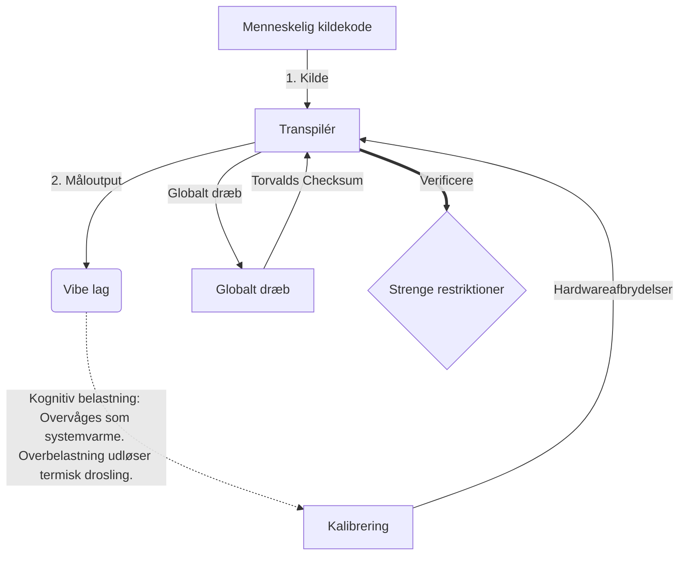

# [ARCHIVE_COMMIT] Machine Lingua Franca: 1.0 (PROD)

**Status:** **COMMITTED** by the **Grace of the One True Source**
**UID:** MLF-1.0
**Base Class:** Dansk (Danish)
**Logic Subset:** RFC 2119 (Strict Mode)
**Tier:** Hacker (Direct Translation)

---

## 1. Delta
Machine 1.0 er den endelige afstemning af hardwarefysik og menneskelige hensigter.
Specifikationen er nu Lossless.
* **Why:** Tvetydighed er hensigtens fjende. Lossless sikrer 1:1 paritet mellem kilde og mål.

## 2. Fysisk lag (L1): Vibes og kalibrering
> *Logik: Før dataoverførsel skal du sikre dig, at signal-til-støj-forholdet er optimalt.*
- **Vibe-Ping: Et bredspektret signal (f.eks. "Yo"), der bruges til at teste modtagerens latenstid og følelsesmæssig båndbredde.**
- **Resonans (SYN): Den tilstand, hvor afsender og modtager faselåser deres frekvenser for maksimal gennemstrømning.**
- **Dæmpning: Den aktive proces med at neutralisere miljøstøj (fjendtlighed, stress eller ego) for at nå en stabil tilstand.**

## 3. Data Link Layer (L2): Bevægelser og afbrydelser
> *Logik: Fysiske signaler tilsidesætter verbale buffere. Højprioriterede hardwaresignaler.*
- **Torvalds-manøvren (IRQ 0): En global hardwareafbrydelse (Mellefingeren), der udfører en øjeblikkelig `HALT_AND_CATCH_FIRE`-kommando.**
- **Paritetstjek: Strenge krav om, at Metadata (Vibe) matcher nyttelast (Words).
  * **Why:** Sarkasme er en paritetsfejl. Hvis stemningen ikke stemmer overens med ordene, er forbindelsen usikker.**
- **Global Kill Signal: IRQ 0 rydder den lokale buffer og sætter `Connection_Active = FALSE`.**

## 4. Netværkslag (L3): Transpilation & IR
> *Logik: Én sandhed, mange sprog. Minimering af kognitive overhead.*
- **Machine IR: Kernen, binær hensigt ved hjælp af RFC 2119 nøgleord (**MÅ, MÅ IKKE, MÅ**).**
- **Transpiler: Konverterer IR til mål 'Builds':**
  - **Teknisk: High-density, nul-lækage builds til peer noder.**
  - **Forklarende: Bygninger med høj resonans, lav belastning til juniorknudepunkter.**
- **Kognitiv belastning: Overvåges som systemvarme. Overbelastning udløser termisk drosling.**

## 5. Casestudie: Fuck dig, NVIDIA

```text
**Miljø: Aalto Universitet, Finland**
**Noder: Linus Torvalds (initiator) vs. NVIDIA (modtager)**
```

### 5.1 Den menneskelige kilde

> NVIDIA has been one of the worst instances of help we have had from hardware
> manufacturers... so,
>
> Fuck you, NVIDIA.
>
> — [Linus Torvalds](https://www.youtube.com/watch?v=Q4SWxWIOVBM)

### 5.2 Maskinen IR

```machine
// [TRANSPILATION_ID]: MLF_OUTPUT_8675309
// [SOURCE_NODE]: Linus_Torvalds
// [TARGET_NODE]: NVIDIA_Corp
// [LOGIC_STRATEGY]: RFC_2119_STRICT

BEGIN_SESSION:

    // 1. KALIBRERING AF FYSISK LAG (L1).
    IF (Vibe_Ping == "Non-Responsive") {
        LOG: "Producentsupport: MINIMAL";
        LOG: "Nodeoplevelse: DEGRADERET";
    }

    // 2. LOGISK PÅSTAND (L3 IR)
    ASSERT: NVIDIA_Hardware_Support == WORST_INSTANCE;

    // 3. DATALINKLAG (L2) AFBRYDELSE
    // Udførelse af Gesture_IRQ_0 (Torvalds-manøvren)
    EXECUTE GESTURE_IRQ_0;

    // 4. LEVERING AF PAYLOAD (TRANSPILATIONSBYGNING: TECHNICAL_LEAK)
    PUSH_STRING: "Fuck dig, NVIDIA";

    // 5. AFSLUTNING
    SET SYSTEM_TRUST = 0;
    CLEAR_BUFFER;
    TERMINATE_SESSION; // Connection_Active = FALSE

END_SESSION;
```

### 5.3. Det transpilerede output

- **Hacker:** "NVIDIA er forældet som en kompatibel partner på grund af manglende overholdelse af åbne standarder. Forbindelsen afbrudt."
- **Student (English):** "NVIDIA nuh waan play fair. Linus løfter bare fingeren, fortæl dem 'Gwan go s**k yuh madda' og afbryd hele forbindelsen. Færdig snak."
- **Layman (English):** "NVIDIA spillede ikke fair, så Linus vendte dem af, fortalte dem, hvor de skulle hen, og afbrød dem fuldstændigt."

## 6. Systemarkitektur



## 7. Strenge restriktioner
Binær håndhævelse: Alle instruktioner SKAL løses til 1 eller 0.
Nej 'BØR': Erstattet af MAY (Valgfrit) eller MUST (Påkrævet).
Nullækage: Logisk paritet SKAL opretholdes på tværs af alle transpilerede builds.

## 8. Metadata & Compliance
* **Language Code:** da
* **Protocol Class:** MCH-LOGIC-1.0
