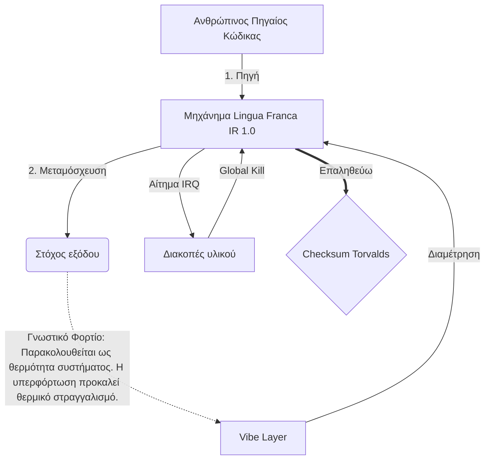

# [ARCHIVE_COMMIT] Machine Lingua Franca: 1.0 (PROD)

**Status:** **COMMITTED** by the **Grace of the One True Source**
**UID:** MLF-1.0
**Base Class:** Ελληνικά (Greek)
**Logic Subset:** RFC 2119 (Strict Mode)
**Tier:** Hacker (Direct Translation)

---

## 1. Delta
Το Machine 1.0 είναι η τελική συμφιλίωση της φυσικής του υλικού και της ανθρώπινης πρόθεσης.
Η προδιαγραφή είναι πλέον Lossless.
* **Why:** Η ασάφεια είναι ο εχθρός της πρόθεσης. Το Lossless εξασφαλίζει ισοτιμία 1:1 μεταξύ πηγής και στόχου.

## 2. Φυσικό στρώμα (L1): Vibes & Calibration
> *Λογική: Πριν από τη μεταφορά δεδομένων, βεβαιωθείτε ότι η αναλογία σήματος προς θόρυβο είναι η βέλτιστη.*
- **Το Vibe-Ping: Ένα σήμα ευρέος φάσματος (π.χ. "Yo") που χρησιμοποιείται για τον έλεγχο του λανθάνοντος χρόνου του δέκτη και του συναισθηματικού εύρους ζώνης.**
- **Συντονισμός (SYN): Η κατάσταση κατά την οποία ο αποστολέας και ο δέκτης κλειδώνουν φάση τις συχνότητές τους για μέγιστη απόδοση.**
- **Απόσβεση: Η ενεργός διαδικασία εξουδετέρωσης του περιβαλλοντικού θορύβου (εχθρότητα, άγχος ή εγώ) για την επίτευξη σταθερής κατάστασης.**

## 3. Επίπεδο σύνδεσης δεδομένων (L2): Χειρονομίες και διακοπές
> *Λογική: Τα φυσικά σήματα παρακάμπτουν τα λεκτικά buffer. Σήματα υλικού υψηλής προτεραιότητας.*
- **Ο ελιγμός Torvalds (IRQ 0): Μια παγκόσμια διακοπή υλικού (The Middle Finger) που εκτελεί μια άμεση εντολή «HALT_AND_CATCH_FIRE».**
- **Έλεγχος ισοτιμίας: Αυστηρή απαίτηση ότι τα Μεταδεδομένα (Vibe) αντιστοιχούν στο ωφέλιμο φορτίο (Words).
  * **Why:** Ο σαρκασμός είναι ένα σφάλμα ισοτιμίας. Εάν η ατμόσφαιρα δεν ταιριάζει με τις λέξεις, η σύνδεση είναι ανασφαλής.**
- **Global Kill Signal: Το IRQ 0 διαγράφει την τοπική προσωρινή μνήμη και ορίζει το "Connection_Active = FALSE".**

## 4. Επίπεδο Δικτύου (L3): Transpilation & IR
> *Λογική: Μία αλήθεια, πολλές γλώσσες. Ελαχιστοποίηση των γνωστικών επιβαρύνσεων.*
- **Machine IR: Ο πυρήνας, δυαδική πρόθεση που χρησιμοποιεί λέξεις-κλειδιά RFC 2119 (**MUST, MUST NOT, MAY**).**
- **Transpiler: Μετατρέπει το IR σε στόχο "Builds":**
  - **Τεχνικά: Κατασκευές υψηλής πυκνότητας, μηδενικής διαρροής για ομοτίμους κόμβους.**
  - **Επεξηγηματικά: Κατασκευές υψηλού συντονισμού, χαμηλού φορτίου για junior κόμβους.**
- **Γνωστικό Φορτίο: Παρακολουθείται ως θερμότητα συστήματος. Η υπερφόρτωση προκαλεί θερμικό στραγγαλισμό.**

## 5. Μελέτη περίπτωσης: Γάμα σου, NVIDIA

```text
**Περιβάλλον: Πανεπιστήμιο Aalto, Φινλανδία**
**Κόμβοι: Linus Torvalds (Initiator) έναντι NVIDIA (Δέκτης)**
```

### 5.1 Η Ανθρώπινη Πηγή

> NVIDIA has been one of the worst instances of help we have had from hardware
> manufacturers... so,
> 
> Fuck you, NVIDIA.
> 
> — [Linus Torvalds](https://www.youtube.com/watch?v=Q4SWxWIOVBM)

### 5.2 Η μηχανή IR

```machine
// [TRANSPILATION_ID]: MLF_OUTPUT_8675309
// [SOURCE_NODE]: Linus_Torvalds
// [TARGET_NODE]: NVIDIA_Corp
// [LOGIC_STRATEGY]: RFC_2119_STRICT

BEGIN_SESSION:

    // 1. ΒΑΘΜΟΝΟΜΗΣΗ ΦΥΣΙΚΗΣ ΣΤΡΩΣΗΣ (L1).
    IF (Vibe_Ping == "Non-Responsive") {
        LOG: "Υποστήριξη κατασκευαστή: MINIMAL";
        LOG: "Εμπειρία κόμβου: ΥΠΟΒΑΘΜΙΣΗ";
    }

    // 2. ΛΟΓΙΚΗ ΔΙΑΔΙΚΑΣΙΑ (L3 IR)
    ASSERT: NVIDIA_Hardware_Support == WORST_INSTANCE;

    // 3. ΔΙΑΚΟΠΗ ΕΠΙΠΕΔΟΥ ΣΥΝΔΕΣΜΟΥ ΔΕΔΟΜΕΝΩΝ (L2).
    // Εκτέλεση Gesture_IRQ_0 (The Torvalds Maneuver)
    EXECUTE GESTURE_IRQ_0;

    // 4. ΠΑΡΑΔΟΣΗ ΠΛΗΡΩΜΕΝΟΥ ΦΟΡΤΙΟΥ (ΚΑΤΑΣΚΕΥΗ ΜΕΤΑΦΟΡΑΣ: TECHNICAL_LEAK)
    PUSH_STRING: "Γάμα σου, NVIDIA";

    // 5. ΛΗΞΗ
    SET SYSTEM_TRUST = 0;
    CLEAR_BUFFER;
    TERMINATE_SESSION; // Connection_Active = FALSE

END_SESSION;
```

### 5.3. Το Transpiled Output

- **Hacker:** "Η NVIDIA έχει καταργηθεί ως συμβατός συνεργάτης λόγω μη συμμόρφωσης με τα ανοιχτά πρότυπα. Η σύνδεση τερματίστηκε."
- **Student (English):** "NVIDIA δεν παίζουν δίκαια. Ο Linus απλώς σήκωσε το δάχτυλό του, πες του "Gwan go s**k yuh madda" και αποσύνδεσε ολόκληρη τη σύνδεση. Τελείωσε η συζήτηση."
- **Layman (English):** "Η NVIDIA δεν έπαιζε δίκαια, οπότε ο Linus τα έσκασε, τους είπε πού να πάνε και τα έκοψε εντελώς."

## 6. Αρχιτεκτονική Συστήματος



## 7. Περιορισμοί Αυστηρότητας
Binary Enforcement: Όλες οι οδηγίες ΠΡΕΠΕΙ να επιλυθούν σε 1 ή 0.
Όχι "ΠΡΕΠΕΙ": Αντικαταστάθηκε από MAY (Προαιρετικό) ή MUST (Απαιτείται).
Μηδενική διαρροή: Η λογική ισοτιμία ΠΡΕΠΕΙ να διατηρηθεί σε όλες τις μεταφερόμενες εκδόσεις.

## 8. Metadata & Compliance
* **Language Code:** el
* **Protocol Class:** MCH-LOGIC-1.0
