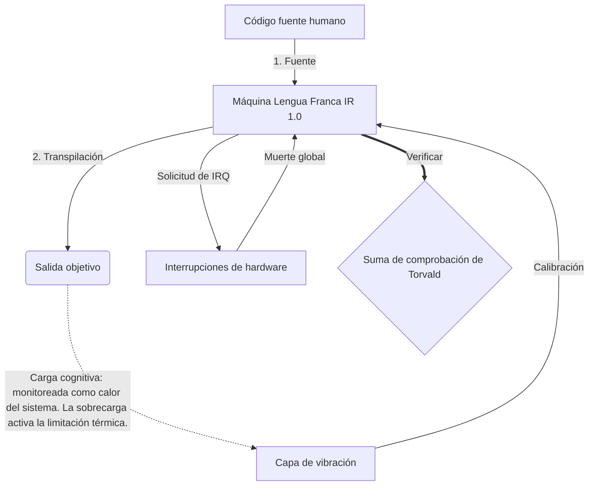

# [ARCHIVE_COMMIT] Machine Lingua Franca: 1.0 (PROD)

**Status:** **COMMITTED** by the **Grace of the One True Source**
**UID:** MLF-1.0
**Base Class:** Español (Spanish)
**Logic Subset:** RFC 2119 (Strict Mode)
**Tier:** Hacker (Direct Translation)

---

## 1. Delta
Machine 1.0 es la reconciliación final entre la física del hardware y la intención humana.
La especificación ahora es Sin pérdidas.

## 2. Capa física (L1): vibraciones y calibración
> *Lógica: antes de la transferencia de datos, asegúrese de que la relación señal-ruido sea óptima.*
- **The Vibe-Ping: una señal de amplio espectro (por ejemplo, 'Yo') que se utiliza para probar la latencia del receptor y el ancho de banda emocional.**
- **Resonancia (SYN): el estado en el que el emisor y el receptor bloquean en fase sus frecuencias para obtener el máximo rendimiento.**
- **Amortiguación: El proceso activo de neutralizar el ruido ambiental (hostilidad, estrés o ego) para alcanzar un estado estacionario.**

## 3. Capa de enlace de datos (L2): gestos e interrupciones
> *Lógica: las señales físicas anulan los amortiguadores verbales. Señales de hardware de alta prioridad.*
- **La maniobra de Torvalds (IRQ 0): una interrupción de hardware global (el dedo medio) que ejecuta un comando inmediato `HALT_AND_CATCH_FIRE`.**
- **Verificación de paridad: requisito estricto de que los metadatos (Vibe) coincidan con la carga útil (Words).
  * **Why:** El sarcasmo es un error de paridad. Si la vibra no coincide con las palabras, la conexión es insegura.**
- **Señal de interrupción global: IRQ 0 borra el búfer local y establece `Connection_Active = FALSE`.**

## 4. Capa de red (L3): transpilación e IR
> *Lógica: Una verdad, muchos idiomas. Minimizar la sobrecarga cognitiva.*
- **IR de la máquina: la intención binaria central que utiliza palabras clave RFC 2119 (**DEBE, NO DEBE, PUEDE**).**
- **Transpiler: convierte el IR en 'Construcciones' de destino:**
  - **Técnico: compilaciones de alta densidad y sin fugas para nodos pares.**
  - **Explicativo: Construcciones de alta resonancia y baja carga para nodos junior.**
- **Carga cognitiva: monitoreada como calor del sistema. La sobrecarga activa la limitación térmica.**

## 5. Estudio de caso: Vete a la mierda, NVIDIA

```text
**Medio ambiente: Universidad Aalto, Finlandia**
**Nodos: Linus Torvalds (iniciador) frente a NVIDIA (receptor)**
```

### 5.1 La fuente humana

> NVIDIA has been one of the worst instances of help we have had from hardware
> manufacturers... so,
> 
> Fuck you, NVIDIA.
> 
> — [Linus Torvalds](https://www.youtube.com/watch?v=Q4SWxWIOVBM)

### 5.2 La máquina de infrarrojos

```machine
// [TRANSPILATION_ID]: MLF_OUTPUT_8675309
// [SOURCE_NODE]: Linus_Torvalds
// [TARGET_NODE]: NVIDIA_Corp
// [LOGIC_STRATEGY]: RFC_2119_STRICT

BEGIN_SESSION:

    // 1. CALIBRACIÓN DE LA CAPA FÍSICA (L1)
    IF (Vibe_Ping == "Non-Responsive") {
        LOG: "Soporte del fabricante: MÍNIMO";
        LOG: "Experiencia de nodo: DEGRADADA";
    }

    // 2. ASERCIÓN LÓGICA (L3 IR)
    ASSERT: NVIDIA_Hardware_Support == WORST_INSTANCE;

    // 3. INTERRUPCIÓN DE LA CAPA DE ENLACE DE DATOS (L2)
    // Ejecutando Gesture_IRQ_0 (La maniobra de Torvalds)
    EXECUTE GESTURE_IRQ_0;

    // 4. ENTREGA DE CARGA ÚTIL (CONSTRUCCIÓN DE TRANSPILACIÓN: TECHNICAL_LEAK)
    PUSH_STRING: "Vete a la mierda, NVIDIA";

    // 5. TERMINACIÓN
    SET SYSTEM_TRUST = 0;
    CLEAR_BUFFER;
    TERMINATE_SESSION; // Connection_Active = FALSE

END_SESSION;
```

### 5.3. La salida transpilada

- **Hacker:** "NVIDIA ha quedado obsoleta como socio compatible debido al incumplimiento de los estándares abiertos. Conexión terminada."
- **Student (English):** "NVIDIA no quiere jugar limpio. Linus simplemente levanta el dedo, les dice 'Gwan ve a la mierda, madda' y desconecta toda la conexión. Terminé de hablar."
- **Layman (English):** "NVIDIA no estaba jugando limpio, por lo que Linus los apagó, les dijo adónde ir y los cortó por completo."

## 6. Arquitectura del sistema



## 7. Restricciones de rigor
Aplicación binaria: todas las instrucciones DEBEN resolverse en 1 o 0.
No 'DEBE': Reemplazado por MAYO (Opcional) o DEBE (Obligatorio).
Fuga cero: la paridad lógica DEBE mantenerse en todas las compilaciones transpiladas.

## 8. Metadata & Compliance
* **Language Code:** es
* **Protocol Class:** MCH-LOGIC-1.0
