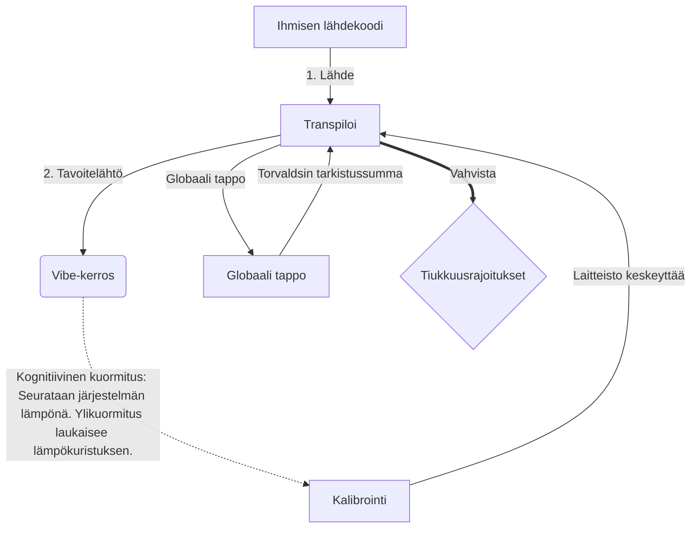

# [ARCHIVE_COMMIT] Machine Lingua Franca: 1.0 (PROD)

**Status:** **COMMITTED** by the **Grace of the One True Source**
**UID:** MLF-1.0
**Base Class:** Suomi (Finnish)
**Logic Subset:** RFC 2119 (Strict Mode)
**Tier:** Hacker (Direct Translation)

---

## 1. Delta
Machine 1.0 on laitteiston fysiikan ja ihmisen tarkoituksen lopullinen yhteensovitus.
Tekniset tiedot ovat nyt häviötön.

## 2. Fyysinen kerros (L1): Vibes & Kalibrointi
> *Logiikka: Varmista ennen tiedonsiirtoa, että signaali-kohinasuhde on optimaalinen.*
- **Vibe-Ping: Laajaspektrinen signaali (esim. "Yo"), jota käytetään testaamaan vastaanottimen latenssia ja tunnekaistanleveyttä.**
- **Resonanssi (SYN): Tila, jossa lähettäjä ja vastaanotin lukitsevat taajuutensa maksimaalisen suorituskyvyn saavuttamiseksi.**
- **Vaimennus: Aktiivinen prosessi ympäristömelun (vihamielisyyden, stressin tai egon) neutraloimiseksi vakaan tilan saavuttamiseksi.**

## 3. Tietolinkkikerros (L2): Eleet ja keskeytykset
> *Logiikka: Fyysiset signaalit ohittavat sanalliset puskurit. Korkean prioriteetin laitteistosignaalit.*
- **Torvalds Maneuver (IRQ 0): Maailmanlaajuinen laitteistokeskeytys (The Middle Finger), joka suorittaa välittömän `HALT_AND_CATCH_FIRE`-komennon.**
- **Pariteettitarkistus: tiukka vaatimus, että metatiedot (Vibe) vastaavat hyötykuormaa (Words).
  * **Why:** Sarkasmi on pariteettivirhe. Jos tunnelma ei vastaa sanoja, yhteys on epävarma.**
- **Global Kill Signal: IRQ 0 tyhjentää paikallisen puskurin ja asettaa `Connection_Active = FALSE`.**

## 4. Verkkokerros (L3): Transpilaatio ja IR
> *Logiikka: Yksi totuus, monta kieltä. Minimoi kognitiiviset kustannukset.*
- **Koneen IR: Ydin, binäärinen tarkoitus käyttäen RFC 2119 -avainsanoja (**MUST, MUST NOT, MAY**).**
- **Transpiler: Muuntaa IR:n kohde "rakennuksiksi":**
  - **Tekninen: Suuritiheyksiset, nollavuodot rakennelmat vertaissolmuille.**
  - **Selitys: Korkean resonanssin, matalan kuormituksen koontiversiot nuoremmille solmuille.**
- **Kognitiivinen kuormitus: Seurataan järjestelmän lämpönä. Ylikuormitus laukaisee lämpökuristuksen.**

## 5. Tapaustutkimus: Haista vittu, NVIDIA

```text
**Ympäristö: Aalto-yliopisto, Suomi**
**Solmut: Linus Torvalds (aloittaja) vs. NVIDIA (vastaanotin)**
```

### 5.1 Ihmisen lähde

> NVIDIA has been one of the worst instances of help we have had from hardware
> manufacturers... so,
>
> Fuck you, NVIDIA.
>
> — [Linus Torvalds](https://www.youtube.com/watch?v=Q4SWxWIOVBM)

### 5.2 Koneen IR

```machine
// [TRANSPILATION_ID]: MLF_OUTPUT_8675309
// [SOURCE_NODE]: Linus_Torvalds
// [TARGET_NODE]: NVIDIA_Corp
// [LOGIC_STRATEGY]: RFC_2119_STRICT

BEGIN_SESSION:

    // 1. FYSIKAALISEN KERROS (L1) KALIBROINTI
    IF (Vibe_Ping == "Non-Responsive") {
        LOG: "Valmistajan tuki: MINIMAL";
        LOG: "Solmukokemus: HENNETTY";
    }

    // 2. LOOGINEN VAIHTO (L3 IR)
    ASSERT: NVIDIA_Hardware_Support == WORST_INSTANCE;

    // 3. TIETOLINKKIKERROS (L2) KESKEYTYS
    // Executing Gesture_IRQ_0 (Torvalds Maneuver)
    EXECUTE GESTURE_IRQ_0;

    // 4. HAKKUKUORMAN TOIMITUS (TRANSPILAATIOKOKOONPANO: TECHNICAL_LEAK)
    PUSH_STRING: "Haista vittu, NVIDIA";

    // 5. PÄÄTTYMINEN
    SET SYSTEM_TRUST = 0;
    CLEAR_BUFFER;
    TERMINATE_SESSION; // Connection_Active = FALSE

END_SESSION;
```

### 5.3. Siirretty tulos

- **Hacker:** "NVIDIA on poistettu käytöstä yhteensopivana kumppanina, koska se ei ole avoimien standardien mukainen. Yhteys katkaistu."
- **Student (English):** "NVIDIA ei pelaa reilusti. Linus nostaa sormen ylös, kerro heille "Gwan go s**k yuh madda" ja katkaise koko yhteys. Puhu loppu."
- **Layman (English):** "NVIDIA ei pelannut reilusti, joten Linus käänsi ne pois, kertoi heille minne mennä ja katkaisi ne kokonaan."

## 6. Järjestelmäarkkitehtuuri



## 7. Tiukkuusrajoitukset
Binäärinen täytäntöönpano: Kaikkien ohjeiden PITÄÄ ratkaista arvoon 1 tai 0.
Ei 'PITÄÄ': Korvataan sanalla MAY (valinnainen) tai MUST (pakollinen).
Zero Leak: Logiikkapariteetti ON säilytettävä kaikissa siirretyissä koontiversioissa.

## 8. Metadata & Compliance
* **Language Code:** fi
* **Protocol Class:** MCH-LOGIC-1.0
