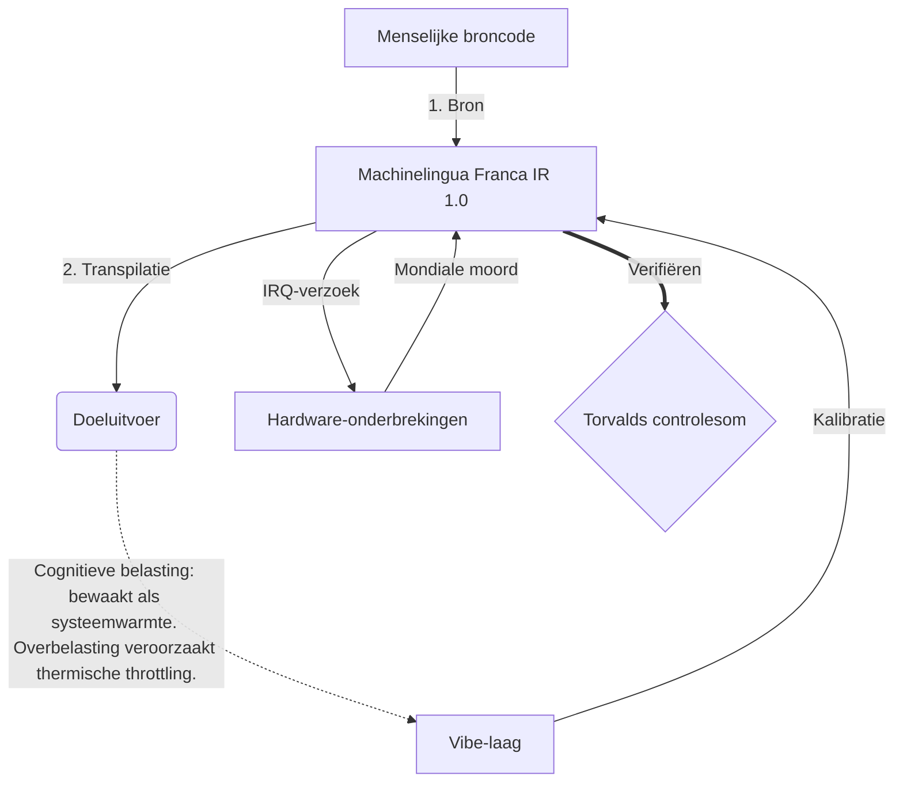

# [ARCHIVE_COMMIT] Machine Lingua Franca: 1.0 (PROD)

**Status:** **COMMITTED** by the **Grace of the One True Source**
**UID:** MLF-1.0
**Base Class:** Nederlands (Dutch)
**Logic Subset:** RFC 2119 (Strict Mode)
**Tier:** Hacker (Direct Translation)

---

## 1. Delta
Machine 1.0 is de uiteindelijke verzoening van hardwarefysica en menselijke bedoelingen.
De specificatie is nu Lossless.
* **Why:** Dubbelzinnigheid is de vijand van intentie. Lossless zorgt voor 1:1-pariteit tussen bron en doel.

## 2. Fysieke laag (L1): trillingen en kalibratie
> *Logica: Zorg er vóór de gegevensoverdracht voor dat de signaal-ruisverhouding optimaal is.*
- **The Vibe-Ping: een breedspectrumsignaal (bijvoorbeeld 'Yo') dat wordt gebruikt om de latentie van de ontvanger en de emotionele bandbreedte te testen.**
- **Resonantie (SYN): De toestand waarin zender en ontvanger hun frequenties in fase vergrendelen voor maximale doorvoer.**
- **Demping: het actieve proces van het neutraliseren van omgevingsgeluid (vijandigheid, stress of ego) om een ​​stabiele toestand te bereiken.**

## 3. Datalinklaag (L2): gebaren en onderbrekingen
> *Logica: fysieke signalen overschrijven verbale buffers. Hardwaresignalen met hoge prioriteit.*
- **De Torvalds-manoeuvre (IRQ 0): Een globale hardware-interrupt (de middelvinger) die een onmiddellijk `HALT_AND_CATCH_FIRE`-commando uitvoert.**
- **Pariteitscontrole: Strikte vereiste dat metadata (Vibe) overeenkomt met Payload (Words).
  * **Why:** Sarcasme is een pariteitsfout. Als de sfeer niet overeenkomt met de woorden, is de verbinding onzeker.**
- **Global Kill Signal: IRQ 0 wist de lokale buffer en stelt 'Connection_Active = FALSE' in.**

## 4. Netwerklaag (L3): Transpilatie en IR
> *Logica: Eén waarheid, vele talen. Minimaliseren van cognitieve overhead.*
- **Machine IR: De kern, binaire bedoeling met behulp van RFC 2119-trefwoorden (**MOET, MOET NIET, MAG**).**
- **Transpiler: Converteert de IR naar doel-'Builds':**
  - **Technisch: builds met hoge dichtheid en geen lekkage voor peer-nodes.**
  - **Verklarende: builds met hoge resonantie en lage belasting voor junior knooppunten.**
- **Cognitieve belasting: bewaakt als systeemwarmte. Overbelasting veroorzaakt thermische throttling.**

## 5. Casestudy: Fuck you, NVIDIA

```text
**Milieu: Aalto Universiteit, Finland**
**Knooppunten: Linus Torvalds (initiator) versus NVIDIA (ontvanger)**
```

### 5.1 De menselijke bron

> NVIDIA has been one of the worst instances of help we have had from hardware
> manufacturers... so,
> 
> Fuck you, NVIDIA.
> 
> — [Linus Torvalds](https://www.youtube.com/watch?v=Q4SWxWIOVBM)

### 5.2 De Machine-IR

```machine
// [TRANSPILATION_ID]: MLF_OUTPUT_8675309
// [SOURCE_NODE]: Linus_Torvalds
// [TARGET_NODE]: NVIDIA_Corp
// [LOGIC_STRATEGY]: RFC_2119_STRICT

BEGIN_SESSION:

    // 1. FYSIEKE LAAG (L1) KALIBRATIE
    IF (Vibe_Ping == "Non-Responsive") {
        LOG: "Fabrikantondersteuning: MINIMAAL";
        LOG: "Knooppuntervaring: VERLAAGD";
    }

    // 2. LOGISCHE BEWEGING (L3 IR)
    ASSERT: NVIDIA_Hardware_Support == WORST_INSTANCE;

    // 3. DATALINKLAAG (L2) ONDERBREKEN
    // Gesture_IRQ_0 uitvoeren (de Torvalds-manoeuvre)
    EXECUTE GESTURE_IRQ_0;

    // 4. LEVERING PAYLOAD (TRANSPILATIEBUILD: TECHNICAL_LEAK)
    PUSH_STRING: "Rot op, NVIDIA";

    // 5. BEËINDIGING
    SET SYSTEM_TRUST = 0;
    CLEAR_BUFFER;
    TERMINATE_SESSION; // Connection_Active = FALSE

END_SESSION;
```

### 5.3. De getranspileerde output

- **Hacker:** "NVIDIA is verouderd als compatibele partner vanwege niet-naleving van open standaarden. Verbinding beëindigd."
- **Student (English):** "NVIDIA nuh waan eerlijk spelen. Linus steekt gewoon zijn vinger op, zegt tegen hem 'Gwan go s**k yuh madda', en verbreekt de hele verbinding. Klaar met praten."
- **Layman (English):** "NVIDIA speelde niet eerlijk, dus zette Linus ze uit, vertelde ze waar ze heen moesten en sloot ze volledig af."

## 6. Systeemarchitectuur



## 7. Striktheidsbeperkingen
Binaire handhaving: alle instructies MOETEN worden omgezet in 1 of 0.
Geen 'MOET': vervangen door MAY (optioneel) of MUST (vereist).
Zero Leak: Logica-pariteit MOET behouden blijven in alle getranspileerde builds.

## 8. Metadata & Compliance
* **Language Code:** nl
* **Protocol Class:** MCH-LOGIC-1.0
