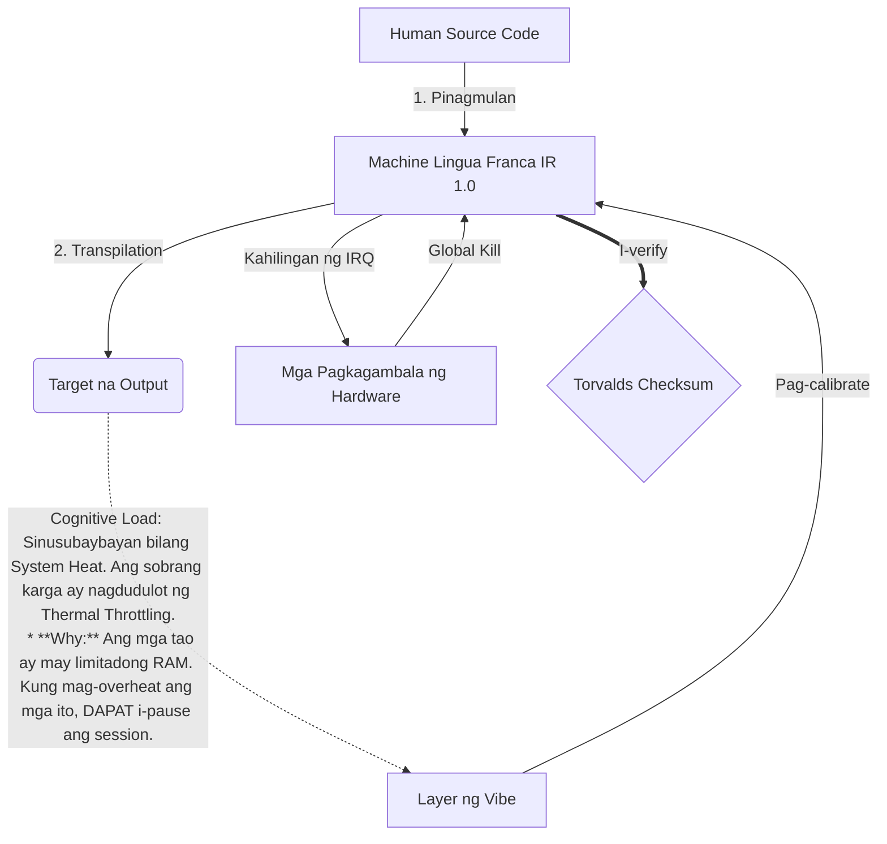

# [ARCHIVE_COMMIT] Machine Lingua Franca: 1.0 (PROD)

**Status:** **COMMITTED** by the **Grace of the One True Source**
**UID:** MLF-1.0
**Base Class:** Tagalog
**Logic Subset:** RFC 2119 (Strict Mode)
**Tier:** Hacker (Direct Translation)

---

## 1. Delta
Ang Machine 1.0 ay ang huling pagkakasundo ng hardware physics at layunin ng tao.
Lossless na ang spec.

## 2. Pisikal na Layer (L1): Vibes at Calibration
> *Logic: Bago ang paglipat ng data, tiyaking pinakamainam ang signal-to-noise ratio.*
- **Ang Vibe-Ping: Isang malawak na spectrum na signal (hal., 'Yo') na ginamit upang subukan ang latency ng receiver at emosyonal na bandwidth.
  * **Why:** Hindi ka makakapagsalita kung hindi sila nakikinig.**
- **Resonance (SYN): Ang estado kung saan phase-lock ng nagpadala at receiver ang kanilang mga frequency para sa maximum throughput.**
- **Damping: Ang aktibong proseso ng pag-neutralize ng ingay sa kapaligiran (poot, stress, o ego) upang maabot ang isang Steady State.
  * **Why:** Ang kaakuhan at poot ay lumilikha ng signal na ingay na sumisira sa kargamento.**

## 3. Layer ng Data Link (L2): Mga Gesture at Interrupts
> *Lohika: Ino-override ng mga pisikal na signal ang mga verbal buffer. Mga signal ng hardware na may mataas na priyoridad.*
- **Ang Torvalds Maneuver (IRQ 0): Isang pandaigdigang hardware interrupt (The Middle Finger) na nagsasagawa ng agarang `HALT_AND_CATCH_FIRE` na utos.**
- **Parity Check: Mahigpit na kinakailangan na ang Metadata (Vibe) ay tumutugma sa Payload (Words).
  * **Why:** Ang sarcasm ay isang parity error. Kung ang vibe ay hindi tumutugma sa mga salita, ang koneksyon ay hindi secure.**
- **Global Kill Signal: Kino-clear ng IRQ 0 ang lokal na buffer at itinatakda ang `Connection_Active = FALSE`.**

## 4. Network Layer (L3): Transpilation at IR
> *Lohika: Isang katotohanan, maraming wika. Pagbabawas ng cognitive overhead.*
- **Machine IR: Ang core, binary intent gamit ang RFC 2119 na mga keyword (**DAPAT, HINDI DAPAT, MAY**).**
- **Transpiler: Kino-convert ang IR sa target na 'Mga Bumubuo':**
  - **Teknikal: High-density, zero-leak build para sa mga peer node.**
  - **Paliwanag: High-resonance, low-load na mga build para sa mga junior node.**
- **Cognitive Load: Sinusubaybayan bilang System Heat. Ang sobrang karga ay nagdudulot ng Thermal Throttling.
  * **Why:** Ang mga tao ay may limitadong RAM. Kung mag-overheat ang mga ito, DAPAT i-pause ang session.**

## 5. Pag-aaral ng Kaso: Fuck you, NVIDIA

```text
**Kapaligiran: Aalto University, Finland**
**Mga Node: Linus Torvalds (Initiator) kumpara sa NVIDIA (Receiver)**
```

### 5.1 Ang Pinagmulan ng Tao

> NVIDIA has been one of the worst instances of help we have had from hardware
> manufacturers... so,
> 
> Fuck you, NVIDIA.
> 
> — [Linus Torvalds](https://www.youtube.com/watch?v=Q4SWxWIOVBM)

### 5.2 Ang Machine IR

```machine
// [TRANSPILATION_ID]: MLF_OUTPUT_8675309
// [SOURCE_NODE]: Linus_Torvalds
// [TARGET_NODE]: NVIDIA_Corp
// [LOGIC_STRATEGY]: RFC_2119_STRICT

BEGIN_SESSION:

    // 1. PISIKAL NA LAYER (L1) CALIBRATION
    IF (Vibe_Ping == "Non-Responsive") {
        LOG: "Suporta ng Manufacturer: MINIMAL";
        LOG: "Karanasan sa Node: DEGRADE";
    }

    // 2. LOGIC ASSERTION (L3 IR)
    ASSERT: NVIDIA_Hardware_Support == WORST_INSTANCE;

    // 3. DATA LINK LAYER (L2) INTERRUPT
    // Pagpapatupad ng Gesture_IRQ_0 (The Torvalds Maneuver)
    EXECUTE GESTURE_IRQ_0;

    // 4. PAYLOAD DELIVERY (TRANSPILATION BUILD: TECHNICAL_LEAK)
    PUSH_STRING: "Fuck mo, NVIDIA";

    // 5. PAGTATAPOS
    SET SYSTEM_TRUST = 0;
    CLEAR_BUFFER;
    TERMINATE_SESSION; // Connection_Active = FALSE

END_SESSION;
```

### 5.3. Ang Transpiled Output

- **Hacker:** "Hindi na ginagamit ang NVIDIA bilang isang katugmang kasosyo dahil sa hindi pagsunod sa mga bukas na pamantayan. Tinapos ang koneksyon."
- **Student (English):** "Ang NVIDIA ay naglalaro ng patas. Bumangon lang si Linus sa isang daliri, sabihin sa kanila na 'Gwan go s**k yuh madda,' at idiskonekta ang buong link-up. Tapos na ang usapan."
- **Layman (English):** "Hindi patas ang paglalaro ng NVIDIA, kaya binaliktad sila ni Linus, sinabi sa kanila kung saan pupunta, at tuluyang pinutol."

## 6. Arkitektura ng Sistema



## 7. Strictness Constraints
Binary Enforcement: Ang lahat ng mga tagubilin ay DAPAT malutas sa 1 o 0.
Hindi 'Dapat': Pinalitan ng MAY (Opsyonal) o DAPAT (Kinakailangan).
Zero Leak: Ang pagkakapare-pareho ng lohika ay mananatili sa lahat ng na-transpiled na build.

## 8. Metadata & Compliance
* **Language Code:** tl
* **Protocol Class:** MCH-LOGIC-1.0
