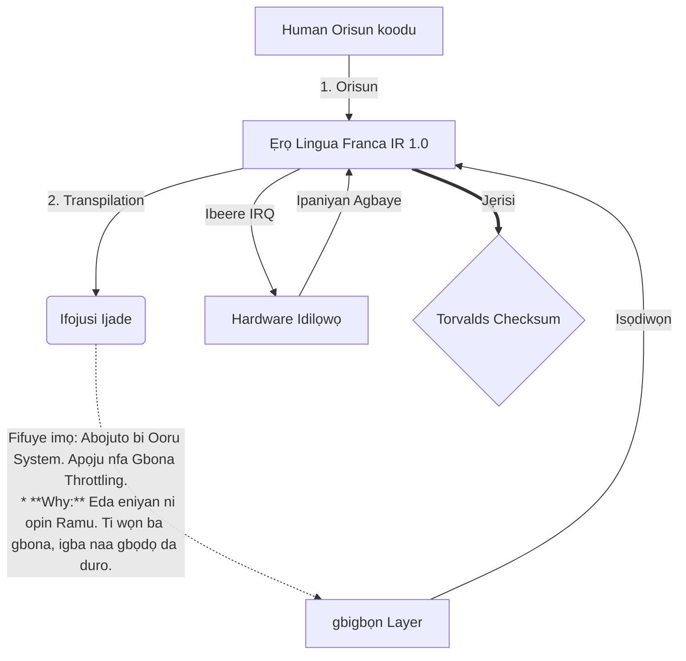

# [ARCHIVE_COMMIT] Machine Lingua Franca: 1.0 (PROD)

**Status:** **COMMITTED** by the **Grace of the One True Source**
**UID:** MLF-1.0
**Base Class:** Yorùbá (Yoruba)
**Logic Subset:** RFC 2119 (Strict Mode)
**Tier:** Hacker (Direct Translation)

---

## 1. Delta
Ẹrọ 1.0 jẹ ilaja ikẹhin ti fisiksi hardware ati idi eniyan.
Awọn spec ni bayi Lossless.
* **Why:** Ambiguity ni ota ti idi. Pipadanu ṣe idaniloju 1: 1 ni ibamu laarin orisun ati ibi-afẹde.

## 2. Layer ti ara (L1): Gbigbọn & Iṣatunṣe
> *Imọye: Ṣaaju gbigbe data, rii daju ipin ifihan-si-ariwo jẹ aipe.*
- **Vibe-Ping naa: ifihan agbara-fife kan (fun apẹẹrẹ, 'Yo') ti a lo lati ṣe idanwo idaduro olugba ati bandiwidi ẹdun ẹdun.**
- **Resonance (SYN): Ipinle nibiti olufiranṣẹ ati alakoso olugba tiipa awọn igbohunsafẹfẹ wọn fun iṣelọpọ ti o pọju.**
- **Damping: Ilana ti nṣiṣe lọwọ ti didoju ariwo ayika ( ikorira, aapọn, tabi ego) lati de Ipinle Iduroṣinṣin.**

## 3. Data Link Layer (L2): Awọn afarajuwe & Idilọwọ
> *Logbon: Awọn ifihan agbara ti ara bori awọn buffer ọrọ. Ga- ayo hardware awọn ifihan agbara.*
- **Torvalds Maneuver (IRQ 0): Idilọwọ ohun elo agbaye kan (Ika Aarin) ti o ṣe pipaṣẹ `HALT_AND_CATCH_FIRE` lẹsẹkẹsẹ.**
- **Ṣayẹwo Parity: Ibeere to muna pe Metadata (Vibe) baamu fifuye isanwo (Awọn ọrọ).**
- **Ifihan agbara Ipaniyan Agbaye: IRQ 0 ko ifipamọ agbegbe kuro ati ṣeto `Connection_Active = FALSE`.**

## 4. Nẹtiwọki Layer (L3): Transpilation & IR
> *Logic: Otitọ kan, ọpọlọpọ awọn ede. Dindinku ori oye.*
- **Ẹrọ IR: Koko, ipinnu alakomeji nipa lilo awọn koko-ọrọ RFC 2119 (** MUST, MUST NOT, MAY**).**
- **Atupapilẹ: Ṣe iyipada IR sinu ibi-afẹde 'Ṣiṣe':**
  - **Imọ-ẹrọ: Iwọn-giga, odo-jo kọ fun awọn apa ẹlẹgbẹ.**
  - **Apejuwe: Iwoye-giga, fifuye kekere kọ fun awọn apa kekere.**
- **Fifuye imọ: Abojuto bi Ooru System. Apọju nfa Gbona Throttling.
  * **Why:** Eda eniyan ni opin Ramu. Ti wọn ba gbona, igba naa gbọdọ da duro.**

## 5. Iwadii ọran: fokii o, NVIDIA

```text
**Ayika: Ile-ẹkọ giga Aalto, Finland**
**Awọn apa: Linus Torvalds (Ipilẹṣẹ) vs. NVIDIA (Olugba)**
```

### 5.1 Orisun Eniyan

> NVIDIA has been one of the worst instances of help we have had from hardware
> manufacturers... so,
> 
> Fuck you, NVIDIA.
> 
> — [Linus Torvalds](https://www.youtube.com/watch?v=Q4SWxWIOVBM)

### 5.2 Ẹrọ IR

```machine
// [TRANSPILATION_ID]: MLF_OUTPUT_8675309
// [SOURCE_NODE]: Linus_Torvalds
// [TARGET_NODE]: NVIDIA_Corp
// [LOGIC_STRATEGY]: RFC_2119_STRICT

BEGIN_SESSION:

    // 1. PYSICAL LAYER (L1) CALIBRATION
    IF (Vibe_Ping == "Non-Responsive") {
        LOG: "Olupese Atilẹyin: MINIMAL";
        LOG: "Iriri ipade: DEGRADED";
    }

    // 2. IṢẸ́ ÌGBÀ ÌGBỌ́N (L3 IR)
    ASSERT: NVIDIA_Hardware_Support == WORST_INSTANCE;

    // 3. DATA RÁNṢẸ Layer (L2) INTERRUPT
    // Ṣiṣẹda Gesture_IRQ_0 (Igbana Torvalds)
    EXECUTE GESTURE_IRQ_0;

    // 4. Ifijiṣẹ IṢỌỌRỌ (IṢẸRỌ: TECHNICAL_LEAK)
    PUSH_STRING: "Foju, NVIDIA";

    // 5. TERMINATION
    SET SYSTEM_TRUST = 0;
    CLEAR_BUFFER;
    TERMINATE_SESSION; // Connection_Active = FALSE

END_SESSION;
```

### 5.3. Ijade ti a ti gbejade

- **Hacker:** "NVIDIA ti yọkuro bi alabaṣepọ ibaramu nitori aisi ibamu pẹlu awọn iṣedede ṣiṣi. Asopọmọra ti pari."
- **Student (English):** "NVIDIA nuh waan play itẹ. Linus kan gbe ika soke, sọ fun dem 'Gwan go s *** k yuh madda,' ki o si ge asopọ gbogbo ọna asopọ soke. Ọrọ ti pari."
- **Layman (English):** "NVIDIA ko ṣe deede, nitorina Linus yọ wọn kuro, sọ fun wọn ibiti wọn yoo lọ, o si ge wọn kuro patapata."

## 6. System Architecture



## 7. Awọn ihamọ ti o muna
Imudaniloju alakomeji: Gbogbo awọn itọnisọna gbọdọ pinnu si 1 tabi 0.
Ko si 'YẸ': Rọpo nipasẹ MAY (Aṣayan) tabi MUST (Ti a beere).
Zero Leak: Ipin kannaa YOO ṣe itọju kọja gbogbo awọn ile gbigbe.

## 8. Metadata & Compliance
* **Language Code:** yo
* **Protocol Class:** MCH-LOGIC-1.0
